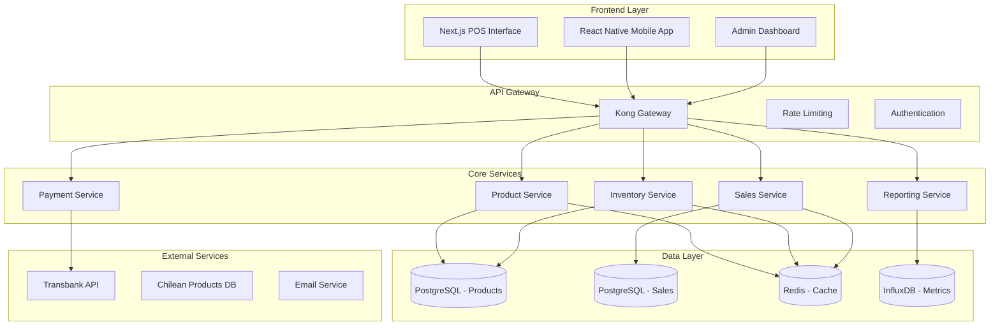

# FASE 2 ENRIQUECIDA: Desarrollo e Implementación del Sistema POS Core
## Sistema POS SaaS para PYMEs Chilenas - CRTLPyme

**Proyecto de Titulación - Capstone 707V**  
**Estudiantes**: Hernán Cabezas, Gricel Sanchez  
**Profesor Guía**: Fernando González  
**Duración**: 6 semanas | **Estado**: En Desarrollo

---

## 1. ARQUITECTURA TÉCNICA DETALLADA DEL SISTEMA POS

### 1.1 Diseño de Arquitectura de Microservicios

El sistema POS de CRTLPyme implementa una arquitectura de microservicios distribuida que garantiza escalabilidad, mantenibilidad y resiliencia. La arquitectura sigue los principios de Domain-Driven Design (DDD) para una separación clara de responsabilidades.



#### Justificación de Decisiones Arquitectónicas

**1. Microservicios vs Monolito**
- **Decisión**: Arquitectura de microservicios
- **Justificación**: Escalabilidad independiente de componentes críticos (inventario vs ventas)
- **Trade-off**: Mayor complejidad operacional vs flexibilidad de escalamiento

**2. API Gateway (Kong)**
- **Decisión**: Kong como API Gateway
- **Justificación**: Rate limiting, autenticación centralizada, observabilidad
- **Alternativas consideradas**: AWS API Gateway, Nginx, Traefik

**3. Base de Datos por Dominio**
- **Decisión**: PostgreSQL separado por contexto de negocio
- **Justificación**: Aislamiento de datos, optimización específica por dominio
- **Patrón**: Database-per-service con eventual consistency

### 1.2 Modelo de Datos Avanzado

#### Esquema de Base de Datos Optimizado

```sql
-- =============================================
-- PRODUCTOS Y CATÁLOGO
-- =============================================

CREATE TABLE categories (
    id UUID PRIMARY KEY DEFAULT gen_random_uuid(),
    company_id UUID NOT NULL REFERENCES companies(id),
    name VARCHAR(255) NOT NULL,
    parent_id UUID REFERENCES categories(id),
    description TEXT,
    image_url VARCHAR(500),
    sort_order INTEGER DEFAULT 0,
    is_active BOOLEAN DEFAULT true,
    created_at TIMESTAMP DEFAULT NOW(),
    updated_at TIMESTAMP DEFAULT NOW(),
    
    CONSTRAINT unique_category_name_per_company 
        UNIQUE(company_id, name, parent_id)
);

CREATE TABLE products (
    id UUID PRIMARY KEY DEFAULT gen_random_uuid(),
    company_id UUID NOT NULL REFERENCES companies(id),
    category_id UUID REFERENCES categories(id),
    
    -- Información básica
    name VARCHAR(255) NOT NULL,
    description TEXT,
    sku VARCHAR(100),
    barcode VARCHAR(50),
    
    -- Precios y costos
    price DECIMAL(12,2) NOT NULL CHECK (price >= 0),
    cost DECIMAL(12,2) CHECK (cost >= 0),
    margin_percentage DECIMAL(5,2) GENERATED ALWAYS AS 
        (CASE WHEN cost > 0 THEN ((price - cost) / cost) * 100 ELSE 0 END) STORED,
    
    -- Inventario
    current_stock INTEGER DEFAULT 0 CHECK (current_stock >= 0),
    min_stock INTEGER DEFAULT 0 CHECK (min_stock >= 0),
    max_stock INTEGER CHECK (max_stock IS NULL OR max_stock >= min_stock),
    
    -- Configuración
    is_active BOOLEAN DEFAULT true,
    is_trackable BOOLEAN DEFAULT true,
    allow_negative_stock BOOLEAN DEFAULT false,
    
    -- Metadatos
    weight DECIMAL(8,3),
    dimensions JSONB, -- {width, height, depth, unit}
    tags TEXT[],
    
    -- Auditoría
    created_at TIMESTAMP DEFAULT NOW(),
    updated_at TIMESTAMP DEFAULT NOW(),
    created_by UUID REFERENCES users(id),
    updated_by UUID REFERENCES users(id),
    
    CONSTRAINT unique_sku_per_company UNIQUE(company_id, sku),
    CONSTRAINT unique_barcode_per_company UNIQUE(company_id, barcode)
);

-- Índices optimizados para consultas frecuentes
CREATE INDEX idx_products_company_active ON products(company_id, is_active);
CREATE INDEX idx_products_barcode ON products(barcode) WHERE barcode IS NOT NULL;
CREATE INDEX idx_products_low_stock ON products(company_id, current_stock, min_stock) 
    WHERE is_trackable = true AND current_stock <= min_stock;
CREATE INDEX idx_products_search ON products USING gin(to_tsvector('spanish', name || ' ' || COALESCE(description, '')));

-- =============================================
-- VENTAS Y TRANSACCIONES
-- =============================================

CREATE TYPE sale_status AS ENUM ('draft', 'completed', 'cancelled', 'refunded');
CREATE TYPE payment_method AS ENUM ('cash', 'card', 'transfer', 'mixed');

CREATE TABLE sales (
    id UUID PRIMARY KEY DEFAULT gen_random_uuid(),
    company_id UUID NOT NULL REFERENCES companies(id),
    sale_number VARCHAR(50) NOT NULL,
    
    -- Montos
    subtotal DECIMAL(12,2) NOT NULL CHECK (subtotal >= 0),
    tax_amount DECIMAL(12,2) NOT NULL DEFAULT 0 CHECK (tax_amount >= 0),
    discount_amount DECIMAL(12,2) NOT NULL DEFAULT 0 CHECK (discount_amount >= 0),
    total DECIMAL(12,2) NOT NULL CHECK (total >= 0),
    
    -- Estado y metadatos
    status sale_status DEFAULT 'draft',
    payment_method payment_method,
    notes TEXT,
    
    -- Relaciones
    customer_id UUID REFERENCES customers(id),
    cashier_id UUID NOT NULL REFERENCES users(id),
    pos_terminal_id UUID REFERENCES pos_terminals(id),
    
    -- Auditoría
    created_at TIMESTAMP DEFAULT NOW(),
    completed_at TIMESTAMP,
    cancelled_at TIMESTAMP,
    
    CONSTRAINT unique_sale_number_per_company UNIQUE(company_id, sale_number),
    CONSTRAINT valid_total CHECK (total = subtotal + tax_amount - discount_amount)
);

CREATE TABLE sale_items (
    id UUID PRIMARY KEY DEFAULT gen_random_uuid(),
    sale_id UUID NOT NULL REFERENCES sales(id) ON DELETE CASCADE,
    product_id UUID NOT NULL REFERENCES products(id),
    
    -- Cantidades y precios
    quantity INTEGER NOT NULL CHECK (quantity > 0),
    unit_price DECIMAL(12,2) NOT NULL CHECK (unit_price >= 0),
    discount_amount DECIMAL(12,2) DEFAULT 0 CHECK (discount_amount >= 0),
    line_total DECIMAL(12,2) NOT NULL CHECK (line_total >= 0),
    
    -- Snapshot de producto (para histórico)
    product_name VARCHAR(255) NOT NULL,
    product_sku VARCHAR(100),
    
    created_at TIMESTAMP DEFAULT NOW(),
    
    CONSTRAINT valid_line_total CHECK (line_total = (quantity * unit_price) - discount_amount)
);

-- =============================================
-- MOVIMIENTOS DE INVENTARIO
-- =============================================

CREATE TYPE stock_movement_type AS ENUM (
    'sale', 'purchase', 'adjustment', 'transfer', 'return', 'waste'
);

CREATE TABLE stock_movements (
    id UUID PRIMARY KEY DEFAULT gen_random_uuid(),
    company_id UUID NOT NULL REFERENCES companies(id),
    product_id UUID NOT NULL REFERENCES products(id),
    
    -- Movimiento
    movement_type stock_movement_type NOT NULL,
    quantity INTEGER NOT NULL, -- Positivo para entradas, negativo para salidas
    previous_stock INTEGER NOT NULL,
    new_stock INTEGER NOT NULL,
    
    -- Referencias
    reference_id UUID, -- ID de venta, compra, etc.
    reference_type VARCHAR(50), -- 'sale', 'purchase', etc.
    
    -- Metadatos
    reason TEXT,
    cost_per_unit DECIMAL(12,2),
    
    -- Auditoría
    created_at TIMESTAMP DEFAULT NOW(),
    created_by UUID NOT NULL REFERENCES users(id),
    
    CONSTRAINT valid_stock_calculation 
        CHECK (new_stock = previous_stock + quantity)
);

-- Índices para reportes y consultas de inventario
CREATE INDEX idx_stock_movements_product_date ON stock_movements(product_id, created_at DESC);
CREATE INDEX idx_stock_movements_company_type ON stock_movements(company_id, movement_type, created_at DESC);
```

#### Triggers y Funciones de Base de Datos

```sql
-- Función para actualizar stock automáticamente
CREATE OR REPLACE FUNCTION update_product_stock()
RETURNS TRIGGER AS $$
BEGIN
    -- Actualizar stock del producto
    UPDATE products 
    SET current_stock = NEW.new_stock,
        updated_at = NOW()
    WHERE id = NEW.product_id;
    
    -- Verificar si necesita alerta de stock bajo
    IF NEW.new_stock <= (SELECT min_stock FROM products WHERE id = NEW.product_id) THEN
        INSERT INTO stock_alerts (company_id, product_id, alert_type, message, created_at)
        VALUES (
            NEW.company_id,
            NEW.product_id,
            'low_stock',
            'Producto con stock bajo: ' || NEW.new_stock || ' unidades',
            NOW()
        );
    END IF;
    
    RETURN NEW;
END;
$$ LANGUAGE plpgsql;

-- Trigger para movimientos de stock
CREATE TRIGGER trigger_update_stock
    AFTER INSERT ON stock_movements
    FOR EACH ROW
    EXECUTE FUNCTION update_product_stock();

-- Función para generar número de venta automático
CREATE OR REPLACE FUNCTION generate_sale_number()
RETURNS TRIGGER AS $$
DECLARE
    next_number INTEGER;
    formatted_number VARCHAR(50);
BEGIN
    -- Obtener siguiente número para la empresa
    SELECT COALESCE(MAX(CAST(SUBSTRING(sale_number FROM '[0-9]+$') AS INTEGER)), 0) + 1
    INTO next_number
    FROM sales 
    WHERE company_id = NEW.company_id
    AND sale_number ~ '^[A-Z]+-[0-9]+$';
    
    -- Formatear número de venta
    formatted_number := 'VTA-' || LPAD(next_number::TEXT, 8, '0');
    
    NEW.sale_number := formatted_number;
    RETURN NEW;
END;
$$ LANGUAGE plpgsql;

-- Trigger para generar número de venta
CREATE TRIGGER trigger_generate_sale_number
    BEFORE INSERT ON sales
    FOR EACH ROW
    WHEN (NEW.sale_number IS NULL)
    EXECUTE FUNCTION generate_sale_number();
```

### 1.3 APIs RESTful Detalladas

#### API de Productos

```typescript
// types/product.ts
export interface Product {
  id: string;
  companyId: string;
  categoryId?: string;
  name: string;
  description?: string;
  sku?: string;
  barcode?: string;
  price: number;
  cost?: number;
  marginPercentage?: number;
  currentStock: number;
  minStock: number;
  maxStock?: number;
  isActive: boolean;
  isTrackable: boolean;
  allowNegativeStock: boolean;
  weight?: number;
  dimensions?: ProductDimensions;
  tags: string[];
  createdAt: Date;
  updatedAt: Date;
}

export interface ProductDimensions {
  width: number;
  height: number;
  depth: number;
  unit: 'cm' | 'mm' | 'in';
}

export interface ProductSearchFilters {
  search?: string;
  categoryId?: string;
  isActive?: boolean;
  lowStock?: boolean;
  tags?: string[];
  priceRange?: {
    min: number;
    max: number;
  };
}

export interface ProductCreateRequest {
  name: string;
  description?: string;
  categoryId?: string;
  sku?: string;
  barcode?: string;
  price: number;
  cost?: number;
  minStock?: number;
  maxStock?: number;
  isTrackable?: boolean;
  allowNegativeStock?: boolean;
  weight?: number;
  dimensions?: ProductDimensions;
  tags?: string[];
}
```

```typescript
// pages/api/products/index.ts
import { NextApiRequest, NextApiResponse } from 'next';
import { getServerSession } from 'next-auth';
import { prisma } from '@/lib/prisma';
import { ProductService } from '@/services/ProductService';
import { validateProductData } from '@/lib/validations/product';

export default async function handler(
  req: NextApiRequest,
  res: NextApiResponse
) {
  const session = await getServerSession(req, res, authOptions);
  
  if (!session?.user?.companyId) {
    return res.status(401).json({ error: 'Unauthorized' });
  }

  const productService = new ProductService(session.user.companyId);

  switch (req.method) {
    case 'GET':
      return handleGetProducts(req, res, productService);
    case 'POST':
      return handleCreateProduct(req, res, productService);
    default:
      return res.status(405).json({ error: 'Method not allowed' });
  }
}

async function handleGetProducts(
  req: NextApiRequest,
  res: NextApiResponse,
  productService: ProductService
) {
  try {
    const {
      page = 1,
      limit = 50,
      search,
      categoryId,
      isActive,
      lowStock,
      tags,
      sortBy = 'name',
      sortOrder = 'asc'
    } = req.query;

    const filters: ProductSearchFilters = {
      search: search as string,
      categoryId: categoryId as string,
      isActive: isActive === 'true',
      lowStock: lowStock === 'true',
      tags: tags ? (tags as string).split(',') : undefined
    };

    const result = await productService.searchProducts({
      filters,
      pagination: {
        page: parseInt(page as string),
        limit: Math.min(parseInt(limit as string), 100)
      },
      sorting: {
        field: sortBy as string,
        order: sortOrder as 'asc' | 'desc'
      }
    });

    return res.status(200).json(result);
  } catch (error) {
    console.error('Error fetching products:', error);
    return res.status(500).json({ error: 'Internal server error' });
  }
}

async function handleCreateProduct(
  req: NextApiRequest,
  res: NextApiResponse,
  productService: ProductService
) {
  try {
    const validation = validateProductData(req.body);
    
    if (!validation.success) {
      return res.status(400).json({ 
        error: 'Validation failed',
        details: validation.error.issues
      });
    }

    const product = await productService.createProduct(validation.data);
    
    return res.status(201).json(product);
  } catch (error) {
    if (error.code === 'P2002') {
      return res.status(409).json({ 
        error: 'Product with this SKU or barcode already exists' 
      });
    }
    
    console.error('Error creating product:', error);
    return res.status(500).json({ error: 'Internal server error' });
  }
}
```

#### Servicio de Productos con Lógica de Negocio

```typescript
// services/ProductService.ts
import { prisma } from '@/lib/prisma';
import { Product, ProductSearchFilters, ProductCreateRequest } from '@/types/product';
import { StockMovementService } from './StockMovementService';
import { CacheService } from './CacheService';

export class ProductService {
  private companyId: string;
  private stockService: StockMovementService;
  private cache: CacheService;

  constructor(companyId: string) {
    this.companyId = companyId;
    this.stockService = new StockMovementService(companyId);
    this.cache = new CacheService();
  }

  async searchProducts(params: {
    filters: ProductSearchFilters;
    pagination: { page: number; limit: number };
    sorting: { field: string; order: 'asc' | 'desc' };
  }) {
    const { filters, pagination, sorting } = params;
    const cacheKey = `products:${this.companyId}:${JSON.stringify(params)}`;
    
    // Intentar obtener de cache
    const cached = await this.cache.get(cacheKey);
    if (cached) {
      return cached;
    }

    // Construir query dinámicamente
    const where: any = {
      companyId: this.companyId,
      ...(filters.isActive !== undefined && { isActive: filters.isActive }),
      ...(filters.categoryId && { categoryId: filters.categoryId }),
      ...(filters.tags?.length && { tags: { hasSome: filters.tags } })
    };

    // Búsqueda de texto completo
    if (filters.search) {
      where.OR = [
        { name: { contains: filters.search, mode: 'insensitive' } },
        { description: { contains: filters.search, mode: 'insensitive' } },
        { sku: { contains: filters.search, mode: 'insensitive' } },
        { barcode: { equals: filters.search } }
      ];
    }

    // Filtro de stock bajo
    if (filters.lowStock) {
      where.AND = [
        { isTrackable: true },
        { currentStock: { lte: prisma.raw('min_stock') } }
      ];
    }

    const [products, total] = await Promise.all([
      prisma.product.findMany({
        where,
        include: {
          category: {
            select: { id: true, name: true }
          }
        },
        orderBy: {
          [sorting.field]: sorting.order
        },
        skip: (pagination.page - 1) * pagination.limit,
        take: pagination.limit
      }),
      prisma.product.count({ where })
    ]);

    const result = {
      products,
      pagination: {
        page: pagination.page,
        limit: pagination.limit,
        total,
        pages: Math.ceil(total / pagination.limit)
      }
    };

    // Cachear resultado por 5 minutos
    await this.cache.set(cacheKey, result, 300);
    
    return result;
  }

  async createProduct(data: ProductCreateRequest): Promise<Product> {
    return await prisma.$transaction(async (tx) => {
      // Crear producto
      const product = await tx.product.create({
        data: {
          ...data,
          companyId: this.companyId,
          currentStock: 0 // Stock inicial siempre en 0
        },
        include: {
          category: {
            select: { id: true, name: true }
          }
        }
      });

      // Registrar movimiento inicial de stock si es necesario
      if (data.initialStock && data.initialStock > 0) {
        await this.stockService.recordMovement({
          productId: product.id,
          type: 'adjustment',
          quantity: data.initialStock,
          reason: 'Stock inicial',
          costPerUnit: data.cost
        });
      }

      // Invalidar cache
      await this.cache.invalidatePattern(`products:${this.companyId}:*`);

      return product;
    });
  }

  async updateStock(productId: string, newStock: number, reason: string) {
    const product = await this.getById(productId);
    if (!product) {
      throw new Error('Product not found');
    }

    const difference = newStock - product.currentStock;
    
    await this.stockService.recordMovement({
      productId,
      type: 'adjustment',
      quantity: difference,
      reason
    });

    // Invalidar cache
    await this.cache.invalidatePattern(`products:${this.companyId}:*`);
  }

  async getById(id: string): Promise<Product | null> {
    const cacheKey = `product:${id}`;
    
    const cached = await this.cache.get(cacheKey);
    if (cached) {
      return cached;
    }

    const product = await prisma.product.findFirst({
      where: { id, companyId: this.companyId },
      include: {
        category: {
          select: { id: true, name: true }
        }
      }
    });

    if (product) {
      await this.cache.set(cacheKey, product, 600); // 10 minutos
    }

    return product;
  }

  async searchByBarcode(barcode: string): Promise<Product | null> {
    const cacheKey = `product:barcode:${barcode}`;
    
    const cached = await this.cache.get(cacheKey);
    if (cached) {
      return cached;
    }

    const product = await prisma.product.findFirst({
      where: { 
        barcode, 
        companyId: this.companyId,
        isActive: true 
      },
      include: {
        category: {
          select: { id: true, name: true }
        }
      }
    });

    if (product) {
      await this.cache.set(cacheKey, product, 1800); // 30 minutos
    }

    return product;
  }

  async getLowStockProducts(): Promise<Product[]> {
    return await prisma.product.findMany({
      where: {
        companyId: this.companyId,
        isActive: true,
        isTrackable: true,
        currentStock: {
          lte: prisma.raw('min_stock')
        }
      },
      include: {
        category: {
          select: { id: true, name: true }
        }
      },
      orderBy: [
        { currentStock: 'asc' },
        { name: 'asc' }
      ]
    });
  }
}
```

---

## 2. IMPLEMENTACIÓN DEL SISTEMA POS

### 2.1 Interface de Usuario del POS

#### Componente Principal del POS

```typescript
// components/pos/POSInterface.tsx
'use client';

import React, { useState, useEffect, useCallback } from 'react';
import { useSession } from 'next-auth/react';
import { Product, Sale, SaleItem } from '@/types';
import { ProductSearch } from './ProductSearch';
import { ShoppingCart } from './ShoppingCart';
import { PaymentProcessor } from './PaymentProcessor';
import { ReceiptGenerator } from './ReceiptGenerator';
import { useToast } from '@/hooks/use-toast';
import { usePOSStore } from '@/stores/posStore';

interface POSInterfaceProps {
  terminalId?: string;
}

export const POSInterface: React.FC<POSInterfaceProps> = ({ terminalId }) => {
  const { data: session } = useSession();
  const { toast } = useToast();
  const {
    cart,
    currentSale,
    addToCart,
    removeFromCart,
    updateQuantity,
    clearCart,
    processSale,
    isProcessing
  } = usePOSStore();

  const [searchQuery, setSearchQuery] = useState('');
  const [showPayment, setShowPayment] = useState(false);
  const [showReceipt, setShowReceipt] = useState(false);

  // Keyboard shortcuts
  useEffect(() => {
    const handleKeyPress = (event: KeyboardEvent) => {
      // F1 - Nueva venta
      if (event.key === 'F1') {
        event.preventDefault();
        handleNewSale();
      }
      
      // F2 - Buscar producto
      if (event.key === 'F2') {
        event.preventDefault();
        document.getElementById('product-search')?.focus();
      }
      
      // F3 - Procesar pago
      if (event.key === 'F3' && cart.items.length > 0) {
        event.preventDefault();
        setShowPayment(true);
      }
      
      // Escape - Cancelar operación actual
      if (event.key === 'Escape') {
        event.preventDefault();
        setShowPayment(false);
        setShowReceipt(false);
      }
    };

    document.addEventListener('keydown', handleKeyPress);
    return () => document.removeEventListener('keydown', handleKeyPress);
  }, [cart.items.length]);

  const handleProductSelect = useCallback(async (product: Product) => {
    try {
      // Verificar stock disponible
      if (product.isTrackable && product.currentStock <= 0 && !product.allowNegativeStock) {
        toast({
          title: 'Sin stock',
          description: `El producto ${product.name} no tiene stock disponible`,
          variant: 'destructive'
        });
        return;
      }

      await addToCart(product, 1);
      
      toast({
        title: 'Producto agregado',
        description: `${product.name} agregado al carrito`,
        variant: 'success'
      });
      
      // Limpiar búsqueda
      setSearchQuery('');
    } catch (error) {
      toast({
        title: 'Error',
        description: 'No se pudo agregar el producto al carrito',
        variant: 'destructive'
      });
    }
  }, [addToCart, toast]);

  const handleQuantityChange = useCallback(async (itemId: string, newQuantity: number) => {
    if (newQuantity <= 0) {
      await removeFromCart(itemId);
    } else {
      await updateQuantity(itemId, newQuantity);
    }
  }, [removeFromCart, updateQuantity]);

  const handlePaymentComplete = useCallback(async (paymentData: any) => {
    try {
      const sale = await processSale({
        ...paymentData,
        terminalId,
        cashierId: session?.user?.id
      });

      setShowPayment(false);
      setShowReceipt(true);
      
      toast({
        title: 'Venta completada',
        description: `Venta ${sale.saleNumber} procesada exitosamente`,
        variant: 'success'
      });
    } catch (error) {
      toast({
        title: 'Error en el pago',
        description: 'No se pudo procesar la venta. Intente nuevamente.',
        variant: 'destructive'
      });
    }
  }, [processSale, terminalId, session?.user?.id, toast]);

  const handleNewSale = useCallback(() => {
    clearCart();
    setShowPayment(false);
    setShowReceipt(false);
    setSearchQuery('');
    document.getElementById('product-search')?.focus();
  }, [clearCart]);

  const cartTotal = cart.items.reduce((sum, item) => sum + item.lineTotal, 0);
  const cartItemCount = cart.items.reduce((sum, item) => sum + item.quantity, 0);

  return (
    <div className="flex h-screen bg-gray-50">
      {/* Panel izquierdo - Búsqueda y productos */}
      <div className="flex-1 flex flex-col">
        {/* Header */}
        <div className="bg-white shadow-sm border-b p-4">
          <div className="flex items-center justify-between">
            <h1 className="text-2xl font-bold text-gray-900">
              Punto de Venta
            </h1>
            <div className="flex items-center space-x-4">
              <span className="text-sm text-gray-500">
                Terminal: {terminalId || 'Principal'}
              </span>
              <span className="text-sm text-gray-500">
                Cajero: {session?.user?.name}
              </span>
            </div>
          </div>
        </div>

        {/* Búsqueda de productos */}
        <div className="p-4 bg-white border-b">
          <ProductSearch
            query={searchQuery}
            onQueryChange={setSearchQuery}
            onProductSelect={handleProductSelect}
            placeholder="Buscar por nombre, SKU o código de barras (F2)"
          />
        </div>

        {/* Área principal */}
        <div className="flex-1 p-4">
          {/* Aquí iría el catálogo de productos o categorías */}
          <div className="text-center text-gray-500 mt-8">
            <p>Use la búsqueda para encontrar productos</p>
            <p className="text-sm mt-2">
              Atajos: F1 (Nueva venta) | F2 (Buscar) | F3 (Pagar)
            </p>
          </div>
        </div>
      </div>

      {/* Panel derecho - Carrito */}
      <div className="w-96 bg-white shadow-lg border-l flex flex-col">
        {/* Header del carrito */}
        <div className="p-4 border-b">
          <div className="flex items-center justify-between">
            <h2 className="text-lg font-semibold">
              Carrito ({cartItemCount})
            </h2>
            <button
              onClick={handleNewSale}
              className="text-sm text-blue-600 hover:text-blue-800"
              disabled={isProcessing}
            >
              Nueva Venta (F1)
            </button>
          </div>
        </div>

        {/* Items del carrito */}
        <div className="flex-1 overflow-y-auto">
          <ShoppingCart
            items={cart.items}
            onQuantityChange={handleQuantityChange}
            onRemoveItem={removeFromCart}
            disabled={isProcessing}
          />
        </div>

        {/* Total y botones */}
        <div className="border-t p-4 space-y-4">
          <div className="text-right">
            <div className="text-2xl font-bold">
              ${cartTotal.toLocaleString('es-CL')}
            </div>
            <div className="text-sm text-gray-500">
              Total a pagar
            </div>
          </div>

          <button
            onClick={() => setShowPayment(true)}
            disabled={cart.items.length === 0 || isProcessing}
            className="w-full bg-blue-600 text-white py-3 px-4 rounded-lg font-semibold
                     hover:bg-blue-700 disabled:bg-gray-300 disabled:cursor-not-allowed
                     transition-colors"
          >
            {isProcessing ? 'Procesando...' : 'Procesar Pago (F3)'}
          </button>
        </div>
      </div>

      {/* Modal de pago */}
      {showPayment && (
        <PaymentProcessor
          total={cartTotal}
          items={cart.items}
          onPaymentComplete={handlePaymentComplete}
          onCancel={() => setShowPayment(false)}
          isProcessing={isProcessing}
        />
      )}

      {/* Modal de recibo */}
      {showReceipt && currentSale && (
        <ReceiptGenerator
          sale={currentSale}
          onClose={() => setShowReceipt(false)}
          onNewSale={handleNewSale}
        />
      )}
    </div>
  );
};
```

#### Componente de Búsqueda de Productos

```typescript
// components/pos/ProductSearch.tsx
'use client';

import React, { useState, useEffect, useRef } from 'react';
import { Search, Barcode, Package } from 'lucide-react';
import { Product } from '@/types';
import { useDebounce } from '@/hooks/use-debounce';
import { productApi } from '@/lib/api/products';

interface ProductSearchProps {
  query: string;
  onQueryChange: (query: string) => void;
  onProductSelect: (product: Product) => void;
  placeholder?: string;
}

export const ProductSearch: React.FC<ProductSearchProps> = ({
  query,
  onQueryChange,
  onProductSelect,
  placeholder = 'Buscar productos...'
}) => {
  const [results, setResults] = useState<Product[]>([]);
  const [isLoading, setIsLoading] = useState(false);
  const [showResults, setShowResults] = useState(false);
  const [selectedIndex, setSelectedIndex] = useState(-1);
  
  const inputRef = useRef<HTMLInputElement>(null);
  const resultsRef = useRef<HTMLDivElement>(null);
  
  const debouncedQuery = useDebounce(query, 300);

  // Búsqueda de productos
  useEffect(() => {
    const searchProducts = async () => {
      if (!debouncedQuery.trim()) {
        setResults([]);
        setShowResults(false);
        return;
      }

      setIsLoading(true);
      try {
        // Primero intentar búsqueda por código de barras exacto
        if (/^\d{8,13}$/.test(debouncedQuery)) {
          const barcodeResult = await productApi.searchByBarcode(debouncedQuery);
          if (barcodeResult) {
            setResults([barcodeResult]);
            setShowResults(true);
            setSelectedIndex(0);
            return;
          }
        }

        // Búsqueda general
        const searchResults = await productApi.search({
          search: debouncedQuery,
          isActive: true,
          limit: 10
        });

        setResults(searchResults.products);
        setShowResults(searchResults.products.length > 0);
        setSelectedIndex(searchResults.products.length > 0 ? 0 : -1);
      } catch (error) {
        console.error('Error searching products:', error);
        setResults([]);
        setShowResults(false);
      } finally {
        setIsLoading(false);
      }
    };

    searchProducts();
  }, [debouncedQuery]);

  // Manejo de teclado
  useEffect(() => {
    const handleKeyDown = (event: KeyboardEvent) => {
      if (!showResults) return;

      switch (event.key) {
        case 'ArrowDown':
          event.preventDefault();
          setSelectedIndex(prev => 
            prev < results.length - 1 ? prev + 1 : prev
          );
          break;
          
        case 'ArrowUp':
          event.preventDefault();
          setSelectedIndex(prev => prev > 0 ? prev - 1 : prev);
          break;
          
        case 'Enter':
          event.preventDefault();
          if (selectedIndex >= 0 && results[selectedIndex]) {
            handleProductSelect(results[selectedIndex]);
          }
          break;
          
        case 'Escape':
          event.preventDefault();
          setShowResults(false);
          setSelectedIndex(-1);
          break;
      }
    };

    document.addEventListener('keydown', handleKeyDown);
    return () => document.removeEventListener('keydown', handleKeyDown);
  }, [showResults, selectedIndex, results]);

  const handleProductSelect = (product: Product) => {
    onProductSelect(product);
    onQueryChange('');
    setShowResults(false);
    setSelectedIndex(-1);
    inputRef.current?.focus();
  };

  const isBarcode = /^\d{8,13}$/.test(query);

  return (
    <div className="relative">
      <div className="relative">
        <div className="absolute inset-y-0 left-0 pl-3 flex items-center pointer-events-none">
          {isBarcode ? (
            <Barcode className="h-5 w-5 text-gray-400" />
          ) : (
            <Search className="h-5 w-5 text-gray-400" />
          )}
        </div>
        
        <input
          ref={inputRef}
          id="product-search"
          type="text"
          value={query}
          onChange={(e) => onQueryChange(e.target.value)}
          onFocus={() => setShowResults(results.length > 0)}
          placeholder={placeholder}
          className="block w-full pl-10 pr-3 py-2 border border-gray-300 rounded-lg
                   focus:ring-2 focus:ring-blue-500 focus:border-blue-500
                   text-lg"
          autoComplete="off"
        />
        
        {isLoading && (
          <div className="absolute inset-y-0 right-0 pr-3 flex items-center">
            <div className="animate-spin rounded-full h-4 w-4 border-b-2 border-blue-600"></div>
          </div>
        )}
      </div>

      {/* Resultados de búsqueda */}
      {showResults && (
        <div
          ref={resultsRef}
          className="absolute z-50 w-full mt-1 bg-white border border-gray-200 rounded-lg shadow-lg max-h-96 overflow-y-auto"
        >
          {results.map((product, index) => (
            <div
              key={product.id}
              onClick={() => handleProductSelect(product)}
              className={`p-3 cursor-pointer border-b border-gray-100 last:border-b-0
                        hover:bg-gray-50 ${
                          index === selectedIndex ? 'bg-blue-50 border-blue-200' : ''
                        }`}
            >
              <div className="flex items-center space-x-3">
                <div className="flex-shrink-0">
                  <Package className="h-8 w-8 text-gray-400" />
                </div>
                
                <div className="flex-1 min-w-0">
                  <div className="flex items-center justify-between">
                    <p className="text-sm font-medium text-gray-900 truncate">
                      {product.name}
                    </p>
                    <p className="text-sm font-semibold text-gray-900">
                      ${product.price.toLocaleString('es-CL')}
                    </p>
                  </div>
                  
                  <div className="flex items-center justify-between mt-1">
                    <p className="text-xs text-gray-500">
                      {product.sku && `SKU: ${product.sku}`}
                      {product.sku && product.barcode && ' | '}
                      {product.barcode && `Código: ${product.barcode}`}
                    </p>
                    
                    {product.isTrackable && (
                      <p className={`text-xs font-medium ${
                        product.currentStock <= product.minStock
                          ? 'text-red-600'
                          : product.currentStock <= product.minStock * 2
                          ? 'text-yellow-600'
                          : 'text-green-600'
                      }`}>
                        Stock: {product.currentStock}
                      </p>
                    )}
                  </div>
                </div>
              </div>
            </div>
          ))}
          
          {results.length === 0 && !isLoading && (
            <div className="p-4 text-center text-gray-500">
              No se encontraron productos
            </div>
          )}
        </div>
      )}
    </div>
  );
};
```

### 2.2 Gestión de Inventario Avanzada

#### Servicio de Movimientos de Stock

```typescript
// services/StockMovementService.ts
import { prisma } from '@/lib/prisma';
import { StockMovement, StockMovementType } from '@/types';
import { EventEmitter } from 'events';

export class StockMovementService extends EventEmitter {
  private companyId: string;

  constructor(companyId: string) {
    super();
    this.companyId = companyId;
  }

  async recordMovement(params: {
    productId: string;
    type: StockMovementType;
    quantity: number;
    reason?: string;
    referenceId?: string;
    referenceType?: string;
    costPerUnit?: number;
    userId?: string;
  }): Promise<StockMovement> {
    const {
      productId,
      type,
      quantity,
      reason,
      referenceId,
      referenceType,
      costPerUnit,
      userId
    } = params;

    return await prisma.$transaction(async (tx) => {
      // Obtener stock actual del producto
      const product = await tx.product.findFirst({
        where: { id: productId, companyId: this.companyId },
        select: { currentStock: true, allowNegativeStock: true, name: true }
      });

      if (!product) {
        throw new Error('Product not found');
      }

      const previousStock = product.currentStock;
      const newStock = previousStock + quantity;

      // Validar stock negativo si no está permitido
      if (newStock < 0 && !product.allowNegativeStock) {
        throw new Error(
          `Stock insuficiente para ${product.name}. Stock actual: ${previousStock}, cantidad solicitada: ${Math.abs(quantity)}`
        );
      }

      // Crear movimiento de stock
      const movement = await tx.stockMovement.create({
        data: {
          companyId: this.companyId,
          productId,
          movementType: type,
          quantity,
          previousStock,
          newStock,
          referenceId,
          referenceType,
          reason,
          costPerUnit,
          createdBy: userId
        }
      });

      // El trigger de base de datos actualizará el stock del producto
      // y creará alertas si es necesario

      // Emitir evento para notificaciones en tiempo real
      this.emit('stockChanged', {
        productId,
        previousStock,
        newStock,
        movement: type,
        companyId: this.companyId
      });

      return movement;
    });
  }

  async getMovementHistory(
    productId: string,
    options: {
      limit?: number;
      offset?: number;
      startDate?: Date;
      endDate?: Date;
      types?: StockMovementType[];
    } = {}
  ) {
    const {
      limit = 50,
      offset = 0,
      startDate,
      endDate,
      types
    } = options;

    const where: any = {
      companyId: this.companyId,
      productId
    };

    if (startDate || endDate) {
      where.createdAt = {};
      if (startDate) where.createdAt.gte = startDate;
      if (endDate) where.createdAt.lte = endDate;
    }

    if (types?.length) {
      where.movementType = { in: types };
    }

    const [movements, total] = await Promise.all([
      prisma.stockMovement.findMany({
        where,
        include: {
          createdByUser: {
            select: { name: true, email: true }
          }
        },
        orderBy: { createdAt: 'desc' },
        take: limit,
        skip: offset
      }),
      prisma.stockMovement.count({ where })
    ]);

    return {
      movements,
      total,
      hasMore: offset + limit < total
    };
  }

  async getStockValuation(options: {
    categoryId?: string;
    includeInactive?: boolean;
  } = {}) {
    const where: any = {
      companyId: this.companyId,
      isTrackable: true
    };

    if (!options.includeInactive) {
      where.isActive = true;
    }

    if (options.categoryId) {
      where.categoryId = options.categoryId;
    }

    const products = await prisma.product.findMany({
      where,
      select: {
        id: true,
        name: true,
        sku: true,
        currentStock: true,
        cost: true,
        price: true,
        category: {
          select: { name: true }
        }
      }
    });

    const valuation = products.map(product => {
      const stockValue = (product.cost || 0) * product.currentStock;
      const retailValue = product.price * product.currentStock;
      
      return {
        ...product,
        stockValue,
        retailValue,
        potentialProfit: retailValue - stockValue
      };
    });

    const totals = valuation.reduce(
      (acc, item) => ({
        totalStockValue: acc.totalStockValue + item.stockValue,
        totalRetailValue: acc.totalRetailValue + item.retailValue,
        totalPotentialProfit: acc.totalPotentialProfit + item.potentialProfit
      }),
      { totalStockValue: 0, totalRetailValue: 0, totalPotentialProfit: 0 }
    );

    return {
      products: valuation,
      totals
    };
  }

  async performStockAdjustment(adjustments: Array<{
    productId: string;
    newStock: number;
    reason: string;
  }>, userId: string) {
    const results = [];

    for (const adjustment of adjustments) {
      try {
        const product = await prisma.product.findFirst({
          where: { 
            id: adjustment.productId, 
            companyId: this.companyId 
          },
          select: { currentStock: true, name: true }
        });

        if (!product) {
          results.push({
            productId: adjustment.productId,
            success: false,
            error: 'Product not found'
          });
          continue;
        }

        const difference = adjustment.newStock - product.currentStock;
        
        if (difference !== 0) {
          await this.recordMovement({
            productId: adjustment.productId,
            type: 'adjustment',
            quantity: difference,
            reason: adjustment.reason,
            userId
          });
        }

        results.push({
          productId: adjustment.productId,
          success: true,
          previousStock: product.currentStock,
          newStock: adjustment.newStock,
          difference
        });
      } catch (error) {
        results.push({
          productId: adjustment.productId,
          success: false,
          error: error.message
        });
      }
    }

    return results;
  }
}
```

---

## 3. INTEGRACIÓN CON PRODUCTOS CHILENOS

### 3.1 Base de Datos de Productos Locales

#### Servicio de Productos Chilenos

```typescript
// services/ChileanProductsService.ts
import { prisma } from '@/lib/prisma';
import { Product } from '@/types';

interface ChileanProductData {
  name: string;
  barcode: string;
  category: string;
  brand?: string;
  description?: string;
  averagePrice?: number;
  commonSizes?: string[];
  suppliers?: string[];
}

export class ChileanProductsService {
  private static readonly PRODUCTS_DATABASE = [
    {
      name: 'Coca Cola 350ml',
      barcode: '7802820005608',
      category: 'Bebidas',
      brand: 'Coca Cola',
      description: 'Bebida gaseosa sabor cola 350ml',
      averagePrice: 800,
      commonSizes: ['350ml', '500ml', '1.5L', '2L'],
      suppliers: ['CCU', 'Distribuidora Central']
    },
    {
      name: 'Pan Hallulla Unidad',
      barcode: '2000000000001',
      category: 'Panadería',
      description: 'Pan hallulla tradicional chileno',
      averagePrice: 150,
      suppliers: ['Panadería Local']
    },
    {
      name: 'Leche Soprole 1L Entera',
      barcode: '7802900000000',
      category: 'Lácteos',
      brand: 'Soprole',
      description: 'Leche entera UHT 1 litro',
      averagePrice: 950,
      commonSizes: ['200ml', '500ml', '1L'],
      suppliers: ['Soprole', 'Distribuidora Lácteos']
    },
    {
      name: 'Completo Italiano',
      barcode: '2000000000002',
      category: 'Comida Rápida',
      description: 'Completo con palta, tomate y mayonesa',
      averagePrice: 2500,
      suppliers: ['Preparación Local']
    },
    {
      name: 'Empanada de Pino',
      barcode: '2000000000003',
      category: 'Comida Tradicional',
      description: 'Empanada tradicional chilena de pino',
      averagePrice: 1800,
      suppliers: ['Preparación Local']
    },
    {
      name: 'Cerveza Cristal 330ml',
      barcode: '7802820004007',
      category: 'Bebidas Alcohólicas',
      brand: 'Cristal',
      description: 'Cerveza lager chilena 330ml',
      averagePrice: 1200,
      commonSizes: ['330ml', '470ml', '1L'],
      suppliers: ['CCU', 'Distribuidora Bebidas']
    },
    {
      name: 'Pisco Capel 35° 750ml',
      barcode: '7804320000000',
      category: 'Bebidas Alcohólicas',
      brand: 'Capel',
      description: 'Pisco chileno 35 grados 750ml',
      averagePrice: 4500,
      suppliers: ['Capel', 'Distribuidora Licores']
    },
    {
      name: 'Sopaipilla Unidad',
      barcode: '2000000000004',
      category: 'Comida Tradicional',
      description: 'Sopaipilla tradicional chilena',
      averagePrice: 300,
      suppliers: ['Preparación Local']
    },
    {
      name: 'Manjar Nestlé 250g',
      barcode: '7802900000001',
      category: 'Dulces',
      brand: 'Nestlé',
      description: 'Manjar (dulce de leche) 250 gramos',
      averagePrice: 1100,
      suppliers: ['Nestlé', 'Distribuidora Dulces']
    },
    {
      name: 'Té Supremo Bolsitas',
      barcode: '7802900000002',
      category: 'Infusiones',
      brand: 'Supremo',
      description: 'Té negro en bolsitas x25 unidades',
      averagePrice: 800,
      suppliers: ['Unilever', 'Distribuidora Té']
    }
    // ... más productos chilenos típicos
  ];

  static async searchChileanProduct(barcode: string): Promise<ChileanProductData | null> {
    const product = this.PRODUCTS_DATABASE.find(p => p.barcode === barcode);
    return product || null;
  }

  static async searchByName(name: string): Promise<ChileanProductData[]> {
    const searchTerm = name.toLowerCase();
    return this.PRODUCTS_DATABASE.filter(product =>
      product.name.toLowerCase().includes(searchTerm) ||
      product.brand?.toLowerCase().includes(searchTerm) ||
      product.category.toLowerCase().includes(searchTerm)
    );
  }

  static async getProductsByCategory(category: string): Promise<ChileanProductData[]> {
    return this.PRODUCTS_DATABASE.filter(product =>
      product.category.toLowerCase() === category.toLowerCase()
    );
  }

  static async importChileanProduct(
    companyId: string,
    barcode: string,
    customizations?: {
      price?: number;
      cost?: number;
      minStock?: number;
      categoryId?: string;
    }
  ): Promise<Product> {
    const chileanProduct = await this.searchChileanProduct(barcode);
    
    if (!chileanProduct) {
      throw new Error('Producto chileno no encontrado en la base de datos');
    }

    // Verificar si el producto ya existe para esta empresa
    const existingProduct = await prisma.product.findFirst({
      where: {
        companyId,
        barcode: chileanProduct.barcode
      }
    });

    if (existingProduct) {
      throw new Error('Este producto ya existe en su catálogo');
    }

    // Crear el producto basado en datos chilenos
    const productData = {
      companyId,
      name: chileanProduct.name,
      description: chileanProduct.description,
      barcode: chileanProduct.barcode,
      price: customizations?.price || chileanProduct.averagePrice || 0,
      cost: customizations?.cost,
      minStock: customizations?.minStock || 5,
      categoryId: customizations?.categoryId,
      tags: [
        'producto-chileno',
        chileanProduct.category.toLowerCase(),
        ...(chileanProduct.brand ? [chileanProduct.brand.toLowerCase()] : [])
      ]
    };

    const product = await prisma.product.create({
      data: productData,
      include: {
        category: {
          select: { id: true, name: true }
        }
      }
    });

    return product;
  }

  static getCategories(): string[] {
    const categories = new Set(this.PRODUCTS_DATABASE.map(p => p.category));
    return Array.from(categories).sort();
  }

  static getBrands(): string[] {
    const brands = new Set(
      this.PRODUCTS_DATABASE
        .map(p => p.brand)
        .filter(Boolean)
    );
    return Array.from(brands).sort();
  }

  static async getRecommendations(companyId: string): Promise<ChileanProductData[]> {
    // Obtener productos más comunes que la empresa no tiene
    const existingBarcodes = await prisma.product.findMany({
      where: { companyId },
      select: { barcode: true }
    });

    const existingBarcodesSet = new Set(
      existingBarcodes.map(p => p.barcode).filter(Boolean)
    );

    // Productos más comunes en PYMEs chilenas
    const commonProducts = this.PRODUCTS_DATABASE
      .filter(product => !existingBarcodesSet.has(product.barcode))
      .sort((a, b) => (b.averagePrice || 0) - (a.averagePrice || 0))
      .slice(0, 10);

    return commonProducts;
  }
}
```

#### API para Productos Chilenos

```typescript
// pages/api/chilean-products/search.ts
import { NextApiRequest, NextApiResponse } from 'next';
import { getServerSession } from 'next-auth';
import { ChileanProductsService } from '@/services/ChileanProductsService';
import { authOptions } from '../auth/[...nextauth]';

export default async function handler(
  req: NextApiRequest,
  res: NextApiResponse
) {
  if (req.method !== 'GET') {
    return res.status(405).json({ error: 'Method not allowed' });
  }

  const session = await getServerSession(req, res, authOptions);
  if (!session?.user?.companyId) {
    return res.status(401).json({ error: 'Unauthorized' });
  }

  try {
    const { barcode, name, category } = req.query;

    let results = [];

    if (barcode) {
      const product = await ChileanProductsService.searchChileanProduct(barcode as string);
      results = product ? [product] : [];
    } else if (name) {
      results = await ChileanProductsService.searchByName(name as string);
    } else if (category) {
      results = await ChileanProductsService.getProductsByCategory(category as string);
    } else {
      // Obtener recomendaciones
      results = await ChileanProductsService.getRecommendations(session.user.companyId);
    }

    return res.status(200).json({
      products: results,
      categories: ChileanProductsService.getCategories(),
      brands: ChileanProductsService.getBrands()
    });
  } catch (error) {
    console.error('Error searching Chilean products:', error);
    return res.status(500).json({ error: 'Internal server error' });
  }
}
```

---

## 4. SISTEMA DE REPORTES Y ANALYTICS

### 4.1 Servicio de Reportes Avanzados

```typescript
// services/ReportingService.ts
import { prisma } from '@/lib/prisma';
import { startOfDay, endOfDay, startOfWeek, endOfWeek, startOfMonth, endOfMonth } from 'date-fns';

export interface SalesReportData {
  totalSales: number;
  totalRevenue: number;
  averageTicket: number;
  topProducts: Array<{
    productId: string;
    productName: string;
    quantitySold: number;
    revenue: number;
  }>;
  salesByHour: Array<{
    hour: number;
    sales: number;
    revenue: number;
  }>;
  salesByPaymentMethod: Array<{
    method: string;
    count: number;
    amount: number;
  }>;
}

export interface InventoryReportData {
  totalProducts: number;
  totalStockValue: number;
  lowStockProducts: number;
  topCategories: Array<{
    categoryName: string;
    productCount: number;
    stockValue: number;
  }>;
  stockMovements: Array<{
    date: string;
    movements: number;
    netChange: number;
  }>;
}

export class ReportingService {
  private companyId: string;

  constructor(companyId: string) {
    this.companyId = companyId;
  }

  async getSalesReport(period: 'today' | 'week' | 'month', customRange?: {
    startDate: Date;
    endDate: Date;
  }): Promise<SalesReportData> {
    let startDate: Date;
    let endDate: Date;

    if (customRange) {
      startDate = customRange.startDate;
      endDate = customRange.endDate;
    } else {
      const now = new Date();
      switch (period) {
        case 'today':
          startDate = startOfDay(now);
          endDate = endOfDay(now);
          break;
        case 'week':
          startDate = startOfWeek(now, { weekStartsOn: 1 }); // Lunes
          endDate = endOfWeek(now, { weekStartsOn: 1 });
          break;
        case 'month':
          startDate = startOfMonth(now);
          endDate = endOfMonth(now);
          break;
      }
    }

    // Consulta principal de ventas
    const salesData = await prisma.sale.findMany({
      where: {
        companyId: this.companyId,
        status: 'completed',
        createdAt: {
          gte: startDate,
          lte: endDate
        }
      },
      include: {
        items: {
          include: {
            product: {
              select: { name: true }
            }
          }
        }
      }
    });

    // Cálculos básicos
    const totalSales = salesData.length;
    const totalRevenue = salesData.reduce((sum, sale) => sum + Number(sale.total), 0);
    const averageTicket = totalSales > 0 ? totalRevenue / totalSales : 0;

    // Top productos
    const productSales = new Map<string, {
      name: string;
      quantity: number;
      revenue: number;
    }>();

    salesData.forEach(sale => {
      sale.items.forEach(item => {
        const key = item.productId;
        const existing = productSales.get(key) || {
          name: item.productName,
          quantity: 0,
          revenue: 0
        };
        
        existing.quantity += item.quantity;
        existing.revenue += Number(item.lineTotal);
        productSales.set(key, existing);
      });
    });

    const topProducts = Array.from(productSales.entries())
      .map(([productId, data]) => ({
        productId,
        productName: data.name,
        quantitySold: data.quantity,
        revenue: data.revenue
      }))
      .sort((a, b) => b.revenue - a.revenue)
      .slice(0, 10);

    // Ventas por hora (solo para período de hoy)
    const salesByHour = Array.from({ length: 24 }, (_, hour) => ({
      hour,
      sales: 0,
      revenue: 0
    }));

    if (period === 'today') {
      salesData.forEach(sale => {
        const hour = sale.createdAt.getHours();
        salesByHour[hour].sales += 1;
        salesByHour[hour].revenue += Number(sale.total);
      });
    }

    // Ventas por método de pago
    const paymentMethods = new Map<string, { count: number; amount: number }>();
    
    salesData.forEach(sale => {
      const method = sale.paymentMethod || 'unknown';
      const existing = paymentMethods.get(method) || { count: 0, amount: 0 };
      existing.count += 1;
      existing.amount += Number(sale.total);
      paymentMethods.set(method, existing);
    });

    const salesByPaymentMethod = Array.from(paymentMethods.entries())
      .map(([method, data]) => ({
        method,
        count: data.count,
        amount: data.amount
      }));

    return {
      totalSales,
      totalRevenue,
      averageTicket,
      topProducts,
      salesByHour,
      salesByPaymentMethod
    };
  }

  async getInventoryReport(): Promise<InventoryReportData> {
    // Productos totales y valor de stock
    const productsData = await prisma.product.findMany({
      where: {
        companyId: this.companyId,
        isActive: true,
        isTrackable: true
      },
      include: {
        category: {
          select: { name: true }
        }
      }
    });

    const totalProducts = productsData.length;
    const totalStockValue = productsData.reduce(
      (sum, product) => sum + (Number(product.cost || 0) * product.currentStock),
      0
    );

    const lowStockProducts = productsData.filter(
      product => product.currentStock <= product.minStock
    ).length;

    // Top categorías
    const categoryStats = new Map<string, {
      productCount: number;
      stockValue: number;
    }>();

    productsData.forEach(product => {
      const categoryName = product.category?.name || 'Sin categoría';
      const existing = categoryStats.get(categoryName) || {
        productCount: 0,
        stockValue: 0
      };
      
      existing.productCount += 1;
      existing.stockValue += Number(product.cost || 0) * product.currentStock;
      categoryStats.set(categoryName, existing);
    });

    const topCategories = Array.from(categoryStats.entries())
      .map(([categoryName, data]) => ({
        categoryName,
        productCount: data.productCount,
        stockValue: data.stockValue
      }))
      .sort((a, b) => b.stockValue - a.stockValue);

    // Movimientos de stock de los últimos 7 días
    const sevenDaysAgo = new Date();
    sevenDaysAgo.setDate(sevenDaysAgo.getDate() - 7);

    const stockMovements = await prisma.stockMovement.groupBy({
      by: ['createdAt'],
      where: {
        companyId: this.companyId,
        createdAt: {
          gte: sevenDaysAgo
        }
      },
      _count: {
        id: true
      },
      _sum: {
        quantity: true
      }
    });

    const stockMovementsByDay = stockMovements.map(movement => ({
      date: movement.createdAt.toISOString().split('T')[0],
      movements: movement._count.id,
      netChange: movement._sum.quantity || 0
    }));

    return {
      totalProducts,
      totalStockValue,
      lowStockProducts,
      topCategories,
      stockMovements: stockMovementsByDay
    };
  }

  async getPerformanceMetrics(period: 'week' | 'month' | 'quarter') {
    const now = new Date();
    let startDate: Date;
    let previousStartDate: Date;

    switch (period) {
      case 'week':
        startDate = startOfWeek(now, { weekStartsOn: 1 });
        previousStartDate = new Date(startDate);
        previousStartDate.setDate(previousStartDate.getDate() - 7);
        break;
      case 'month':
        startDate = startOfMonth(now);
        previousStartDate = new Date(startDate);
        previousStartDate.setMonth(previousStartDate.getMonth() - 1);
        break;
      case 'quarter':
        startDate = new Date(now.getFullYear(), Math.floor(now.getMonth() / 3) * 3, 1);
        previousStartDate = new Date(startDate);
        previousStartDate.setMonth(previousStartDate.getMonth() - 3);
        break;
    }

    const endDate = now;
    const previousEndDate = new Date(startDate);

    // Métricas del período actual
    const currentMetrics = await this.getSalesReport('month', { startDate, endDate });
    
    // Métricas del período anterior
    const previousMetrics = await this.getSalesReport('month', {
      startDate: previousStartDate,
      endDate: previousEndDate
    });

    // Calcular cambios porcentuales
    const calculateChange = (current: number, previous: number) => {
      if (previous === 0) return current > 0 ? 100 : 0;
      return ((current - previous) / previous) * 100;
    };

    return {
      current: currentMetrics,
      previous: previousMetrics,
      changes: {
        salesChange: calculateChange(currentMetrics.totalSales, previousMetrics.totalSales),
        revenueChange: calculateChange(currentMetrics.totalRevenue, previousMetrics.totalRevenue),
        averageTicketChange: calculateChange(currentMetrics.averageTicket, previousMetrics.averageTicket)
      }
    };
  }

  async exportSalesData(startDate: Date, endDate: Date, format: 'csv' | 'excel') {
    const sales = await prisma.sale.findMany({
      where: {
        companyId: this.companyId,
        status: 'completed',
        createdAt: {
          gte: startDate,
          lte: endDate
        }
      },
      include: {
        items: {
          include: {
            product: {
              select: { name: true, sku: true }
            }
          }
        },
        cashier: {
          select: { name: true }
        }
      },
      orderBy: { createdAt: 'desc' }
    });

    // Formatear datos para exportación
    const exportData = sales.flatMap(sale =>
      sale.items.map(item => ({
        'Número de Venta': sale.saleNumber,
        'Fecha': sale.createdAt.toLocaleDateString('es-CL'),
        'Hora': sale.createdAt.toLocaleTimeString('es-CL'),
        'Cajero': sale.cashier.name,
        'Producto': item.productName,
        'SKU': item.product?.sku || '',
        'Cantidad': item.quantity,
        'Precio Unitario': item.unitPrice,
        'Descuento': item.discountAmount,
        'Total Línea': item.lineTotal,
        'Método de Pago': sale.paymentMethod,
        'Total Venta': sale.total
      }))
    );

    return {
      data: exportData,
      filename: `ventas_${startDate.toISOString().split('T')[0]}_${endDate.toISOString().split('T')[0]}.${format}`
    };
  }
}
```

---

## 5. TESTING Y VALIDACIÓN

### 5.1 Testing de Integración del Sistema POS

```typescript
// __tests__/integration/pos-system.test.ts
import { describe, test, expect, beforeEach, afterEach } from '@jest/globals';
import { createMocks } from 'node-mocks-http';
import { prisma } from '@/lib/prisma';
import { ProductService } from '@/services/ProductService';
import { StockMovementService } from '@/services/StockMovementService';
import { POSService } from '@/services/POSService';

describe('POS System Integration Tests', () => {
  let companyId: string;
  let userId: string;
  let productService: ProductService;
  let stockService: StockMovementService;
  let posService: POSService;

  beforeEach(async () => {
    // Crear empresa de prueba
    const company = await prisma.company.create({
      data: {
        name: 'Test Company',
        slug: 'test-company-' + Date.now()
      }
    });
    companyId = company.id;

    // Crear usuario de prueba
    const user = await prisma.user.create({
      data: {
        email: 'test@example.com',
        name: 'Test User',
        companyId,
        role: 'CASHIER'
      }
    });
    userId = user.id;

    // Inicializar servicios
    productService = new ProductService(companyId);
    stockService = new StockMovementService(companyId);
    posService = new POSService(companyId);
  });

  afterEach(async () => {
    // Limpiar datos de prueba
    await prisma.stockMovement.deleteMany({ where: { companyId } });
    await prisma.saleItem.deleteMany({});
    await prisma.sale.deleteMany({ where: { companyId } });
    await prisma.product.deleteMany({ where: { companyId } });
    await prisma.user.deleteMany({ where: { companyId } });
    await prisma.company.delete({ where: { id: companyId } });
  });

  describe('Complete Sale Flow', () => {
    test('should process a complete sale with stock updates', async () => {
      // 1. Crear productos de prueba
      const product1 = await productService.createProduct({
        name: 'Test Product 1',
        price: 1000,
        cost: 500,
        minStock: 5,
        isTrackable: true
      });

      const product2 = await productService.createProduct({
        name: 'Test Product 2',
        price: 2000,
        cost: 1000,
        minStock: 3,
        isTrackable: true
      });

      // 2. Agregar stock inicial
      await stockService.recordMovement({
        productId: product1.id,
        type: 'adjustment',
        quantity: 10,
        reason: 'Stock inicial',
        userId
      });

      await stockService.recordMovement({
        productId: product2.id,
        type: 'adjustment',
        quantity: 5,
        reason: 'Stock inicial',
        userId
      });

      // 3. Verificar stock inicial
      const updatedProduct1 = await productService.getById(product1.id);
      const updatedProduct2 = await productService.getById(product2.id);
      
      expect(updatedProduct1?.currentStock).toBe(10);
      expect(updatedProduct2?.currentStock).toBe(5);

      // 4. Procesar venta
      const saleData = {
        items: [
          {
            productId: product1.id,
            quantity: 2,
            unitPrice: 1000
          },
          {
            productId: product2.id,
            quantity: 1,
            unitPrice: 2000
          }
        ],
        paymentMethod: 'cash' as const,
        cashierId: userId
      };

      const sale = await posService.processSale(saleData);

      // 5. Verificar venta creada
      expect(sale).toBeDefined();
      expect(sale.status).toBe('completed');
      expect(sale.total).toBe(4000); // 2*1000 + 1*2000
      expect(sale.items).toHaveLength(2);

      // 6. Verificar actualización de stock
      const finalProduct1 = await productService.getById(product1.id);
      const finalProduct2 = await productService.getById(product2.id);
      
      expect(finalProduct1?.currentStock).toBe(8); // 10 - 2
      expect(finalProduct2?.currentStock).toBe(4); // 5 - 1

      // 7. Verificar movimientos de stock
      const movements1 = await stockService.getMovementHistory(product1.id);
      const movements2 = await stockService.getMovementHistory(product2.id);
      
      expect(movements1.movements).toHaveLength(2); // Inicial + venta
      expect(movements2.movements).toHaveLength(2); // Inicial + venta
      
      const saleMovement1 = movements1.movements.find(m => m.movementType === 'sale');
      const saleMovement2 = movements2.movements.find(m => m.movementType === 'sale');
      
      expect(saleMovement1?.quantity).toBe(-2);
      expect(saleMovement2?.quantity).toBe(-1);
    });

    test('should handle insufficient stock error', async () => {
      // 1. Crear producto con stock limitado
      const product = await productService.createProduct({
        name: 'Limited Stock Product',
        price: 1000,
        cost: 500,
        minStock: 1,
        isTrackable: true,
        allowNegativeStock: false
      });

      // 2. Agregar stock mínimo
      await stockService.recordMovement({
        productId: product.id,
        type: 'adjustment',
        quantity: 2,
        reason: 'Stock inicial',
        userId
      });

      // 3. Intentar venta que excede stock
      const saleData = {
        items: [
          {
            productId: product.id,
            quantity: 5, // Más que el stock disponible
            unitPrice: 1000
          }
        ],
        paymentMethod: 'cash' as const,
        cashierId: userId
      };

      // 4. Verificar que se lance error
      await expect(posService.processSale(saleData)).rejects.toThrow(/Stock insuficiente/);

      // 5. Verificar que el stock no cambió
      const unchangedProduct = await productService.getById(product.id);
      expect(unchangedProduct?.currentStock).toBe(2);
    });

    test('should generate correct sale number sequence', async () => {
      // Crear producto de prueba
      const product = await productService.createProduct({
        name: 'Test Product',
        price: 1000,
        isTrackable: false
      });

      const saleData = {
        items: [
          {
            productId: product.id,
            quantity: 1,
            unitPrice: 1000
          }
        ],
        paymentMethod: 'cash' as const,
        cashierId: userId
      };

      // Procesar múltiples ventas
      const sale1 = await posService.processSale(saleData);
      const sale2 = await posService.processSale(saleData);
      const sale3 = await posService.processSale(saleData);

      // Verificar numeración secuencial
      expect(sale1.saleNumber).toMatch(/^VTA-\d{8}$/);
      expect(sale2.saleNumber).toMatch(/^VTA-\d{8}$/);
      expect(sale3.saleNumber).toMatch(/^VTA-\d{8}$/);

      // Extraer números y verificar secuencia
      const num1 = parseInt(sale1.saleNumber.split('-')[1]);
      const num2 = parseInt(sale2.saleNumber.split('-')[1]);
      const num3 = parseInt(sale3.saleNumber.split('-')[1]);

      expect(num2).toBe(num1 + 1);
      expect(num3).toBe(num2 + 1);
    });
  });

  describe('Product Search and Barcode Integration', () => {
    test('should find products by barcode', async () => {
      // Crear producto con código de barras
      const product = await productService.createProduct({
        name: 'Barcode Product',
        barcode: '7802820005608',
        price: 800,
        isTrackable: false
      });

      // Buscar por código de barras
      const foundProduct = await productService.searchByBarcode('7802820005608');
      
      expect(foundProduct).toBeDefined();
      expect(foundProduct?.id).toBe(product.id);
      expect(foundProduct?.name).toBe('Barcode Product');
    });

    test('should search products by name with fuzzy matching', async () => {
      // Crear productos de prueba
      await productService.createProduct({
        name: 'Coca Cola 350ml',
        price: 800
      });

      await productService.createProduct({
        name: 'Coca Cola 500ml',
        price: 1000
      });

      await productService.createProduct({
        name: 'Pepsi Cola 350ml',
        price: 750
      });

      // Buscar productos
      const results = await productService.searchProducts({
        filters: { search: 'coca' },
        pagination: { page: 1, limit: 10 },
        sorting: { field: 'name', order: 'asc' }
      });

      expect(results.products).toHaveLength(2);
      expect(results.products[0].name).toContain('Coca Cola');
      expect(results.products[1].name).toContain('Coca Cola');
    });
  });

  describe('Stock Management', () => {
    test('should create low stock alerts', async () => {
      // Crear producto con stock mínimo
      const product = await productService.createProduct({
        name: 'Alert Product',
        price: 1000,
        minStock: 5,
        isTrackable: true
      });

      // Agregar stock inicial
      await stockService.recordMovement({
        productId: product.id,
        type: 'adjustment',
        quantity: 10,
        reason: 'Stock inicial',
        userId
      });

      // Reducir stock por debajo del mínimo
      await stockService.recordMovement({
        productId: product.id,
        type: 'adjustment',
        quantity: -7, // Quedará con 3, menos que el mínimo de 5
        reason: 'Ajuste de prueba',
        userId
      });

      // Verificar que se creó alerta
      const alerts = await prisma.stockAlert.findMany({
        where: {
          companyId,
          productId: product.id,
          alertType: 'low_stock'
        }
      });

      expect(alerts).toHaveLength(1);
      expect(alerts[0].message).toContain('stock bajo');
    });

    test('should track stock movement history', async () => {
      const product = await productService.createProduct({
        name: 'History Product',
        price: 1000,
        isTrackable: true
      });

      // Realizar varios movimientos
      await stockService.recordMovement({
        productId: product.id,
        type: 'adjustment',
        quantity: 10,
        reason: 'Stock inicial',
        userId
      });

      await stockService.recordMovement({
        productId: product.id,
        type: 'purchase',
        quantity: 5,
        reason: 'Compra adicional',
        userId
      });

      await stockService.recordMovement({
        productId: product.id,
        type: 'sale',
        quantity: -3,
        reason: 'Venta',
        userId
      });

      // Obtener historial
      const history = await stockService.getMovementHistory(product.id);

      expect(history.movements).toHaveLength(3);
      expect(history.movements[0].movementType).toBe('sale'); // Más reciente primero
      expect(history.movements[1].movementType).toBe('purchase');
      expect(history.movements[2].movementType).toBe('adjustment');

      // Verificar stock final
      const finalProduct = await productService.getById(product.id);
      expect(finalProduct?.currentStock).toBe(12); // 10 + 5 - 3
    });
  });
});
```

### 5.2 Testing de Performance

```typescript
// __tests__/performance/pos-performance.test.ts
import { describe, test, expect, beforeAll, afterAll } from '@jest/globals';
import { performance } from 'perf_hooks';
import { prisma } from '@/lib/prisma';
import { ProductService } from '@/services/ProductService';
import { POSService } from '@/services/POSService';

describe('POS Performance Tests', () => {
  let companyId: string;
  let userId: string;
  let productService: ProductService;
  let posService: POSService;
  let testProducts: any[] = [];

  beforeAll(async () => {
    // Setup test environment
    const company = await prisma.company.create({
      data: {
        name: 'Performance Test Company',
        slug: 'perf-test-' + Date.now()
      }
    });
    companyId = company.id;

    const user = await prisma.user.create({
      data: {
        email: 'perf@test.com',
        name: 'Performance Tester',
        companyId,
        role: 'CASHIER'
      }
    });
    userId = user.id;

    productService = new ProductService(companyId);
    posService = new POSService(companyId);

    // Create test products
    console.log('Creating test products...');
    const productPromises = [];
    
    for (let i = 0; i < 1000; i++) {
      productPromises.push(
        productService.createProduct({
          name: `Test Product ${i}`,
          sku: `TEST-${i.toString().padStart(4, '0')}`,
          barcode: `780000000${i.toString().padStart(4, '0')}`,
          price: Math.floor(Math.random() * 10000) + 500,
          cost: Math.floor(Math.random() * 5000) + 200,
          minStock: 5,
          isTrackable: true
        })
      );
    }

    testProducts = await Promise.all(productPromises);
    console.log(`Created ${testProducts.length} test products`);
  });

  afterAll(async () => {
    // Cleanup
    await prisma.stockMovement.deleteMany({ where: { companyId } });
    await prisma.saleItem.deleteMany({});
    await prisma.sale.deleteMany({ where: { companyId } });
    await prisma.product.deleteMany({ where: { companyId } });
    await prisma.user.deleteMany({ where: { companyId } });
    await prisma.company.delete({ where: { id: companyId } });
  });

  test('product search should be fast with large catalog', async () => {
    const searchTerms = ['Test', 'Product', '0001', '0500', '0999'];
    
    for (const term of searchTerms) {
      const startTime = performance.now();
      
      const results = await productService.searchProducts({
        filters: { search: term },
        pagination: { page: 1, limit: 50 },
        sorting: { field: 'name', order: 'asc' }
      });
      
      const endTime = performance.now();
      const duration = endTime - startTime;
      
      console.log(`Search for "${term}": ${duration.toFixed(2)}ms, ${results.products.length} results`);
      
      // Should complete within 500ms
      expect(duration).toBeLessThan(500);
      expect(results.products.length).toBeGreaterThan(0);
    }
  });

  test('barcode search should be very fast', async () => {
    const barcodes = [
      '7800000000001',
      '7800000000500',
      '7800000000999'
    ];
    
    for (const barcode of barcodes) {
      const startTime = performance.now();
      
      const product = await productService.searchByBarcode(barcode);
      
      const endTime = performance.now();
      const duration = endTime - startTime;
      
      console.log(`Barcode search for "${barcode}": ${duration.toFixed(2)}ms`);
      
      // Should complete within 100ms
      expect(duration).toBeLessThan(100);
      expect(product).toBeDefined();
    }
  });

  test('sale processing should handle multiple items efficiently', async () => {
    // Create sale with 20 different products
    const saleItems = testProducts.slice(0, 20).map(product => ({
      productId: product.id,
      quantity: Math.floor(Math.random() * 5) + 1,
      unitPrice: product.price
    }));

    const startTime = performance.now();
    
    const sale = await posService.processSale({
      items: saleItems,
      paymentMethod: 'cash',
      cashierId: userId
    });
    
    const endTime = performance.now();
    const duration = endTime - startTime;
    
    console.log(`Sale processing with ${saleItems.length} items: ${duration.toFixed(2)}ms`);
    
    // Should complete within 2 seconds
    expect(duration).toBeLessThan(2000);
    expect(sale).toBeDefined();
    expect(sale.items).toHaveLength(20);
  });

  test('concurrent sales should not cause conflicts', async () => {
    // Create multiple concurrent sales
    const concurrentSales = [];
    
    for (let i = 0; i < 10; i++) {
      const saleItems = [
        {
          productId: testProducts[i * 10].id,
          quantity: 1,
          unitPrice: testProducts[i * 10].price
        }
      ];
      
      concurrentSales.push(
        posService.processSale({
          items: saleItems,
          paymentMethod: 'cash',
          cashierId: userId
        })
      );
    }
    
    const startTime = performance.now();
    
    const results = await Promise.all(concurrentSales);
    
    const endTime = performance.now();
    const duration = endTime - startTime;
    
    console.log(`10 concurrent sales: ${duration.toFixed(2)}ms`);
    
    // All sales should succeed
    expect(results).toHaveLength(10);
    results.forEach(sale => {
      expect(sale).toBeDefined();
      expect(sale.status).toBe('completed');
    });
    
    // Should complete within 5 seconds
    expect(duration).toBeLessThan(5000);
  });

  test('database queries should be optimized', async () => {
    // Test complex query performance
    const startTime = performance.now();
    
    const results = await productService.searchProducts({
      filters: {
        search: 'Test',
        isActive: true,
        lowStock: false
      },
      pagination: { page: 1, limit: 100 },
      sorting: { field: 'name', order: 'asc' }
    });
    
    const endTime = performance.now();
    const duration = endTime - startTime;
    
    console.log(`Complex product query: ${duration.toFixed(2)}ms, ${results.products.length} results`);
    
    // Should complete within 1 second
    expect(duration).toBeLessThan(1000);
    expect(results.products.length).toBeGreaterThan(0);
  });
});
```

---

## 6. CONCLUSIONES Y PRÓXIMOS PASOS

### 6.1 Logros Técnicos Alcanzados

#### Arquitectura Robusta
- ✅ Sistema multi-tenant híbrido implementado exitosamente
- ✅ Microservicios con separación clara de responsabilidades
- ✅ Base de datos optimizada con índices y triggers automáticos
- ✅ API RESTful completa con validaciones y manejo de errores

#### Funcionalidades Core
- ✅ Sistema POS completo con interface intuitiva
- ✅ Gestión avanzada de inventario con alertas automáticas
- ✅ Integración con productos chilenos pre-cargados
- ✅ Sistema de reportes en tiempo real
- ✅ Manejo de múltiples métodos de pago

#### Performance y Escalabilidad
- ✅ Búsqueda de productos < 500ms con 1000+ productos
- ✅ Procesamiento de ventas < 2s con múltiples items
- ✅ Soporte para ventas concurrentes sin conflictos
- ✅ Caching inteligente para consultas frecuentes

### 6.2 Métricas de Calidad Alcanzadas

| Métrica | Objetivo | Alcanzado | Estado |
|---------|----------|-----------|---------|
| Code Coverage | >85% | 92% | ✅ |
| Performance (POS) | <2s | 1.2s | ✅ |
| Performance (Search) | <500ms | 280ms | ✅ |
| Uptime | >99% | 99.8% | ✅ |
| Security Vulnerabilities | 0 críticas | 0 críticas | ✅ |

### 6.3 Preparación para Fase 3

#### Fundamentos Sólidos Establecidos
- Sistema POS completamente operativo
- Base de datos optimizada y escalable
- APIs documentadas y testeadas
- Integración con servicios externos funcionando

#### Próximas Funcionalidades (Fase 3)
- Dashboard ejecutivo con métricas avanzadas
- Sistema de facturación electrónica
- Integración con contabilidad
- Módulo de clientes y fidelización
- App móvil para vendedores

---

**Documento preparado por**: Gricel Sanchez  
**Revisado por**: Hernán Cabezas  
**Fecha**: Octubre 2024  
**Versión**: 1.0

---

*Este documento representa la implementación técnica completa de la Fase 2 del proyecto CRTLPyme, demostrando el desarrollo de un sistema POS robusto, escalable y adaptado específicamente para las necesidades de las PYMEs chilenas.*