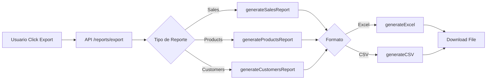
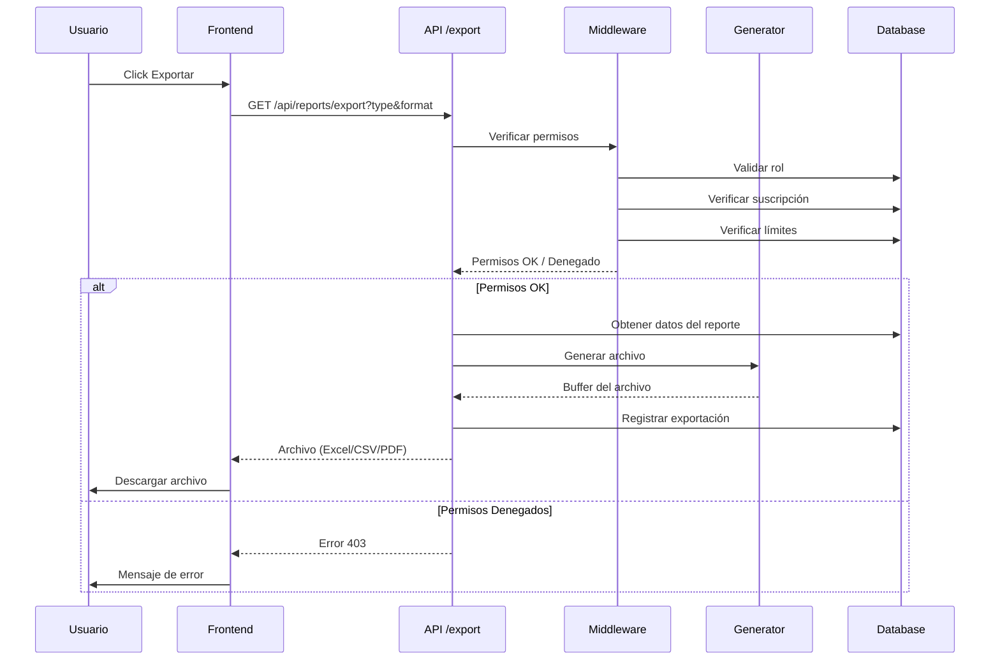

# 📊 Plan de Implementación: Exportación de Reportes
## Sistema CRTLPyme - Análisis Completo y Propuesta de Solución

**Fecha:** 21 de Noviembre, 2025  
**Versión:** 1.0  
**Estado:** Pendiente de Aprobación

---

## 📋 Tabla de Contenidos

1. [Resumen Ejecutivo](#resumen-ejecutivo)
2. [Análisis del Sistema Actual](#análisis-del-sistema-actual)
3. [Sistema de Suscripciones](#sistema-de-suscripciones)
4. [Inventario de Reportes](#inventario-de-reportes)
5. [Estado Actual de Exportación](#estado-actual-de-exportación)
6. [Bugs y Problemas Identificados](#bugs-y-problemas-identificados)
7. [Propuesta de Solución](#propuesta-de-solución)
8. [Arquitectura Técnica](#arquitectura-técnica)
9. [Plan de Implementación](#plan-de-implementación)
10. [Estimación de Tiempo](#estimación-de-tiempo)
11. [Riesgos y Mitigaciones](#riesgos-y-mitigaciones)
12. [Recomendaciones Adicionales](#recomendaciones-adicionales)

---

## 🎯 Resumen Ejecutivo

### Objetivo
Completar y mejorar el sistema de exportación de reportes del sistema CRTLPyme, añadiendo soporte para PDF y resolviendo problemas existentes.

### Hallazgos Clave
- ✅ **Exportación Excel/CSV**: Ya implementada y funcional
- ⚠️ **Exportación PDF**: Librería instalada pero no implementada
- 🐛 **Bug Crítico**: Modelo `Customer` no existe en schema pero es usado en API de reportes
- ✅ **Control de Acceso**: Sistema de permisos por rol bien implementado
- ⚠️ **Límites por Plan**: Sistema implementado pero no aplicado a exportaciones

### Recomendación
Se requiere:
1. **Prioridad CRÍTICA**: Resolver el bug del modelo Customer
2. **Prioridad ALTA**: Implementar exportación a PDF
3. **Prioridad MEDIA**: Añadir restricciones de exportación por tipo de plan

---

## 🔍 Análisis del Sistema Actual

### 1. Sistema de Suscripciones

#### 1.1 Tipos de Planes
El sistema utiliza el enum `PlanType` con tres niveles:

```typescript
enum PlanType {
  BASIC      // Plan básico
  PRO        // Plan profesional
  ENTERPRISE // Plan empresarial
}
```

#### 1.2 Estados de Cuenta

```typescript
enum AccountStatus {
  ACTIVE     // Cuenta activa
  TRIAL      // En período de prueba
  SUSPENDED  // Suspendida (por falta de pago)
  BLOCKED    // Bloqueada (por administrador)
  CANCELLED  // Cancelada (por usuario)
}
```

#### 1.3 Límites por Plan

El modelo `SubscriptionPlan` incluye los siguientes límites:

| Campo | Tipo | Descripción |
|-------|------|-------------|
| `maxUsers` | Int? | Máximo de usuarios permitidos |
| `maxProducts` | Int? | Máximo de productos en inventario |
| `maxSales` | Int? | Máximo de ventas por mes |

**Nota Importante**: Los límites son opcionales (pueden ser `null`), lo que implica "ilimitado" para ese plan.

#### 1.4 Sistema de Permisos por Rol

```typescript
enum UserRole {
  PROVEEDOR   // Administrador SaaS (acceso total)
  ADMIN       // Administrador Cliente (acceso completo a su tenant)
  CAJA        // Operador punto de venta
  INVENTARIO  // Encargado de stock
  SOPORTE     // Soporte técnico
}
```

**Permisos de Acceso a Reportes:**

| Reporte | PROVEEDOR | ADMIN | INVENTARIO | CAJA | SOPORTE |
|---------|-----------|-------|------------|------|---------|
| Ventas | ✅ | ✅ | ❌ | ❌ | ❌ |
| Productos | ✅ | ✅ | ✅ | ❌ | ❌ |
| Clientes | ✅ | ✅ | ❌ | ❌ | ❌ |

---

## 📊 Inventario de Reportes

### 2.1 Reporte de Ventas

**Ubicación:**
- Frontend: `/app/admin/reports/sales/page.tsx`
- API: `/app/api/reports/sales/route.ts`

**Descripción**: Análisis completo del rendimiento de ventas del negocio.

**Datos Mostrados:**
- Resumen general (total ventas, ingresos, ticket promedio, margen utilidad)
- Ventas por período (día/semana/mes)
- Ventas por método de pago (efectivo, débito, crédito, transferencia)
- Ventas por cajero
- Top 10 productos más vendidos

**Filtros Disponibles:**
- Fecha inicio
- Fecha fin
- Agrupar por (día/semana/mes)

**Visualizaciones:**
- Gráfico de barras: Ventas por período
- Gráfico de torta: Distribución por método de pago
- Tabla: Top productos

**Exportación:**
- ✅ Excel (implementado)
- ✅ CSV (implementado)
- ❌ PDF (no implementado)

---

### 2.2 Reporte de Productos

**Ubicación:**
- Frontend: `/app/admin/reports/products/page.tsx`
- API: `/app/api/reports/products/route.ts`

**Descripción**: Análisis del inventario y rendimiento de productos.

**Datos Mostrados:**
- Resumen general (total productos, valor inventario, productos sin stock, stock bajo)
- Lista completa de productos con: SKU, nombre, categoría, stock actual, stock mínimo, precios, margen, ventas totales
- Productos por categoría
- Top 10 productos más vendidos
- Productos con mayor margen de utilidad

**Filtros Disponibles:**
- Solo productos con stock bajo
- Por categoría

**Visualizaciones:**
- Gráfico de torta: Productos por categoría
- Gráfico de barras: Valor por categoría
- Tabla: Top productos

**Exportación:**
- ✅ Excel (implementado)
- ✅ CSV (implementado)
- ❌ PDF (no implementado)

---

### 2.3 Reporte de Clientes

**Ubicación:**
- Frontend: `/app/admin/reports/customers/page.tsx`
- API: `/app/api/reports/customers/route.ts`

**Descripción**: Análisis del comportamiento de compra de clientes.

**⚠️ ESTADO: NO FUNCIONAL** (ver sección de Bugs)

**Datos Esperados:**
- Resumen general (total clientes, clientes activos, ingresos, valor promedio por cliente)
- Lista de clientes con: nombre, email, teléfono, RUT, total compras, monto gastado, última compra
- Segmentación por valor (VIP, Regular, Ocasional, Nuevo)
- Clientes en riesgo (sin compras en 60+ días)
- Top 10 mejores clientes

**Filtros Disponibles:**
- Mínimo de compras

**Visualizaciones:**
- Gráfico de torta: Segmentación de clientes
- Gráfico de barras: Ingresos por segmento
- Tabla: Top clientes

**Exportación:**
- ⚠️ Excel (implementado pero no funcional)
- ⚠️ CSV (implementado pero no funcional)
- ❌ PDF (no implementado)

---

## ✅ Estado Actual de Exportación

### 3.1 Implementación Existente

#### Librería de Exportación

**Ubicación:** `/lib/report-generator.ts`

**Características:**

```typescript
interface ReportData {
  title: string;
  headers: string[];
  rows: any[][];
  summary?: { [key: string]: any };
}
```

**Funciones Disponibles:**
- `generateExcel(data: ReportData): Buffer` - Genera archivo Excel (.xlsx)
- `generateCSV(data: ReportData): string` - Genera archivo CSV
- `formatCurrency(amount: number): string` - Formato moneda chilena
- `formatDate(date: Date | string): string` - Formato fecha chilena
- `formatPercentage(value: number): string` - Formato porcentaje

**Librería Utilizada:**
- **Excel/CSV**: `xlsx` v0.18.5 ✅ (instalada y funcional)

#### API de Exportación

**Ubicación:** `/app/api/reports/export/route.ts`

**Endpoint:** `GET /api/reports/export`

**Parámetros:**
- `type`: Tipo de reporte (sales, products, customers)
- `format`: Formato de exportación (excel, csv)
- `startDate`: Fecha inicio (para ventas)
- `endDate`: Fecha fin (para ventas)

**Flujo Actual:**



**Verificación de Permisos:**
- ✅ Solo roles ADMIN y PROVEEDOR pueden exportar
- ✅ Verificación de tenantId
- ❌ No hay límites por tipo de plan

### 3.2 Componentes Frontend

Todos los reportes tienen botones de exportación:

```tsx
<Button onClick={() => handleExport('excel')}>
  <Download className="mr-2 h-4 w-4" />
  Descargar Excel
</Button>
<Button variant="outline" onClick={() => handleExport('csv')}>
  <Download className="mr-2 h-4 w-4" />
  Descargar CSV
</Button>
```

**Funcionalidad:**
- ✅ Descarga automática del archivo
- ✅ Nombre de archivo con timestamp
- ✅ Manejo de errores con alertas
- ✅ Respeta filtros aplicados (fechas, categorías, etc.)

---

## 🐛 Bugs y Problemas Identificados

### 4.1 Bug Crítico: Modelo Customer No Existe

**Severidad:** 🔴 CRÍTICA

**Descripción:**
El reporte de clientes y su API intentan acceder a un modelo `Customer` que **NO EXISTE** en el schema de Prisma.

**Código Afectado:**

```typescript
// /app/api/reports/customers/route.ts (línea 44)
const customers = await prisma.customer.findMany({
  where: {
    tenantId,
    isActive: true,
  },
  // ...
});

// /app/api/reports/export/route.ts (línea 253)
const customers = await prisma.customer.findMany({
  // ...
});
```

**Evidencia del Schema:**
```bash
$ grep "model Customer" /home/ubuntu/CRTLPyme/prisma/schema.prisma
# No se encontró ningún resultado
```

**Impacto:**
- ❌ El reporte de clientes NO FUNCIONA (error 500)
- ❌ La exportación de clientes NO FUNCIONA
- ❌ Toda funcionalidad relacionada con customers falla

**Solución Requerida:**
1. Crear el modelo `Customer` en el schema de Prisma
2. Ejecutar migración de base de datos
3. Verificar funcionalidad del reporte

**Modelo Customer Propuesto:**

```prisma
model Customer {
  id        String   @id @default(cuid())
  firstName String
  lastName  String
  email     String?
  phone     String?
  rut       String?  @unique
  address   String?
  isActive  Boolean  @default(true)
  tenantId  String
  createdAt DateTime @default(now())
  updatedAt DateTime @updatedAt

  // Relations
  tenant Tenant @relation(fields: [tenantId], references: [id], onDelete: Cascade)
  sales  Sale[]

  @@unique([tenantId, rut])
  @@index([tenantId])
  @@index([tenantId, email])
  @@map("customers")
}
```

---

### 4.2 Problema: PDF No Implementado

**Severidad:** 🟡 MEDIA

**Descripción:**
La librería jsPDF está instalada pero no se utiliza en ninguna parte del código.

**Librerías Instaladas:**
```json
{
  "jspdf": "^3.0.3",
  "jspdf-autotable": "^5.0.2"
}
```

**Estado:** No implementada

---

### 4.3 Problema: Sin Restricciones de Exportación por Plan

**Severidad:** 🟡 MEDIA

**Descripción:**
El sistema tiene límites definidos en los planes de suscripción, pero NO se aplican a las exportaciones.

**Situación Actual:**
- Todos los planes pueden exportar sin límites
- No hay diferenciación entre BASIC, PRO y ENTERPRISE para exportaciones
- No hay registro de cuántas exportaciones ha hecho un tenant

**Posibles Restricciones a Implementar:**

| Plan | Exportaciones/Mes | Formatos Disponibles | Histórico |
|------|-------------------|----------------------|-----------|
| BASIC | 10 | CSV | 3 meses |
| PRO | 50 | CSV, Excel | 12 meses |
| ENTERPRISE | Ilimitado | CSV, Excel, PDF | Ilimitado |

---

## 💡 Propuesta de Solución

### 5.1 Fase 1: Resolver Bug Crítico (PRIORIDAD ALTA)

**Objetivo:** Hacer funcional el reporte de clientes

**Tareas:**
1. Crear modelo Customer en schema.prisma
2. Generar y aplicar migración
3. Actualizar relaciones en el modelo Sale
4. Crear seeds para datos de prueba
5. Verificar funcionalidad de reportes y exportación

**Entregable:** Reporte de clientes 100% funcional

---

### 5.2 Fase 2: Implementar Exportación a PDF (PRIORIDAD ALTA)

**Objetivo:** Añadir soporte completo para exportación a PDF

**Tecnologías:**
- **jsPDF** v3.0.3 (ya instalada)
- **jspdf-autotable** v5.0.2 (ya instalada)

**Características del PDF:**

#### 5.2.1 Diseño Propuesto

```
┌─────────────────────────────────────────────────────┐
│  [LOGO]         CRTLPyme                           │
│                                                     │
│  REPORTE DE VENTAS                                 │
│  Período: 01/11/2025 - 30/11/2025                │
│                                                     │
│  ┌─────────────────────────────────────────────┐  │
│  │ RESUMEN                                      │  │
│  │ • Total Ventas: 150                         │  │
│  │ • Ingresos: $1,500,000                      │  │
│  │ • Ticket Promedio: $10,000                  │  │
│  └─────────────────────────────────────────────┘  │
│                                                     │
│  DETALLE DE VENTAS                                 │
│  ┌──────┬──────────┬─────────┬──────────────┐    │
│  │ N°   │ Fecha    │ Cajero  │ Total        │    │
│  ├──────┼──────────┼─────────┼──────────────┤    │
│  │ V001 │ 01/11    │ Juan P. │ $15,000      │    │
│  │ V002 │ 01/11    │ María G.│ $8,500       │    │
│  └──────┴──────────┴─────────┴──────────────┘    │
│                                                     │
│  ────────────────────────────────────────────────  │
│  Página 1 de 3                                     │
│  Generado: 21/11/2025 14:30                       │
└─────────────────────────────────────────────────────┘
```

#### 5.2.2 Elementos del PDF

1. **Header**
   - Logo de CRTLPyme
   - Título del reporte
   - Período/Filtros aplicados
   - Fecha de generación

2. **Resumen**
   - Métricas clave en cuadro destacado
   - Formato de moneda chilena
   - Íconos visuales (opcional)

3. **Tablas de Datos**
   - Headers con background color
   - Alternancia de colores en filas
   - Bordes y padding apropiados
   - Formateo de números y fechas

4. **Gráficos** (Opcional - Fase 3)
   - Exportar gráficos de recharts como imágenes
   - Incluir en PDF

5. **Footer**
   - Número de página
   - Fecha y hora de generación
   - Información de contacto

#### 5.2.3 Implementación Técnica

**Archivo nuevo:** `/lib/pdf-generator.ts`

```typescript
import jsPDF from 'jspdf';
import autoTable from 'jspdf-autotable';
import { ReportData } from './report-generator';

export interface PDFOptions {
  title: string;
  subtitle?: string;
  orientation?: 'portrait' | 'landscape';
  includeCharts?: boolean;
}

export function generatePDF(
  data: ReportData, 
  options: PDFOptions
): Buffer {
  // Crear documento PDF
  const doc = new jsPDF({
    orientation: options.orientation || 'portrait',
    unit: 'mm',
    format: 'a4',
  });

  // Añadir header
  addHeader(doc, options.title, options.subtitle);

  // Añadir resumen
  if (data.summary) {
    addSummary(doc, data.summary);
  }

  // Añadir tabla de datos
  autoTable(doc, {
    head: [data.headers],
    body: data.rows,
    startY: 70,
    styles: {
      fontSize: 8,
      cellPadding: 2,
    },
    headStyles: {
      fillColor: [41, 128, 185],
      textColor: 255,
      fontStyle: 'bold',
    },
    alternateRowStyles: {
      fillColor: [245, 245, 245],
    },
  });

  // Añadir footer
  addFooter(doc);

  // Convertir a buffer
  return Buffer.from(doc.output('arraybuffer'));
}

function addHeader(
  doc: jsPDF, 
  title: string, 
  subtitle?: string
): void {
  // Logo (si existe)
  // doc.addImage(logo, 'PNG', 15, 10, 30, 15);

  // Título
  doc.setFontSize(18);
  doc.setTextColor(41, 128, 185);
  doc.text(title, 105, 20, { align: 'center' });

  // Subtítulo
  if (subtitle) {
    doc.setFontSize(10);
    doc.setTextColor(100);
    doc.text(subtitle, 105, 28, { align: 'center' });
  }

  // Línea separadora
  doc.setDrawColor(200);
  doc.line(15, 32, 195, 32);
}

function addSummary(
  doc: jsPDF, 
  summary: { [key: string]: any }
): void {
  doc.setFontSize(12);
  doc.setTextColor(0);
  doc.text('Resumen', 15, 42);

  let y = 50;
  Object.entries(summary).forEach(([key, value]) => {
    doc.setFontSize(9);
    doc.text(`${key}: ${value}`, 20, y);
    y += 6;
  });
}

function addFooter(doc: jsPDF): void {
  const pageCount = doc.getNumberOfPages();
  
  for (let i = 1; i <= pageCount; i++) {
    doc.setPage(i);
    doc.setFontSize(8);
    doc.setTextColor(150);
    
    // Número de página
    doc.text(
      `Página ${i} de ${pageCount}`,
      105,
      287,
      { align: 'center' }
    );
    
    // Fecha de generación
    const now = new Date().toLocaleString('es-CL');
    doc.text(
      `Generado: ${now}`,
      195,
      287,
      { align: 'right' }
    );
  }
}
```

**Actualizar:** `/app/api/reports/export/route.ts`

```typescript
import { generatePDF } from '@/lib/pdf-generator';

// ... en el switch de formato

else if (format === 'pdf') {
  fileBuffer = generatePDF(reportData, {
    title: reportData.title,
    subtitle: `Período: ${startDate} - ${endDate}`,
    orientation: reportType === 'sales' ? 'landscape' : 'portrait',
  });
  contentType = 'application/pdf';
  filename += '.pdf';
}
```

**Actualizar Frontend:** Añadir botón de PDF

```tsx
<Button variant="secondary" onClick={() => handleExport('pdf')}>
  <Download className="mr-2 h-4 w-4" />
  Descargar PDF
</Button>
```

---

### 5.3 Fase 3: Restricciones por Plan (PRIORIDAD MEDIA)

**Objetivo:** Diferenciar capacidades de exportación según plan

#### 5.3.1 Nuevo Modelo: ExportLog

```prisma
model ExportLog {
  id         String   @id @default(cuid())
  tenantId   String
  userId     String
  reportType String   // sales, products, customers
  format     String   // excel, csv, pdf
  createdAt  DateTime @default(now())

  // Relations
  tenant Tenant @relation(fields: [tenantId], references: [id], onDelete: Cascade)
  user   User   @relation(fields: [userId], references: [id])

  @@index([tenantId, createdAt])
  @@index([userId])
  @@map("export_logs")
}
```

#### 5.3.2 Límites por Plan

**Actualizar:** `/lib/subscription-middleware.ts`

```typescript
export interface ExportLimits {
  maxExportsPerMonth: number | null; // null = ilimitado
  allowedFormats: ('csv' | 'excel' | 'pdf')[];
  historicalDataMonths: number | null; // null = ilimitado
}

export function getExportLimits(planType: PlanType): ExportLimits {
  switch (planType) {
    case 'BASIC':
      return {
        maxExportsPerMonth: 10,
        allowedFormats: ['csv'],
        historicalDataMonths: 3,
      };
    case 'PRO':
      return {
        maxExportsPerMonth: 50,
        allowedFormats: ['csv', 'excel'],
        historicalDataMonths: 12,
      };
    case 'ENTERPRISE':
      return {
        maxExportsPerMonth: null,
        allowedFormats: ['csv', 'excel', 'pdf'],
        historicalDataMonths: null,
      };
    default:
      return {
        maxExportsPerMonth: 0,
        allowedFormats: [],
        historicalDataMonths: 1,
      };
  }
}

export async function canExportReport(
  tenantId: string,
  format: 'csv' | 'excel' | 'pdf'
): Promise<{ allowed: boolean; message?: string }> {
  // Obtener plan del tenant
  const tenant = await prisma.tenant.findUnique({
    where: { id: tenantId },
  });

  if (!tenant) {
    return { allowed: false, message: 'Tenant no encontrado' };
  }

  // Obtener límites del plan
  const limits = getExportLimits(tenant.planType);

  // Verificar formato permitido
  if (!limits.allowedFormats.includes(format)) {
    return {
      allowed: false,
      message: `El formato ${format.toUpperCase()} no está disponible en su plan. Por favor, actualice a un plan superior.`,
    };
  }

  // Verificar cantidad de exportaciones del mes
  if (limits.maxExportsPerMonth !== null) {
    const startOfMonth = new Date();
    startOfMonth.setDate(1);
    startOfMonth.setHours(0, 0, 0, 0);

    const exportCount = await prisma.exportLog.count({
      where: {
        tenantId,
        createdAt: { gte: startOfMonth },
      },
    });

    if (exportCount >= limits.maxExportsPerMonth) {
      return {
        allowed: false,
        message: `Ha alcanzado el límite de ${limits.maxExportsPerMonth} exportaciones mensuales. Por favor, actualice su plan.`,
      };
    }
  }

  return { allowed: true };
}
```

#### 5.3.3 Actualizar API de Exportación

```typescript
// En /app/api/reports/export/route.ts

// Verificar límites de exportación
const exportCheck = await canExportReport(tenantId, format as any);
if (!exportCheck.allowed) {
  return NextResponse.json(
    { error: exportCheck.message },
    { status: 403 }
  );
}

// ... realizar exportación ...

// Registrar la exportación
await prisma.exportLog.create({
  data: {
    tenantId,
    userId: session.user.id,
    reportType,
    format,
  },
});
```

#### 5.3.4 UI: Mostrar Límites

**Nuevo componente:** `/components/admin/ExportLimitsBadge.tsx`

```tsx
'use client';

import { useEffect, useState } from 'react';
import { Badge } from '@/components/ui/badge';
import { Alert, AlertDescription } from '@/components/ui/alert';

interface ExportLimitsInfo {
  current: number;
  limit: number | null;
  allowedFormats: string[];
}

export function ExportLimitsBadge() {
  const [limits, setLimits] = useState<ExportLimitsInfo | null>(null);

  useEffect(() => {
    fetch('/api/exports/limits')
      .then(res => res.json())
      .then(setLimits);
  }, []);

  if (!limits) return null;

  const isNearLimit = limits.limit && limits.current >= limits.limit * 0.8;

  return (
    <div className="mb-4">
      <div className="flex items-center gap-2 mb-2">
        <span className="text-sm text-gray-600">Exportaciones este mes:</span>
        <Badge variant={isNearLimit ? 'destructive' : 'secondary'}>
          {limits.current} / {limits.limit || '∞'}
        </Badge>
      </div>
      
      <div className="flex items-center gap-2">
        <span className="text-sm text-gray-600">Formatos disponibles:</span>
        {limits.allowedFormats.map(format => (
          <Badge key={format} variant="outline">
            {format.toUpperCase()}
          </Badge>
        ))}
      </div>

      {isNearLimit && (
        <Alert className="mt-2">
          <AlertDescription>
            Está cerca del límite de exportaciones. 
            <a href="/subscriptions/upgrade" className="underline ml-1">
              Actualice su plan
            </a>
          </AlertDescription>
        </Alert>
      )}
    </div>
  );
}
```

---

## 🏗️ Arquitectura Técnica

### 6.1 Diagrama de Flujo Completo



### 6.2 Estructura de Archivos

```
CRTLPyme/
├── app/
│   ├── admin/
│   │   └── reports/
│   │       ├── page.tsx                 # Lista de reportes
│   │       ├── sales/page.tsx           # Reporte ventas
│   │       ├── products/page.tsx        # Reporte productos
│   │       └── customers/page.tsx       # Reporte clientes
│   │
│   └── api/
│       ├── reports/
│       │   ├── sales/route.ts           # API datos ventas
│       │   ├── products/route.ts        # API datos productos
│       │   ├── customers/route.ts       # API datos clientes
│       │   └── export/route.ts          # API exportación
│       │
│       └── exports/
│           └── limits/route.ts          # API límites (NUEVO)
│
├── lib/
│   ├── report-generator.ts              # Generador Excel/CSV (EXISTENTE)
│   ├── pdf-generator.ts                 # Generador PDF (NUEVO)
│   ├── subscription-middleware.ts       # Middleware (ACTUALIZAR)
│   └── db.ts
│
├── components/
│   └── admin/
│       └── ExportLimitsBadge.tsx        # Componente límites (NUEVO)
│
└── prisma/
    └── schema.prisma                     # Schema (ACTUALIZAR)
```

---

## 📅 Plan de Implementación

### Fase 1: Bug Fix - Modelo Customer (1-2 días)

#### Día 1: Modelado y Migración

**Tareas:**
1. ✅ Añadir modelo `Customer` al schema.prisma
2. ✅ Actualizar modelo `Sale` para incluir relación con Customer
3. ✅ Generar migración de Prisma
4. ✅ Aplicar migración en desarrollo
5. ✅ Verificar integridad de la base de datos

**Comandos:**
```bash
# 1. Editar schema.prisma (añadir modelo Customer)

# 2. Generar migración
npx prisma migrate dev --name add_customer_model

# 3. Verificar
npx prisma studio
```

#### Día 2: Testing y Validación

**Tareas:**
1. ✅ Crear seed de datos de prueba para customers
2. ✅ Probar API de reportes de clientes
3. ✅ Probar exportación de clientes (Excel/CSV)
4. ✅ Verificar UI del reporte
5. ✅ Documentar cambios

**Pruebas:**
```bash
# Ejecutar seed
npm run seed

# Probar API
curl http://localhost:3000/api/reports/customers

# Probar exportación
curl http://localhost:3000/api/reports/export?type=customers&format=excel
```

**Criterios de Aceptación:**
- [ ] Modelo Customer existe en DB
- [ ] API de clientes devuelve datos sin errores
- [ ] Exportación Excel funciona
- [ ] Exportación CSV funciona
- [ ] UI muestra datos correctamente

---

### Fase 2: Exportación PDF (2-3 días)

#### Día 1: Implementación Base

**Tareas:**
1. ✅ Crear archivo `/lib/pdf-generator.ts`
2. ✅ Implementar función `generatePDF()`
3. ✅ Implementar funciones auxiliares:
   - `addHeader()`
   - `addSummary()`
   - `addFooter()`
4. ✅ Implementar formateo de tablas con autoTable
5. ✅ Probar generación básica de PDF

**Código de Prueba:**
```typescript
// test-pdf.ts
import { generatePDF } from './lib/pdf-generator';

const testData = {
  title: 'Reporte de Prueba',
  headers: ['Nombre', 'Cantidad', 'Precio'],
  rows: [
    ['Producto A', '10', '$5,000'],
    ['Producto B', '5', '$10,000'],
  ],
  summary: {
    'Total Items': 15,
    'Total Value': '$15,000',
  },
};

const pdf = generatePDF(testData, {
  title: 'Test Report',
  orientation: 'portrait',
});

// Guardar para inspección
require('fs').writeFileSync('test-report.pdf', pdf);
```

#### Día 2: Integración con API

**Tareas:**
1. ✅ Actualizar `/app/api/reports/export/route.ts`
2. ✅ Añadir caso 'pdf' en el switch de formato
3. ✅ Adaptar datos de cada reporte para PDF
4. ✅ Probar exportación PDF de ventas
5. ✅ Probar exportación PDF de productos
6. ✅ Probar exportación PDF de clientes

**Pruebas:**
```bash
# Probar cada reporte
curl "http://localhost:3000/api/reports/export?type=sales&format=pdf&startDate=2025-11-01&endDate=2025-11-30" --output ventas.pdf

curl "http://localhost:3000/api/reports/export?type=products&format=pdf" --output productos.pdf

curl "http://localhost:3000/api/reports/export?type=customers&format=pdf" --output clientes.pdf
```

#### Día 3: UI y Testing

**Tareas:**
1. ✅ Añadir botón "Descargar PDF" en cada reporte
2. ✅ Añadir manejo de errores específicos para PDF
3. ✅ Mejorar diseño de PDFs (colores, tipografía)
4. ✅ Añadir logo si está disponible
5. ✅ Testing en diferentes navegadores
6. ✅ Documentar uso de PDFs

**Criterios de Aceptación:**
- [ ] PDF se genera sin errores
- [ ] Formato es profesional y legible
- [ ] Tablas tienen paginación correcta
- [ ] Footer con número de página funciona
- [ ] Descarga automática en navegador funciona
- [ ] PDFs se abren correctamente en lectores PDF

---

### Fase 3: Restricciones por Plan (2-3 días)

#### Día 1: Modelado y Base de Datos

**Tareas:**
1. ✅ Añadir modelo `ExportLog` al schema.prisma
2. ✅ Añadir relación en modelos Tenant y User
3. ✅ Generar y aplicar migración
4. ✅ Crear funciones en subscription-middleware:
   - `getExportLimits()`
   - `canExportReport()`
5. ✅ Probar lógica de límites

**Migración:**
```bash
npx prisma migrate dev --name add_export_log
```

#### Día 2: Integración en API

**Tareas:**
1. ✅ Actualizar API `/api/reports/export/route.ts`
2. ✅ Añadir verificación de límites antes de exportar
3. ✅ Registrar exportación en ExportLog
4. ✅ Crear API `/api/exports/limits/route.ts`
5. ✅ Probar límites con diferentes planes

**Tests:**
```typescript
// Simular tenant con plan BASIC
// - Intentar exportar 11 veces (debería fallar la 11)
// - Intentar exportar PDF (debería fallar)

// Simular tenant con plan PRO
// - Intentar exportar PDF (debería fallar)
// - Intentar exportar Excel (debería funcionar)

// Simular tenant con plan ENTERPRISE
// - Todo debería funcionar sin límites
```

#### Día 3: UI y Experiencia de Usuario

**Tareas:**
1. ✅ Crear componente `ExportLimitsBadge`
2. ✅ Añadir componente a cada página de reporte
3. ✅ Deshabilitar botones de formatos no permitidos
4. ✅ Mostrar tooltips explicativos
5. ✅ Añadir enlace a página de upgrade
6. ✅ Testing de flujo completo

**Ejemplo de UI:**
```tsx
<div className="export-section">
  <ExportLimitsBadge />
  
  <div className="export-buttons">
    <Button 
      onClick={() => handleExport('csv')}
      disabled={!allowedFormats.includes('csv')}
    >
      Descargar CSV
    </Button>
    
    <Button 
      onClick={() => handleExport('excel')}
      disabled={!allowedFormats.includes('excel')}
      title={!allowedFormats.includes('excel') 
        ? 'Disponible en plan PRO o superior'
        : ''
      }
    >
      Descargar Excel
    </Button>
    
    <Button 
      onClick={() => handleExport('pdf')}
      disabled={!allowedFormats.includes('pdf')}
      title={!allowedFormats.includes('pdf') 
        ? 'Disponible en plan ENTERPRISE'
        : ''
      }
    >
      Descargar PDF
    </Button>
  </div>
</div>
```

**Criterios de Aceptación:**
- [ ] Límites se aplican correctamente por plan
- [ ] Mensajes de error son claros y accionables
- [ ] UI muestra claramente qué está disponible
- [ ] Contador de exportaciones se actualiza en tiempo real
- [ ] Botones no permitidos están deshabilitados
- [ ] Tooltips explican por qué algo no está disponible

---

### Fase 4: Optimizaciones y Mejoras (Opcional - 1-2 días)

#### Mejoras de Performance

**Tareas:**
1. ✅ Implementar caché de reportes frecuentes
2. ✅ Añadir paginación para reportes grandes
3. ✅ Optimizar queries de base de datos
4. ✅ Comprimir archivos exportados grandes

#### Mejoras de UX

**Tareas:**
1. ✅ Añadir preview de PDF antes de descargar
2. ✅ Añadir opción de enviar reporte por email
3. ✅ Añadir programación de reportes automáticos
4. ✅ Añadir templates personalizables

#### Mejoras Visuales

**Tareas:**
1. ✅ Añadir gráficos a PDFs (convertir charts de recharts)
2. ✅ Mejorar diseño de tablas en PDFs
3. ✅ Añadir marca de agua opcional
4. ✅ Añadir firma digital (para Enterprise)

---

## ⏱️ Estimación de Tiempo

### Resumen por Fase

| Fase | Descripción | Tiempo Estimado | Prioridad |
|------|-------------|-----------------|-----------|
| **Fase 1** | Bug Fix - Modelo Customer | 1-2 días | 🔴 CRÍTICA |
| **Fase 2** | Exportación PDF | 2-3 días | 🔴 ALTA |
| **Fase 3** | Restricciones por Plan | 2-3 días | 🟡 MEDIA |
| **Fase 4** | Optimizaciones (Opcional) | 1-2 días | 🟢 BAJA |
| **Total** | | **6-10 días** | |

### Distribución de Horas

```
Fase 1: Bug Fix (8-16 hrs)
├── Modelado y migración: 4-6 hrs
├── Seeds y datos prueba: 2-4 hrs
└── Testing: 2-6 hrs

Fase 2: PDF (16-24 hrs)
├── Implementación base: 6-8 hrs
├── Integración API: 4-6 hrs
├── UI y testing: 4-6 hrs
└── Refinamiento diseño: 2-4 hrs

Fase 3: Restricciones (16-24 hrs)
├── Modelado y BD: 4-6 hrs
├── Lógica middleware: 4-6 hrs
├── Integración API: 4-6 hrs
└── UI y UX: 4-6 hrs

Fase 4: Optimizaciones (8-16 hrs)
├── Performance: 3-5 hrs
├── UX: 3-5 hrs
└── Visual: 2-6 hrs
```

### Cronograma Recomendado

**Semana 1:**
- Días 1-2: Fase 1 completa (Bug Fix)
- Días 3-5: Fase 2 completa (PDF)

**Semana 2:**
- Días 1-3: Fase 3 completa (Restricciones)
- Días 4-5: Fase 4 parcial (Optimizaciones prioritarias)

---

## ⚠️ Riesgos y Mitigaciones

### Riesgo 1: Modelo Customer en Producción

**Descripción:** Al añadir el modelo Customer, puede haber inconsistencias con datos existentes.

**Probabilidad:** MEDIA  
**Impacto:** ALTO

**Mitigación:**
1. Crear migración con valores por defecto
2. Script de migración de datos existentes si aplica
3. Backup completo antes de migrar producción
4. Probar migración en staging primero

**Plan de Rollback:**
```sql
-- Revertir migración si hay problemas
DROP TABLE IF EXISTS customers CASCADE;
-- Restaurar backup
pg_restore --dbname=crtlpyme backup.dump
```

---

### Riesgo 2: Tamaño de Archivos PDF

**Descripción:** PDFs con muchos datos pueden ser muy pesados o fallar al generar.

**Probabilidad:** MEDIA  
**Impacto:** MEDIO

**Mitigación:**
1. Implementar límite máximo de filas por PDF (ej: 1000)
2. Paginación automática en PDFs
3. Opción de dividir en múltiples archivos
4. Mostrar advertencia si hay muchos datos

**Código:**
```typescript
const MAX_ROWS_PDF = 1000;

if (data.rows.length > MAX_ROWS_PDF) {
  return NextResponse.json({
    error: `El reporte tiene ${data.rows.length} filas. El límite para PDF es ${MAX_ROWS_PDF}. Use Excel o CSV para reportes grandes.`,
  }, { status: 400 });
}
```

---

### Riesgo 3: Límites Muy Restrictivos

**Descripción:** Usuarios pueden quejarse de límites de exportación.

**Probabilidad:** ALTA  
**Impacto:** BAJO

**Mitigación:**
1. Comunicar límites claramente en UI
2. Ofrecer opciones de upgrade prominentes
3. Permitir compra de packs de exportaciones adicionales
4. Monitorear feedback y ajustar límites

**Estrategia de Comunicación:**
- Email a usuarios cuando se acerquen al límite (80%)
- Banner en UI al llegar a 90% del límite
- Notificación in-app al alcanzar el límite
- CTA claro para upgrade

---

### Riesgo 4: Rendimiento en Reportes Grandes

**Descripción:** Reportes con miles de registros pueden ser lentos.

**Probabilidad:** MEDIA  
**Impacto:** MEDIO

**Mitigación:**
1. Implementar caché de reportes
2. Procesar exportaciones en background (jobs)
3. Notificar al usuario cuando esté listo
4. Optimizar queries con índices apropiados

**Solución de Background Jobs:**
```typescript
// Crear job de exportación
const job = await prisma.exportJob.create({
  data: {
    tenantId,
    userId,
    reportType,
    format,
    status: 'PENDING',
    filters: JSON.stringify(filters),
  },
});

// Procesar en worker
processExportJob(job.id);

// Notificar cuando esté listo
sendEmailWithLink(user.email, downloadUrl);
```

---

### Riesgo 5: Compatibilidad de PDFs

**Descripción:** PDFs pueden verse diferentes en distintos lectores.

**Probabilidad:** BAJA  
**Impacto:** BAJO

**Mitigación:**
1. Probar en múltiples lectores (Adobe, Chrome, Firefox, Edge)
2. Usar fuentes estándar (no custom)
3. Evitar características avanzadas no soportadas
4. Generar PDFs según estándar PDF/A

**Testing Checklist:**
- [ ] Adobe Acrobat Reader
- [ ] Chrome PDF Viewer
- [ ] Firefox PDF Viewer
- [ ] Safari Preview
- [ ] Edge PDF Viewer
- [ ] Mobile devices (iOS/Android)

---

## 💡 Recomendaciones Adicionales

### 1. Analítica de Exportaciones

Implementar tracking de exportaciones para entender uso:

```typescript
// Eventos a trackear
interface ExportAnalytics {
  reportType: string;
  format: string;
  duration: number; // ms
  rowCount: number;
  fileSize: number; // bytes
  planType: string;
  timestamp: Date;
}

// Usar para:
// - Identificar reportes más populares
// - Optimizar formatos más usados
// - Ajustar límites por plan
// - Detectar problemas de rendimiento
```

---

### 2. Histórico de Exportaciones

Permitir a usuarios ver y re-descargar exportaciones anteriores:

```prisma
model ExportArchive {
  id         String   @id @default(cuid())
  tenantId   String
  userId     String
  reportType String
  format     String
  filename   String
  fileUrl    String   // S3 o storage local
  filters    Json?
  expiresAt  DateTime // Auto-delete después de X días
  createdAt  DateTime @default(now())

  tenant Tenant @relation(...)
  user   User   @relation(...)

  @@map("export_archives")
}
```

**UI:**
```tsx
<Card>
  <CardHeader>
    <CardTitle>Exportaciones Recientes</CardTitle>
  </CardHeader>
  <CardContent>
    {archives.map(archive => (
      <div key={archive.id} className="flex justify-between items-center">
        <div>
          <p className="font-medium">{archive.reportType}</p>
          <p className="text-sm text-gray-500">
            {format(archive.createdAt, 'PPP')}
          </p>
        </div>
        <Button size="sm" onClick={() => download(archive.fileUrl)}>
          Re-descargar
        </Button>
      </div>
    ))}
  </CardContent>
</Card>
```

---

### 3. Templates Personalizados

Permitir a clientes Enterprise personalizar PDFs:

```prisma
model ReportTemplate {
  id               String  @id @default(cuid())
  tenantId         String
  name             String
  reportType       String
  logoUrl          String?
  primaryColor     String?
  secondaryColor   String?
  headerText       String?
  footerText       String?
  includeCharts    Boolean @default(true)
  includeWatermark Boolean @default(false)
  isDefault        Boolean @default(false)

  tenant Tenant @relation(...)

  @@map("report_templates")
}
```

---

### 4. Reportes Programados

Enviar reportes automáticamente por email:

```prisma
model ScheduledReport {
  id         String        @id @default(cuid())
  tenantId   String
  reportType String
  format     String
  frequency  Frequency     // DAILY, WEEKLY, MONTHLY
  dayOfWeek  Int?          // 0-6 para WEEKLY
  dayOfMonth Int?          // 1-31 para MONTHLY
  recipients String[]      // Emails
  filters    Json?
  isActive   Boolean       @default(true)
  lastRun    DateTime?
  nextRun    DateTime?

  tenant Tenant @relation(...)

  @@map("scheduled_reports")
}

enum Frequency {
  DAILY
  WEEKLY
  MONTHLY
}
```

---

### 5. Exportación por Email

Para reportes grandes, enviar por email en vez de descarga directa:

```typescript
async function exportByEmail(
  tenantId: string,
  userId: string,
  reportType: string,
  format: string,
  filters: any
): Promise<void> {
  // Generar reporte en background
  const fileBuffer = await generateReport(reportType, format, filters);

  // Subir a S3 o almacenamiento temporal
  const fileUrl = await uploadToStorage(fileBuffer, filename);

  // Enviar email con link
  await sendEmail({
    to: user.email,
    subject: `Tu reporte ${reportType} está listo`,
    body: `
      Hola,
      
      Tu reporte ${reportType} en formato ${format.toUpperCase()} está listo.
      
      Descárgalo aquí: ${fileUrl}
      
      (Este link expirará en 24 horas)
    `,
  });
}
```

---

### 6. Modo Oscuro en PDFs

Ofrecer opción de tema oscuro/claro:

```typescript
interface PDFTheme {
  background: string;
  text: string;
  primary: string;
  secondary: string;
  border: string;
}

const lightTheme: PDFTheme = {
  background: '#FFFFFF',
  text: '#000000',
  primary: '#2980B9',
  secondary: '#95A5A6',
  border: '#CCCCCC',
};

const darkTheme: PDFTheme = {
  background: '#1E1E1E',
  text: '#FFFFFF',
  primary: '#3498DB',
  secondary: '#BDC3C7',
  border: '#444444',
};

function generatePDF(
  data: ReportData, 
  options: PDFOptions & { theme?: 'light' | 'dark' }
): Buffer {
  const theme = options.theme === 'dark' ? darkTheme : lightTheme;
  
  // Aplicar colores del tema en el PDF
  // ...
}
```

---

## ✅ Checklist Final

### Antes de Implementar

- [ ] Revisar y aprobar este plan
- [ ] Asignar recursos y desarrolladores
- [ ] Configurar entorno de staging
- [ ] Preparar backups de base de datos
- [ ] Comunicar a usuarios sobre nuevas features

### Durante Implementación

**Fase 1: Customer Model**
- [ ] Modelo añadido al schema
- [ ] Migración creada y aplicada
- [ ] Seeds de prueba funcionan
- [ ] API de clientes funciona sin errores
- [ ] Exportaciones de clientes funcionan
- [ ] Tests pasando

**Fase 2: PDF Export**
- [ ] Librería pdf-generator implementada
- [ ] PDFs se generan correctamente
- [ ] Diseño es profesional
- [ ] Paginación funciona
- [ ] Footer con número de página correcto
- [ ] API de exportación actualizada
- [ ] Botones en UI añadidos
- [ ] Tests de descarga funcionan
- [ ] Compatible con lectores principales

**Fase 3: Plan Limits**
- [ ] Modelo ExportLog añadido
- [ ] Funciones de límites implementadas
- [ ] API de límites funcionando
- [ ] Verificaciones en exportación
- [ ] Registro de exportaciones
- [ ] Componente de límites en UI
- [ ] Botones deshabilitados apropiadamente
- [ ] Mensajes de error claros
- [ ] Tests de límites pasando

### Después de Implementar

- [ ] Deploy a staging completo
- [ ] Testing QA exhaustivo
- [ ] Pruebas de carga (reportes grandes)
- [ ] Validación con usuarios beta
- [ ] Documentación actualizada
- [ ] Changelog publicado
- [ ] Deploy a producción
- [ ] Monitoreo de errores activo
- [ ] Comunicación a todos los usuarios

---

## 📚 Documentación Técnica

### API Endpoints

#### 1. GET /api/reports/export

**Descripción:** Exporta un reporte en el formato especificado.

**Parámetros:**
- `type` (required): Tipo de reporte (`sales`, `products`, `customers`)
- `format` (required): Formato de exportación (`csv`, `excel`, `pdf`)
- `startDate` (optional): Fecha inicio (para ventas)
- `endDate` (optional): Fecha fin (para ventas)

**Respuesta:**
- Success: Archivo binario (Content-Type según formato)
- Error 401: No autenticado
- Error 403: Sin permisos o límite excedido
- Error 400: Parámetros inválidos
- Error 500: Error interno del servidor

**Ejemplo:**
```bash
curl -X GET "https://api.crtlpyme.cl/api/reports/export?type=sales&format=pdf&startDate=2025-11-01&endDate=2025-11-30" \
  -H "Cookie: next-auth.session-token=..." \
  --output reporte-ventas.pdf
```

---

#### 2. GET /api/exports/limits

**Descripción:** Obtiene información sobre límites de exportación del tenant.

**Respuesta:**
```json
{
  "current": 5,
  "limit": 10,
  "allowedFormats": ["csv", "excel"],
  "planType": "PRO",
  "historicalDataMonths": 12
}
```

---

### Modelos de Datos

#### Customer

```typescript
interface Customer {
  id: string;
  firstName: string;
  lastName: string;
  email: string | null;
  phone: string | null;
  rut: string | null;
  address: string | null;
  isActive: boolean;
  tenantId: string;
  createdAt: Date;
  updatedAt: Date;
}
```

#### ExportLog

```typescript
interface ExportLog {
  id: string;
  tenantId: string;
  userId: string;
  reportType: 'sales' | 'products' | 'customers';
  format: 'csv' | 'excel' | 'pdf';
  createdAt: Date;
}
```

---

## 📞 Contacto y Soporte

Para dudas o aclaraciones sobre este plan:

- **Email:** dev@crtlpyme.cl
- **Slack:** #proyecto-reportes
- **Jira:** [CRTL-123] Implementación Exportación Reportes

---

## 📄 Historial de Versiones

| Versión | Fecha | Autor | Cambios |
|---------|-------|-------|---------|
| 1.0 | 21/11/2025 | DeepAgent | Versión inicial del plan |

---

## 🎯 Conclusión

Este plan proporciona una hoja de ruta completa y detallada para implementar y mejorar el sistema de exportación de reportes en CRTLPyme.

### Resumen de Entregables

1. **Fase 1 (CRÍTICO):** Modelo Customer funcional → Reporte de clientes operativo
2. **Fase 2 (ALTO):** Exportación PDF implementada → 3 formatos disponibles
3. **Fase 3 (MEDIO):** Restricciones por plan → Monetización mejorada
4. **Fase 4 (OPCIONAL):** Mejoras adicionales → Mejor experiencia de usuario

### Próximos Pasos

1. **Revisar y aprobar** este plan con el equipo
2. **Priorizar** las fases según necesidades del negocio
3. **Asignar** desarrolladores a cada fase
4. **Iniciar** con Fase 1 (bug crítico)
5. **Iterar** según feedback de usuarios

---

**¿Estás listo para comenzar? 🚀**

Este plan está diseñado para ser flexible y adaptable. Puedes ajustar prioridades, tiempos y alcance según las necesidades específicas del proyecto.

**¡Manos a la obra!**
