# Diagrama de Clases del Dominio - Sistema CRTLPyme
## Plataforma POS-SaaS para Pequeños Comercios

---

## Introducción

Este documento presenta el **Diagrama de Clases del Dominio Completo** del sistema CRTLPyme, incluyendo todas las entidades principales del sistema con sus atributos, métodos y relaciones. El diagrama está diseñado con colores vibrantes para facilitar la identificación de los diferentes módulos funcionales.

### Leyenda de Colores

- 🟦 **Azul (#1976D2)**: Gestión de Usuarios y Multi-tenancy
- 🟩 **Verde (#388E3C)**: Gestión de Inventario y Productos
- 🟨 **Amarillo (#FBC02D)**: Gestión de Ventas (POS)
- 🟪 **Morado (#7B1FA2)**: Gestión de Clientes y Suscripciones
- 🟧 **Naranja (#F57C00)**: Análisis Financiero y Punto de Equilibrio
- 🟥 **Rojo (#D32F2F)**: Auditoría y Control

---

## Diagrama de Clases Completo

```mermaid
classDiagram
    %% =============================================
    %% MULTI-TENANCY Y USUARIOS
    %% =============================================
    class Tenant {
        <<Entity>>
        +String id
        +String businessName
        +String rut
        +String email
        +String phone
        +String address
        +Boolean isActive
        +PlanType planType
        +Int maxCashiers
        +Int extraCashiers
        +DateTime createdAt
        +DateTime updatedAt
        +getUsers() User[]
        +getProducts() Product[]
        +getSales() Sale[]
        +calculateBreakeven() BreakevenCalculation
    }
    
    class User {
        <<Entity>>
        +String id
        +String email
        +String password
        +String firstName
        +String lastName
        +UserRole role
        +Boolean isActive
        +String tenantId
        +DateTime createdAt
        +DateTime updatedAt
        +can(permission) Boolean
        +getTenant() Tenant
        +hasRole(roles) Boolean
    }
    
    %% =============================================
    %% GESTIÓN DE INVENTARIO
    %% =============================================
    class Product {
        <<Entity>>
        +String id
        +String sku
        +String barcode
        +String name
        +String description
        +String category
        +String brand
        +Decimal costPrice
        +Decimal salePrice
        +Int stock
        +Int minStock
        +Boolean isActive
        +String tenantId
        +DateTime createdAt
        +DateTime updatedAt
        +calculateMargin() Decimal
        +isLowStock() Boolean
        +updateStock(quantity) void
    }
    
    class StockAdjustment {
        <<Entity>>
        +String id
        +String productId
        +Int quantity
        +AdjustmentType type
        +String reason
        +String userId
        +String tenantId
        +DateTime createdAt
        +getProduct() Product
        +getUser() User
    }
    
    %% =============================================
    %% GESTIÓN DE VENTAS (POS)
    %% =============================================
    class Sale {
        <<Aggregate Root>>
        +String id
        +String saleNumber
        +Decimal subtotal
        +Decimal tax
        +Decimal total
        +PaymentMethod paymentMethod
        +Decimal cashReceived
        +Decimal change
        +SaleStatus status
        +String userId
        +String tenantId
        +String cashSessionId
        +DateTime createdAt
        +DateTime updatedAt
        +addItem(product, quantity) void
        +calculateTotal() void
        +complete() void
    }
    
    class SaleItem {
        <<Entity>>
        +String id
        +String saleId
        +String productId
        +Int quantity
        +Decimal unitPrice
        +Decimal unitCost
        +Decimal subtotal
        +String tenantId
        +calculateSubtotal() Decimal
        +calculateMargin() Decimal
    }
    
    class CashSession {
        <<Entity>>
        +String id
        +Decimal initialAmount
        +Decimal finalAmount
        +Decimal expectedAmount
        +Decimal difference
        +CashSessionStatus status
        +DateTime openedAt
        +DateTime closedAt
        +String userId
        +String tenantId
        +open(initialAmount) void
        +close(finalAmount) void
        +calculateExpectedAmount() Decimal
    }
    
    %% =============================================
    %% GESTIÓN DE CLIENTES Y SUSCRIPCIONES
    %% =============================================
    class Customer {
        <<Entity>>
        +String id
        +String name
        +String phone
        +String email
        +String tenantId
        +DateTime createdAt
        +DateTime updatedAt
        +getSubscriptions() Subscription[]
        +getTotalDebt() Decimal
    }
    
    class Subscription {
        <<Entity>>
        +String id
        +String customerId
        +String tenantId
        +SubscriptionType type
        +Decimal amount
        +Date startDate
        +Date nextPaymentDate
        +SubscriptionStatus status
        +processPayment() SubscriptionPayment
        +calculateNextPayment() Date
    }
    
    class SubscriptionPayment {
        <<Entity>>
        +String id
        +String subscriptionId
        +Decimal amount
        +DateTime paymentDate
        +PaymentStatus status
        +String transactionId
    }
    
    %% =============================================
    %% ANÁLISIS FINANCIERO Y PUNTO DE EQUILIBRIO
    %% =============================================
    class FixedExpense {
        <<Entity>>
        +String id
        +String name
        +Decimal amount
        +ExpenseFrequency frequency
        +DateTime startDate
        +DateTime endDate
        +String notes
        +Boolean isActive
        +String tenantId
        +DateTime createdAt
        +DateTime updatedAt
        +normalizeToMonthly() Decimal
    }
    
    class VariableExpense {
        <<Entity>>
        +String id
        +String concept
        +Decimal amount
        +DateTime date
        +ExpenseCategory category
        +String description
        +String productId
        +String saleId
        +String userId
        +String tenantId
        +DateTime createdAt
        +DateTime updatedAt
        +getMonthlyTotal(period) Decimal
        +getProductExpenses(productId) VariableExpense[]
    }
    
    class BreakevenCalculation {
        <<Entity>>
        +String id
        +String tenantId
        +String period
        +DateTime calculationDate
        +Decimal totalFixedCosts
        +Decimal totalVariableCosts
        +Decimal totalSales
        +Decimal totalCosts
        +Decimal grossMargin
        +Decimal grossMarginPercentage
        +Decimal breakevenPoint
        +Int breakevenDays
        +Decimal currentProgress
        +DateTime breakevenDate
        +Decimal remainingAmount
        +Boolean isAchieved
        +JSON metadata
        +DateTime createdAt
        +calculateBreakeven() void
        +willAchieveBreakeven() Boolean
        +generateRecommendations() String[]
    }
    
    %% =============================================
    %% AUDITORÍA Y CONTROL
    %% =============================================
    class AuditLog {
        <<Entity>>
        +String id
        +String action
        +String entity
        +String entityId
        +JSON oldValues
        +JSON newValues
        +String userId
        +String tenantId
        +DateTime createdAt
    }
    
    %% =============================================
    %% ENUMERACIONES
    %% =============================================
    class UserRole {
        <<enumeration>>
        PROVEEDOR
        ADMIN
        CAJA
        INVENTARIO
        SOPORTE
    }
    
    class PaymentMethod {
        <<enumeration>>
        CASH
        DEBIT
        CREDIT
        TRANSFER
    }
    
    class SaleStatus {
        <<enumeration>>
        PENDING
        COMPLETED
        CANCELLED
    }
    
    class AdjustmentType {
        <<enumeration>>
        PURCHASE
        LOSS
        CORRECTION
        RETURN
    }
    
    class CashSessionStatus {
        <<enumeration>>
        OPEN
        CLOSED
    }
    
    class SubscriptionType {
        <<enumeration>>
        DAILY
        WEEKLY
        MONTHLY
    }
    
    class SubscriptionStatus {
        <<enumeration>>
        ACTIVE
        SUSPENDED
        CANCELLED
    }
    
    class PaymentStatus {
        <<enumeration>>
        PENDING
        COMPLETED
        FAILED
    }
    
    class ExpenseFrequency {
        <<enumeration>>
        DAILY
        WEEKLY
        MONTHLY
        YEARLY
    }
    
    class ExpenseCategory {
        <<enumeration>>
        PRODUCT_COST
        COMMISSION
        TRANSPORT
        PACKAGING
        OTHER
    }
    
    class PlanType {
        <<enumeration>>
        BASIC
        PRO
        ENTERPRISE
    }
    
    %% =============================================
    %% RELACIONES
    %% =============================================
    
    %% Tenant relacionado con todas las entidades
    Tenant "1" --> "*" User : has
    Tenant "1" --> "*" Product : manages
    Tenant "1" --> "*" Sale : records
    Tenant "1" --> "*" Customer : serves
    Tenant "1" --> "*" FixedExpense : has
    Tenant "1" --> "*" VariableExpense : has
    Tenant "1" --> "*" BreakevenCalculation : calculates
    Tenant "1" --> "*" CashSession : operates
    Tenant "1" --> "*" StockAdjustment : registers
    Tenant "1" --> "*" AuditLog : audits
    
    %% User relacionado con operaciones
    User "1" --> "*" Sale : creates
    User "1" --> "*" CashSession : operates
    User "1" --> "*" StockAdjustment : registers
    User "1" --> "*" VariableExpense : registers
    User "1" --> "*" AuditLog : generates
    User "*" --> "1" Tenant : belongs to
    
    %% Product relacionado con ventas y ajustes
    Product "1" --> "*" SaleItem : sold in
    Product "1" --> "*" StockAdjustment : adjusted by
    Product "1" --> "*" VariableExpense : may have
    Product "*" --> "1" Tenant : belongs to
    
    %% Sale y SaleItem (Aggregate)
    Sale "1" --> "*" SaleItem : contains
    Sale "*" --> "1" User : created by
    Sale "*" --> "1" Tenant : belongs to
    Sale "*" --> "0..1" CashSession : in session
    Sale "1" --> "*" VariableExpense : may have
    
    %% SaleItem relacionado con Product
    SaleItem "*" --> "1" Product : references
    SaleItem "*" --> "1" Sale : part of
    
    %% CashSession
    CashSession "*" --> "1" User : operated by
    CashSession "*" --> "1" Tenant : belongs to
    CashSession "1" --> "*" Sale : groups
    
    %% Customer y Subscription
    Customer "1" --> "*" Subscription : has
    Customer "*" --> "1" Tenant : belongs to
    Subscription "1" --> "*" SubscriptionPayment : generates
    Subscription "*" --> "1" Customer : belongs to
    
    %% VariableExpense asociaciones opcionales
    VariableExpense "*" --> "0..1" Product : optionally relates to
    VariableExpense "*" --> "0..1" Sale : optionally relates to
    VariableExpense "*" --> "1" User : registered by
    VariableExpense "*" --> "1" Tenant : belongs to
    
    %% FixedExpense y BreakevenCalculation
    FixedExpense "*" --> "1" Tenant : belongs to
    BreakevenCalculation "*" --> "1" Tenant : belongs to
    
    %% StockAdjustment
    StockAdjustment "*" --> "1" Product : adjusts
    StockAdjustment "*" --> "1" User : registered by
    StockAdjustment "*" --> "1" Tenant : belongs to
    
    %% AuditLog
    AuditLog "*" --> "1" User : performed by
    AuditLog "*" --> "1" Tenant : belongs to
    
    %% Relaciones de User con UserRole
    User --> UserRole : has role
    
    %% Sale con PaymentMethod y SaleStatus
    Sale --> PaymentMethod : uses
    Sale --> SaleStatus : has status
    
    %% Otras relaciones con enumeraciones
    StockAdjustment --> AdjustmentType : type
    CashSession --> CashSessionStatus : status
    Subscription --> SubscriptionType : type
    Subscription --> SubscriptionStatus : status
    SubscriptionPayment --> PaymentStatus : status
    FixedExpense --> ExpenseFrequency : frequency
    VariableExpense --> ExpenseCategory : category
    Tenant --> PlanType : plan
    
    %% =============================================
    %% ESTILOS Y COLORES
    %% =============================================
    
    %% Multi-tenancy y Usuarios (Azul)
    style Tenant fill:#1976D2,stroke:#0D47A1,stroke-width:3px,color:#FFFFFF
    style User fill:#1976D2,stroke:#0D47A1,stroke-width:2px,color:#FFFFFF
    style UserRole fill:#42A5F5,stroke:#0D47A1,stroke-width:2px,color:#000000
    
    %% Inventario (Verde)
    style Product fill:#388E3C,stroke:#1B5E20,stroke-width:3px,color:#FFFFFF
    style StockAdjustment fill:#66BB6A,stroke:#2E7D32,stroke-width:2px,color:#000000
    style AdjustmentType fill:#81C784,stroke:#2E7D32,stroke-width:2px,color:#000000
    
    %% Ventas/POS (Amarillo/Dorado)
    style Sale fill:#FBC02D,stroke:#F57F17,stroke-width:3px,color:#000000
    style SaleItem fill:#FDD835,stroke:#F57F17,stroke-width:2px,color:#000000
    style CashSession fill:#FFEB3B,stroke:#F57F17,stroke-width:2px,color:#000000
    style PaymentMethod fill:#FFEE58,stroke:#F57F17,stroke-width:2px,color:#000000
    style SaleStatus fill:#FFF176,stroke:#F57F17,stroke-width:2px,color:#000000
    style CashSessionStatus fill:#FFF59D,stroke:#F57F17,stroke-width:2px,color:#000000
    
    %% Clientes y Suscripciones (Morado)
    style Customer fill:#7B1FA2,stroke:#4A148C,stroke-width:3px,color:#FFFFFF
    style Subscription fill:#9C27B0,stroke:#4A148C,stroke-width:2px,color:#FFFFFF
    style SubscriptionPayment fill:#BA68C8,stroke:#6A1B9A,stroke-width:2px,color:#000000
    style SubscriptionType fill:#CE93D8,stroke:#6A1B9A,stroke-width:2px,color:#000000
    style SubscriptionStatus fill:#E1BEE7,stroke:#6A1B9A,stroke-width:2px,color:#000000
    style PaymentStatus fill:#F3E5F5,stroke:#6A1B9A,stroke-width:2px,color:#000000
    
    %% Análisis Financiero (Naranja)
    style FixedExpense fill:#F57C00,stroke:#E65100,stroke-width:3px,color:#FFFFFF
    style VariableExpense fill:#FF9800,stroke:#E65100,stroke-width:3px,color:#000000
    style BreakevenCalculation fill:#FFB74D,stroke:#EF6C00,stroke-width:3px,color:#000000
    style ExpenseFrequency fill:#FFCC80,stroke:#EF6C00,stroke-width:2px,color:#000000
    style ExpenseCategory fill:#FFE0B2,stroke:#EF6C00,stroke-width:2px,color:#000000
    
    %% Auditoría (Rojo)
    style AuditLog fill:#D32F2F,stroke:#B71C1C,stroke-width:3px,color:#FFFFFF
    
    %% Otros
    style PlanType fill:#00ACC1,stroke:#006064,stroke-width:2px,color:#000000
```

---

## Descripción de Módulos

### 🟦 Módulo de Multi-tenancy y Usuarios

**Entidades:**
- **Tenant**: Entidad raíz que representa un negocio cliente
- **User**: Usuarios del sistema con roles específicos

**Responsabilidades:**
- Aislamiento de datos por organización
- Gestión de usuarios y roles (RBAC)
- Control de acceso y permisos

---

### 🟩 Módulo de Gestión de Inventario

**Entidades:**
- **Product**: Productos vendibles del negocio
- **StockAdjustment**: Movimientos de inventario

**Responsabilidades:**
- Control de stock en tiempo real
- Alertas de stock bajo
- Trazabilidad de movimientos
- Cálculo de márgenes

---

### 🟨 Módulo de Gestión de Ventas (POS)

**Entidades:**
- **Sale**: Transacción de venta (Aggregate Root)
- **SaleItem**: Líneas de venta
- **CashSession**: Sesiones de caja

**Responsabilidades:**
- Registro de ventas atómico
- Actualización automática de inventario
- Control de efectivo en caja
- Conciliación de ventas

---

### 🟪 Módulo de Clientes y Suscripciones

**Entidades:**
- **Customer**: Clientes del negocio
- **Subscription**: Suscripciones recurrentes
- **SubscriptionPayment**: Pagos de suscripciones

**Responsabilidades:**
- Gestión de clientes frecuentes
- Suscripciones con cobros automáticos
- Control de deudas
- Integración con pasarela de pagos

---

### 🟧 Módulo de Análisis Financiero

**Entidades:**
- **FixedExpense**: Gastos fijos del negocio
- **VariableExpense**: Gastos variables
- **BreakevenCalculation**: Cálculos de punto de equilibrio

**Responsabilidades:**
- Registro de todos los gastos
- Cálculo automático del punto de equilibrio
- Proyecciones financieras
- Generación de recomendaciones
- Análisis de tendencias

---

### 🟥 Módulo de Auditoría

**Entidades:**
- **AuditLog**: Registro inmutable de operaciones

**Responsabilidades:**
- Trazabilidad completa de cambios
- Seguridad y cumplimiento
- Diagnóstico de problemas
- Análisis forense

---

## Cardinalidades Principales

| Relación | Cardinalidad | Tipo |
|----------|--------------|------|
| Tenant → User | 1:N | Composición |
| Tenant → Product | 1:N | Composición |
| Tenant → Sale | 1:N | Composición |
| Tenant → FixedExpense | 1:N | Composición |
| Tenant → VariableExpense | 1:N | Composición |
| Tenant → BreakevenCalculation | 1:N | Composición |
| Sale → SaleItem | 1:N | Composición |
| SaleItem → Product | N:1 | Referencia |
| Product → VariableExpense | 1:N | Asociación (opcional) |
| Sale → VariableExpense | 1:N | Asociación (opcional) |
| User → VariableExpense | 1:N | Asociación |

---

## Patrones Aplicados

### 1. Multi-tenancy Pattern
- **Implementación**: Tenant como entidad raíz
- **Beneficio**: Aislamiento total de datos por cliente

### 2. Aggregate Root Pattern
- **Implementación**: Sale como agregado de SaleItems
- **Beneficio**: Consistencia transaccional garantizada

### 3. Repository Pattern
- **Implementación**: Interfaces de repositorio por entidad
- **Beneficio**: Abstracción del acceso a datos

### 4. Domain-Driven Design (DDD)
- **Implementación**: Entidades, Value Objects, Aggregates, Domain Services
- **Beneficio**: Modelo rico que refleja el negocio

---

## Validaciones y Reglas de Negocio

### Reglas Críticas

1. **RN-001**: Multi-tenancy estricto - Todas las queries incluyen tenantId
2. **RN-002**: Stock no negativo - Validación antes de cada venta
3. **RN-003**: Transaccionalidad - Venta + Actualización stock = Atómica
4. **RN-004**: Punto de equilibrio diario - Cálculo automático cada día
5. **RN-005**: Gastos variables asociables - A productos o ventas específicas
6. **RN-006**: Histórico inmutable - Cálculos y auditorías no se modifican

---

## Conclusión

Este diagrama representa la arquitectura completa del dominio de CRTLPyme, diseñado para:

- ✅ **Escalabilidad**: Multi-tenancy con miles de clientes
- ✅ **Integridad**: Transacciones ACID y validaciones estrictas
- ✅ **Trazabilidad**: Auditoría completa de operaciones
- ✅ **Análisis**: Punto de equilibrio y métricas financieras
- ✅ **Mantenibilidad**: Código organizado por módulos funcionales

El uso de colores facilita la identificación rápida de los diferentes módulos y sus responsabilidades, mejorando la comunicación entre los stakeholders del proyecto.

---

**Última actualización:** Octubre 2025  
**Versión:** 2.0 (Incluye funcionalidad de Punto de Equilibrio)
