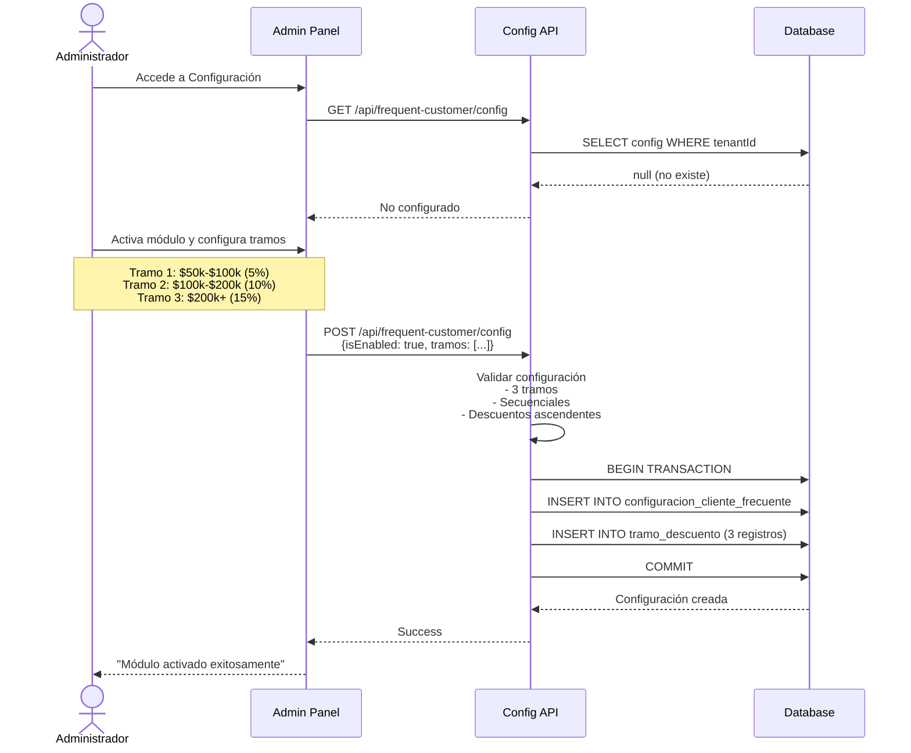
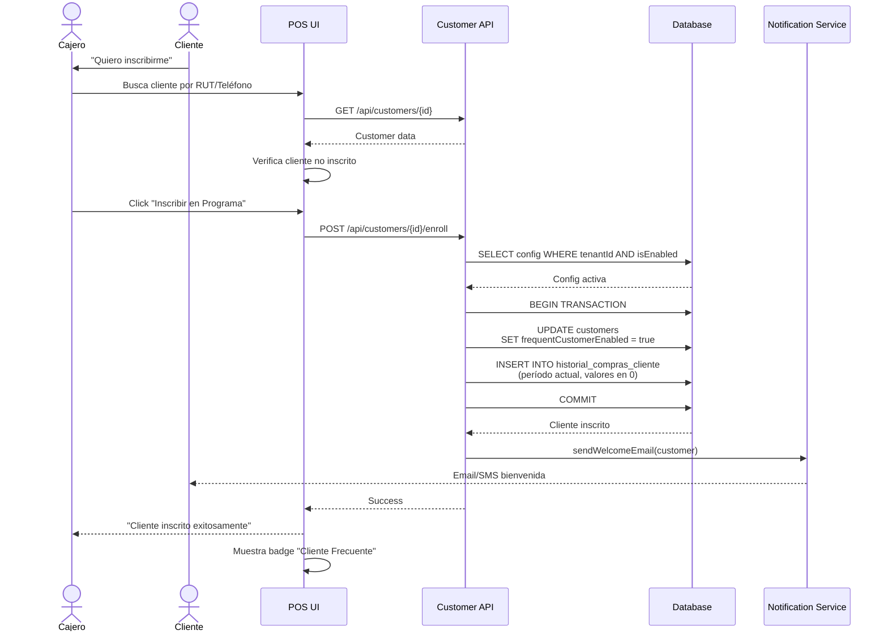
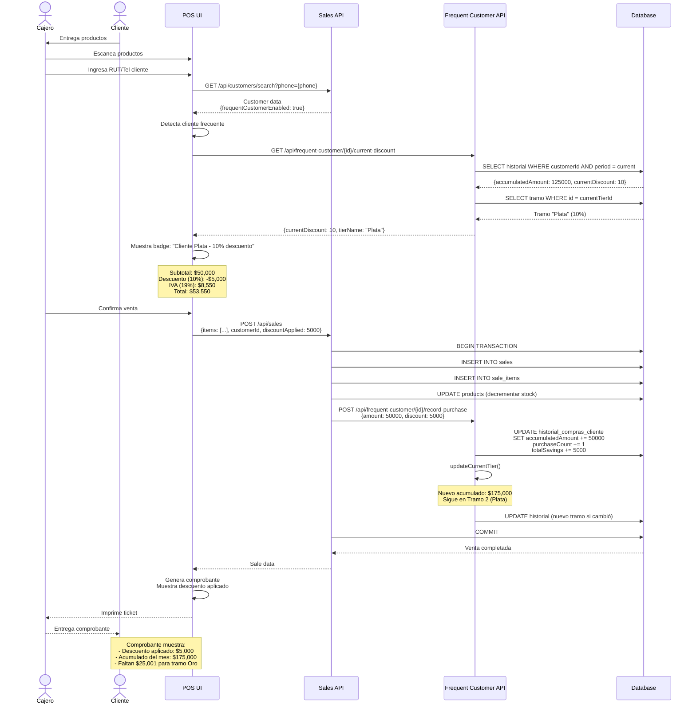
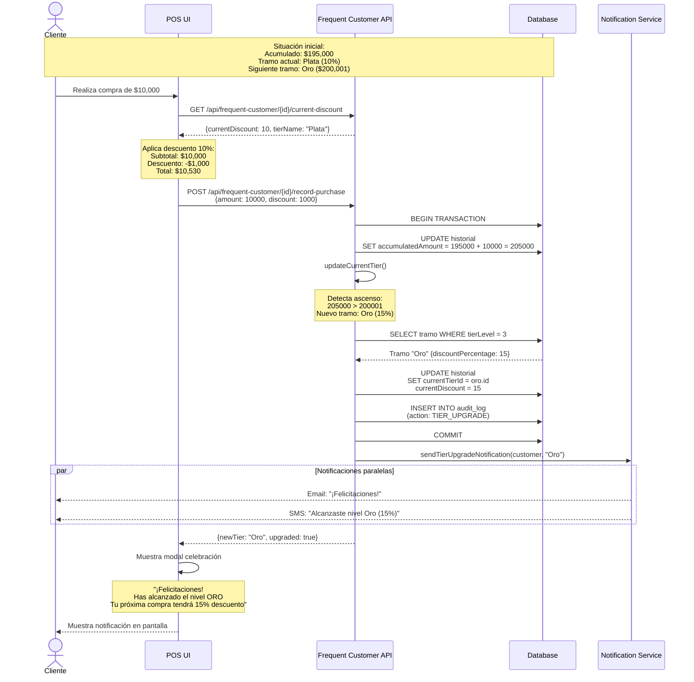

# Funcionalidad de Mantenedor de Clientes Frecuentes (MÓDULO OPCIONAL)
## Sistema CRTLPyme - Plataforma POS-SaaS

---

## Tabla de Contenidos

1. [Introducción](#introducción)
2. [Propósito del Módulo](#propósito-del-módulo)
3. [Características Principales](#características-principales)
4. [Entidades del Dominio](#entidades-del-dominio)
5. [Reglas de Negocio](#reglas-de-negocio)
6. [Flujo de Operación](#flujo-de-operación)
7. [Integración con Módulos Existentes](#integración-con-módulos-existentes)
8. [Casos de Uso](#casos-de-uso)

---

## Introducción

El **Módulo de Clientes Frecuentes** es una funcionalidad **opcional** de CRTLPyme que permite a los pequeños comercios implementar un sistema de fidelización de clientes basado en descuentos por volumen de compras acumuladas.

**Características clave:**
- Sistema de tres tramos de descuentos ascendentes
- Acumulación automática de compras mensuales
- Reseteo automático al inicio de cada mes
- Activación/desactivación por tenant sin perder datos históricos
- Integración transparente con el sistema de ventas

---

## Propósito del Módulo

### Problema que Resuelve

Los pequeños comercios necesitan:
- **Fidelizar clientes**: Incentivar compras recurrentes
- **Aumentar ticket promedio**: Motivar a los clientes a comprar más para alcanzar tramos superiores
- **Diferenciarse de la competencia**: Ofrecer beneficios concretos a clientes leales
- **Gestionar automáticamente**: Sin trabajo manual complejo

### Solución Propuesta

Un sistema automatizado que:
1. **Registra automáticamente** cada compra del cliente inscrito
2. **Acumula el monto** durante el mes en curso
3. **Calcula el tramo actual** basado en el monto acumulado
4. **Aplica el descuento** correspondiente en cada venta
5. **Resetea las acumulaciones** el primer día de cada mes
6. **Notifica al cliente** cuando alcanza un nuevo tramo

---

## Características Principales

### 1. Sistema de Tres Tramos

El módulo implementa exactamente **3 niveles de descuento** configurables:

| Tramo | Nombre Sugerido | Rango de Ejemplo | Descuento Ejemplo |
|-------|----------------|------------------|-------------------|
| **Tramo 1** | Bronce | $50,000 - $100,000 | 5% |
| **Tramo 2** | Plata | $100,001 - $200,000 | 10% |
| **Tramo 3** | Oro | $200,001 en adelante | 15% |

**Características:**
- Los montos y porcentajes son **totalmente configurables** por cada tenant
- Los tramos deben ser **secuenciales sin solapamiento**
- El tramo superior (3) **no tiene límite máximo**
- Los descuentos deben ser **ascendentes**: Tramo1 < Tramo2 < Tramo3

### 2. Acumulación Mensual

- **Período**: Calendario mensual (1 al último día del mes)
- **Acumulación**: Se suma el monto total de cada venta completada
- **Reseteo**: Automático el día 1 de cada mes (configurable)
- **Histórico**: Se mantiene registro de cada período para análisis

### 3. Inscripción Voluntaria

- Los clientes deben **inscribirse explícitamente** en el programa
- La inscripción es **gratuita e inmediata**
- Clientes no inscritos no acumulan ni reciben descuentos
- Se puede dar de baja sin perder el historial (solo se desactiva)

### 4. Aplicación Transparente

- El descuento se **calcula automáticamente** en cada venta
- Se aplica **sobre el total de la venta** antes de impuestos
- El cliente **ve el descuento** en el comprobante
- Se registra el **ahorro acumulado** del período

---

## Entidades del Dominio

### 1. ConfiguracionClienteFrecuente

**Propósito:** Configuración global del módulo de clientes frecuentes por Tenant.

**Atributos:**

| Atributo | Tipo | Descripción | Ejemplo |
|----------|------|-------------|---------|
| `id` | String (CUID) | Identificador único | `cm2x7k...` |
| `tenantId` | String | Referencia al Tenant | `ck9s3d...` |
| `isEnabled` | Boolean | Si el módulo está activo | `true` |
| `periodType` | Enum | Tipo de período | `MONTHLY` |
| `resetDay` | Integer | Día del mes para resetear | `1` |
| `description` | String | Descripción del programa | `"Programa Clientes VIP"` |
| `createdAt` | DateTime | Fecha de creación | `2025-10-01T10:00:00Z` |
| `updatedAt` | DateTime | Última actualización | `2025-10-19T15:30:00Z` |

**Métodos principales:**

```typescript
isActive(): Boolean
shouldResetAccumulation(date: DateTime): Boolean
getActiveTiers(): TramoDescuento[]
calculateApplicableDiscount(accumulatedAmount: Decimal): Decimal
```

**Relaciones:**
- `Tenant (1) → ConfiguracionClienteFrecuente (0..1)`: Un tenant puede tener una configuración
- `ConfiguracionClienteFrecuente (1) → TramoDescuento (3)`: Una configuración tiene exactamente 3 tramos

---

### 2. TramoDescuento

**Propósito:** Define cada uno de los tres niveles de descuento.

**Atributos:**

| Atributo | Tipo | Descripción | Ejemplo |
|----------|------|-------------|---------|
| `id` | String (CUID) | Identificador único | `cm2x7k...` |
| `configId` | String | Ref. a ConfiguracionClienteFrecuente | `cm2x7h...` |
| `tenantId` | String | Referencia al Tenant | `ck9s3d...` |
| `tierLevel` | Integer | Nivel del tramo (1, 2, 3) | `1` |
| `tierName` | String | Nombre descriptivo | `"Bronce"` |
| `minAmount` | Decimal(10,2) | Monto mínimo | `50000.00` |
| `maxAmount` | Decimal(10,2) | Monto máximo (null para tier 3) | `100000.00` |
| `discountPercentage` | Decimal(5,2) | Porcentaje de descuento | `5.00` |
| `color` | String | Color hex para UI | `"#CD7F32"` |
| `isActive` | Boolean | Si el tramo está activo | `true` |

**Métodos principales:**

```typescript
isInRange(amount: Decimal): Boolean
calculateDiscount(saleAmount: Decimal): Decimal
amountToReach(currentAmount: Decimal): Decimal
getNextTier(): TramoDescuento | null
```

**Ejemplo de Configuración Completa:**

```typescript
const tramos = [
  {
    tierLevel: 1,
    tierName: "Bronce",
    minAmount: 50000,
    maxAmount: 100000,
    discountPercentage: 5,
    color: "#CD7F32"
  },
  {
    tierLevel: 2,
    tierName: "Plata",
    minAmount: 100001,
    maxAmount: 200000,
    discountPercentage: 10,
    color: "#C0C0C0"
  },
  {
    tierLevel: 3,
    tierName: "Oro",
    minAmount: 200001,
    maxAmount: null, // Sin límite superior
    discountPercentage: 15,
    color: "#FFD700"
  }
];
```

---

### 3. HistorialComprasCliente

**Propósito:** Registra el historial mensual de compras de cada cliente inscrito.

**Atributos:**

| Atributo | Tipo | Descripción | Ejemplo |
|----------|------|-------------|---------|
| `id` | String (CUID) | Identificador único | `cm2x7k...` |
| `customerId` | String | Referencia al Customer | `ck9s3d...` |
| `tenantId` | String | Referencia al Tenant | `ck9s3d...` |
| `period` | String | Período YYYY-MM | `"2025-10"` |
| `accumulatedAmount` | Decimal(10,2) | Monto total acumulado | `125000.00` |
| `purchaseCount` | Integer | Número de compras | `15` |
| `currentTierId` | String | Tramo actual | `cm2x7t...` |
| `currentDiscount` | Decimal(5,2) | % descuento actual | `10.00` |
| `totalSavings` | Decimal(10,2) | Total ahorrado | `12500.00` |
| `lastPurchaseDate` | DateTime | Fecha última compra | `2025-10-19T14:30:00Z` |

**Métodos principales:**

```typescript
addPurchase(saleAmount: Decimal, discount: Decimal): void
updateCurrentTier(): void
getCurrentTier(): TramoDescuento | null
amountToNextTier(): Decimal | null
calculatePotentialSavings(): Decimal
resetPeriod(): void
isActivePeriod(): Boolean
```

**Relaciones:**
- `Customer (1) → HistorialComprasCliente (N)`: Un cliente tiene múltiples historiales (uno por período)
- `HistorialComprasCliente (N) → TramoDescuento (0..1)`: Cada historial referencia su tramo actual

**Reglas especiales:**
- **Unicidad**: Solo un registro por (customerId + period)
- **Inmutabilidad histórica**: Los períodos cerrados no se modifican
- **Creación automática**: Se crea en la primera compra del cliente en el período
- **Reseteo mensual**: El día configurado se crea nuevo período y se archiva el anterior

---

### 4. Customer (Extensiones)

**Nuevos Atributos:**

| Atributo | Tipo | Descripción | Ejemplo |
|----------|------|-------------|---------|
| `frequentCustomerEnabled` | Boolean | Si está inscrito | `true` |
| `frequentCustomerSince` | DateTime | Fecha de inscripción | `2025-09-15T10:00:00Z` |
| `totalLifetimePurchases` | Decimal(10,2) | Total histórico | `1500000.00` |
| `preferredContactMethod` | Enum | Canal preferido | `WHATSAPP` |

**Nuevos Métodos:**

```typescript
enrollInFrequentProgram(): void
unenrollFromFrequentProgram(): void
getCurrentPeriodHistory(): HistorialComprasCliente | null
getAvailableDiscount(): Decimal
getCurrentTier(): TramoDescuento | null
getFrequentCustomerStats(): FrequentCustomerStats
recordPurchase(saleAmount: Decimal, appliedDiscount: Decimal): void
```

---

## Reglas de Negocio

### RN-FREQ-001: Configuración Única por Tenant

**Descripción:** Solo puede existir una configuración activa de clientes frecuentes por Tenant.

**Validación:**
```typescript
const existingConfig = await prisma.configuracionClienteFrecuente.findFirst({
  where: { tenantId: tenantId, isEnabled: true }
});

if (existingConfig) {
  throw new Error("Ya existe una configuración activa para este negocio");
}
```

**Excepciones:** Se puede tener configuraciones inactivas (históricas).

---

### RN-FREQ-002: Exactamente Tres Tramos

**Descripción:** Cada configuración debe tener exactamente 3 tramos de descuento activos y secuenciales.

**Validación:**
```typescript
const tiers = await prisma.tramoDescuento.findMany({
  where: { configId: configId, isActive: true },
  orderBy: { tierLevel: 'asc' }
});

if (tiers.length !== 3) {
  throw new Error("Debe configurar exactamente 3 tramos de descuento");
}

// Validar secuencialidad
for (let i = 0; i < tiers.length - 1; i++) {
  if (tiers[i].maxAmount >= tiers[i + 1].minAmount) {
    throw new Error("Los tramos deben ser secuenciales sin solapamiento");
  }
}

// El último tramo no debe tener máximo
if (tiers[2].maxAmount !== null) {
  throw new Error("El tramo superior no debe tener límite máximo");
}
```

---

### RN-FREQ-003: Descuentos Ascendentes

**Descripción:** Los porcentajes de descuento deben ser ascendentes entre tramos.

**Validación:**
```typescript
const tiers = getActiveTiers();

for (let i = 0; i < tiers.length - 1; i++) {
  if (tiers[i].discountPercentage >= tiers[i + 1].discountPercentage) {
    throw new Error("Los descuentos deben ser ascendentes (Tramo1 < Tramo2 < Tramo3)");
  }
}
```

**Límite máximo:** El descuento del tramo 3 no debe exceder 50% (configurable por sistema).

---

### RN-FREQ-004: Inscripción Voluntaria

**Descripción:** Los clientes deben inscribirse explícitamente para participar.

**Proceso de Inscripción:**
```typescript
async function enrollCustomer(customerId: string, tenantId: string): Promise<void> {
  // 1. Verificar que el módulo está activo
  const config = await getActiveConfig(tenantId);
  if (!config) {
    throw new Error("El programa de clientes frecuentes no está disponible");
  }
  
  // 2. Verificar que el cliente no esté ya inscrito
  const customer = await prisma.customer.findUnique({
    where: { id: customerId }
  });
  
  if (customer.frequentCustomerEnabled) {
    throw new Error("El cliente ya está inscrito en el programa");
  }
  
  // 3. Inscribir al cliente
  await prisma.customer.update({
    where: { id: customerId },
    data: {
      frequentCustomerEnabled: true,
      frequentCustomerSince: new Date()
    }
  });
  
  // 4. Crear historial del período actual
  const currentPeriod = getCurrentPeriod(); // "2025-10"
  await prisma.historialComprasCliente.create({
    data: {
      customerId: customerId,
      tenantId: tenantId,
      period: currentPeriod,
      accumulatedAmount: 0,
      purchaseCount: 0,
      currentTierId: null,
      currentDiscount: 0,
      totalSavings: 0
    }
  });
  
  // 5. Notificar al cliente (opcional)
  await sendWelcomeNotification(customer);
}
```

---

### RN-FREQ-005: Acumulación Solo de Ventas Completadas

**Descripción:** Solo las ventas con estado `COMPLETED` se contabilizan en la acumulación.

**Validación:**
```typescript
async function processSaleForFrequentCustomer(
  sale: Sale,
  customer: Customer
): Promise<void> {
  // Solo procesar si la venta está completada
  if (sale.status !== SaleStatus.COMPLETED) {
    return;
  }
  
  // Solo procesar si el cliente está inscrito
  if (!customer.frequentCustomerEnabled) {
    return;
  }
  
  // Obtener o crear historial del período
  let history = await getOrCreatePeriodHistory(customer.id, sale.tenantId);
  
  // Calcular descuento aplicable (basado en tramo ACTUAL antes de esta compra)
  const discount = calculateDiscount(history.currentDiscount, sale.subtotal);
  
  // Actualizar historial
  await history.addPurchase(sale.subtotal, discount);
}
```

**Nota importante:** El descuento se aplica basado en el tramo **actual** (antes de sumar esta compra). Si la compra hace que el cliente ascienda de tramo, el nuevo descuento se aplicará en la **próxima** compra.

---

### RN-FREQ-006: Reseteo Automático Mensual

**Descripción:** Las acumulaciones se resetean automáticamente al inicio de cada período (por defecto, el día 1 del mes).

**Proceso automatizado:**
```typescript
// Job programado que se ejecuta diariamente
async function processMonthlyReset(): Promise<void> {
  // 1. Verificar si hoy es día de reseteo
  const today = new Date();
  const configs = await prisma.configuracionClienteFrecuente.findMany({
    where: { isEnabled: true }
  });
  
  for (const config of configs) {
    if (today.getDate() !== config.resetDay) continue;
    
    // 2. Obtener todos los clientes frecuentes activos del tenant
    const customers = await prisma.customer.findMany({
      where: {
        tenantId: config.tenantId,
        frequentCustomerEnabled: true
      }
    });
    
    // 3. Para cada cliente, crear nuevo período y archivar el anterior
    const currentPeriod = getCurrentPeriod();
    const previousPeriod = getPreviousPeriod();
    
    for (const customer of customers) {
      // Archivar período anterior (marcar como cerrado)
      await prisma.historialComprasCliente.updateMany({
        where: {
          customerId: customer.id,
          period: previousPeriod
        },
        data: {
          isClosed: true
        }
      });
      
      // Crear nuevo período con valores en 0
      await prisma.historialComprasCliente.create({
        data: {
          customerId: customer.id,
          tenantId: customer.tenantId,
          period: currentPeriod,
          accumulatedAmount: 0,
          purchaseCount: 0,
          currentTierId: null,
          currentDiscount: 0,
          totalSavings: 0
        }
      });
      
      // Notificar al cliente (opcional)
      await sendPeriodResetNotification(customer, previousPeriod);
    }
  }
}
```

**Características:**
- Los períodos anteriores son **inmutables** (no se modifican después del cierre)
- Se mantiene **histórico completo** para análisis de tendencias
- Los clientes reciben **notificación** del reseteo con resumen del mes anterior
- El histórico permite generar **reportes mensuales** y anuales

---

### RN-FREQ-007: Cálculo Automático del Tramo

**Descripción:** El sistema calcula automáticamente el tramo actual después de cada compra.

**Algoritmo:**
```typescript
function updateCurrentTier(history: HistorialComprasCliente): void {
  // 1. Obtener la configuración activa
  const config = getActiveConfig(history.tenantId);
  if (!config) {
    history.currentTierId = null;
    history.currentDiscount = 0;
    return;
  }
  
  // 2. Obtener tramos activos ordenados por nivel
  const tiers = config.getActiveTiers();
  
  // 3. Buscar el tramo que corresponde al monto acumulado
  const applicableTier = tiers.find(tier => 
    tier.isInRange(history.accumulatedAmount)
  );
  
  // 4. Actualizar historial
  if (applicableTier) {
    history.currentTierId = applicableTier.id;
    history.currentDiscount = applicableTier.discountPercentage;
  } else {
    // Aún no alcanza el primer tramo
    history.currentTierId = null;
    history.currentDiscount = 0;
  }
}
```

**Eventos de Ascenso de Tramo:**
```typescript
function checkTierUpgrade(
  history: HistorialComprasCliente,
  previousTierId: string | null
): void {
  // Detectar si el cliente ascendió de tramo
  if (previousTierId !== history.currentTierId) {
    const newTier = history.getCurrentTier();
    
    // Registrar evento
    await auditLog.create({
      action: 'TIER_UPGRADE',
      entity: 'HistorialComprasCliente',
      entityId: history.id,
      metadata: {
        previousTierId: previousTierId,
        newTierId: history.currentTierId,
        newDiscount: history.currentDiscount
      }
    });
    
    // Notificar al cliente
    await sendTierUpgradeNotification(
      history.customerId,
      newTier,
      history.accumulatedAmount
    );
  }
}
```

---

### RN-FREQ-008: Desactivación sin Pérdida de Datos

**Descripción:** Si se desactiva el módulo (`isEnabled = false`), los clientes mantienen su historial pero no acumulan ni reciben descuentos.

**Comportamiento:**
```typescript
async function processSale(sale: Sale, customer: Customer): Promise<void> {
  // 1. Verificar si el módulo está activo
  const config = await getActiveConfig(sale.tenantId);
  
  if (!config || !config.isEnabled) {
    // Módulo desactivado: procesar venta normalmente sin descuentos
    await completeSale(sale);
    return;
  }
  
  // 2. Verificar si el cliente está inscrito
  if (!customer.frequentCustomerEnabled) {
    // Cliente no inscrito: procesar venta normalmente
    await completeSale(sale);
    return;
  }
  
  // 3. Aplicar lógica de cliente frecuente
  const history = await getOrCreatePeriodHistory(customer.id, sale.tenantId);
  const discount = calculateDiscount(history.currentDiscount, sale.subtotal);
  
  // Aplicar descuento a la venta
  sale.frequentCustomerDiscount = discount;
  sale.total = sale.subtotal - discount + sale.tax;
  
  await completeSale(sale);
  
  // Actualizar historial
  await history.addPurchase(sale.subtotal, discount);
}
```

**Reactivación:**
- Al reactivar el módulo, los clientes inscritos **continúan acumulando** desde su estado actual
- No se pierde el historial del período en curso
- El sistema continúa desde donde quedó

---

## Flujo de Operación

### Flujo 1: Configuración Inicial del Módulo



---

### Flujo 2: Inscripción de Cliente



---

### Flujo 3: Procesamiento de Venta con Descuento



---

### Flujo 4: Ascenso de Tramo Durante Venta



---

## Integración con Módulos Existentes

### 1. Integración con Módulo de Ventas

**Modificaciones en el flujo de venta:**

```typescript
// Antes (sin clientes frecuentes)
async function processSale(saleData: CreateSaleDTO): Promise<Sale> {
  const sale = await createSale(saleData);
  const total = calculateTotal(sale.items);
  sale.total = total + (total * 0.19); // IVA
  return completeSale(sale);
}

// Después (con clientes frecuentes)
async function processSale(saleData: CreateSaleDTO): Promise<Sale> {
  const sale = await createSale(saleData);
  let subtotal = calculateTotal(sale.items);
  
  // NUEVO: Verificar si hay descuento de cliente frecuente
  let frequentCustomerDiscount = 0;
  if (saleData.customerId) {
    const customer = await getCustomer(saleData.customerId);
    if (customer.frequentCustomerEnabled) {
      const history = await getCurrentPeriodHistory(customer.id);
      if (history && history.currentDiscount > 0) {
        frequentCustomerDiscount = subtotal * (history.currentDiscount / 100);
      }
    }
  }
  
  // Aplicar descuento
  const subtotalWithDiscount = subtotal - frequentCustomerDiscount;
  const tax = subtotalWithDiscount * 0.19;
  sale.frequentCustomerDiscount = frequentCustomerDiscount;
  sale.total = subtotalWithDiscount + tax;
  
  const completedSale = await completeSale(sale);
  
  // NUEVO: Registrar compra en historial
  if (frequentCustomerDiscount > 0) {
    await recordFrequentCustomerPurchase(
      saleData.customerId,
      subtotal,
      frequentCustomerDiscount
    );
  }
  
  return completedSale;
}
```

**Cambios en el modelo Sale:**

```prisma
model Sale {
  // ... campos existentes
  
  // NUEVOS campos para clientes frecuentes
  frequentCustomerDiscount Decimal?  @db.Decimal(10, 2)
  frequentCustomerTierId   String?
  
  // Relación
  frequentCustomerTier     TramoDescuento? @relation(fields: [frequentCustomerTierId], references: [id])
}
```

---

### 2. Integración con Módulo de Clientes

**Extensión del modelo Customer:**

```prisma
model Customer {
  id                         String                      @id @default(cuid())
  // ... campos existentes
  
  // NUEVOS campos
  frequentCustomerEnabled    Boolean                     @default(false)
  frequentCustomerSince      DateTime?
  totalLifetimePurchases     Decimal                     @default(0) @db.Decimal(10, 2)
  preferredContactMethod     ContactMethod?
  
  // NUEVA relación
  purchaseHistory            HistorialComprasCliente[]
}
```

**Mejoras en la interfaz de gestión de clientes:**

- Badge visual indicando si es cliente frecuente
- Panel mostrando estadísticas del mes actual
- Botón para inscribir/dar de baja del programa
- Gráfico de evolución de compras

---

### 3. Integración con Módulo de Reportes

**Nuevos reportes disponibles:**

1. **Reporte de Clientes Frecuentes Activos**
   - Total de clientes inscritos
   - Distribución por tramos
   - Clientes inactivos (sin compras en 30 días)

2. **Reporte de Descuentos Otorgados**
   - Total de descuentos del período
   - Descuentos por tramo
   - ROI del programa (incremento de ventas vs. descuentos otorgados)

3. **Reporte de Evolución de Clientes**
   - Clientes que ascendieron de tramo
   - Promedio de compras por tramo
   - Ticket promedio por tramo

**Implementación:**

```typescript
interface FrequentCustomerReport {
  period: string;
  totalEnrolled: number;
  activeCustomers: number;
  distribution: {
    tier1: number;
    tier2: number;
    tier3: number;
    noTier: number;
  };
  totalDiscountsGiven: Decimal;
  totalSalesByTier: {
    tier1: Decimal;
    tier2: Decimal;
    tier3: Decimal;
  };
  averageTicketByTier: {
    tier1: Decimal;
    tier2: Decimal;
    tier3: Decimal;
  };
  roi: {
    additionalRevenue: Decimal;
    discountsCost: Decimal;
    netBenefit: Decimal;
    percentage: Decimal;
  };
}
```

---

### 4. Integración con Módulo de Notificaciones

**Eventos que generan notificaciones:**

1. **Bienvenida al programa**
   - Al inscribirse por primera vez
   - Canal: Email/SMS/WhatsApp

2. **Ascenso de tramo**
   - Cuando el cliente alcanza un nuevo nivel
   - Incluye: nuevo % descuento, beneficios

3. **Próximo a ascender**
   - Cuando falta menos del 10% para el siguiente tramo
   - Ejemplo: "¡Solo te faltan $5,000 para alcanzar nivel Oro!"

4. **Resumen mensual**
   - Al final de cada período
   - Incluye: total de compras, ahorros, nuevo tramo para el próximo mes

5. **Reactivación**
   - Cliente inactivo (sin compras en 60 días)
   - Recordatorio de beneficios del programa

**Configuración de notificaciones:**

```typescript
interface NotificationConfig {
  enrollmentWelcome: {
    enabled: boolean;
    channels: ('email' | 'sms' | 'whatsapp')[];
    template: string;
  };
  tierUpgrade: {
    enabled: boolean;
    channels: ('email' | 'sms' | 'whatsapp')[];
    template: string;
  };
  almostNextTier: {
    enabled: boolean;
    threshold: number; // % restante para notificar
    channels: ('email' | 'sms')[];
  };
  monthlySummary: {
    enabled: boolean;
    sendDay: number; // Día del mes
    channels: ('email')[];
  };
}
```

---

## Casos de Uso

### CU-FREQ-001: Activar Módulo de Clientes Frecuentes

**Actor:** Administrador del Negocio (ADMIN)

**Precondiciones:**
- El administrador tiene sesión iniciada
- El módulo aún no está configurado

**Flujo Principal:**
1. Administrador accede a Configuración > Clientes Frecuentes
2. Sistema muestra wizard de configuración
3. Administrador activa el módulo
4. Administrador configura los 3 tramos de descuento:
   - Tramo 1: Nombre, rango min-max, % descuento
   - Tramo 2: Nombre, rango min-max, % descuento
   - Tramo 3: Nombre, rango mínimo, % descuento (sin máximo)
5. Administrador configura día de reseteo mensual
6. Sistema valida la configuración
7. Sistema activa el módulo
8. Sistema muestra confirmación

**Postcondiciones:**
- El módulo está activo y disponible para inscribir clientes
- Los 3 tramos están creados en la base de datos

**Flujos Alternativos:**
- **6a. Validación falla (tramos solapados):**
  - Sistema muestra error específico
  - Administrador corrige la configuración
  - Continúa en paso 6

---

### CU-FREQ-002: Inscribir Cliente en Programa

**Actor:** Cajero (CAJA) o Administrador (ADMIN)

**Precondiciones:**
- El módulo de clientes frecuentes está activo
- El cliente existe en el sistema
- El cliente no está ya inscrito

**Flujo Principal:**
1. Cajero busca al cliente por RUT/Teléfono/Nombre
2. Sistema muestra datos del cliente
3. Cajero selecciona "Inscribir en Programa de Clientes Frecuentes"
4. Sistema solicita confirmación del cliente
5. Cajero confirma con el cliente
6. Sistema inscribe al cliente
7. Sistema crea historial del período actual con valores en 0
8. Sistema envía notificación de bienvenida al cliente
9. Sistema muestra confirmación con badge "Cliente Frecuente"

**Postcondiciones:**
- Cliente inscrito en el programa (`frequentCustomerEnabled = true`)
- Historial del período actual creado
- Cliente recibe notificación de bienvenida

**Flujos Alternativos:**
- **3a. Cliente ya inscrito:**
  - Sistema muestra mensaje "Cliente ya está inscrito"
  - Muestra estadísticas actuales del cliente
  - Caso de uso termina

---

### CU-FREQ-003: Procesar Venta con Descuento de Cliente Frecuente

**Actor:** Cajero (CAJA)

**Precondiciones:**
- El módulo de clientes frecuentes está activo
- El cliente está inscrito y tiene tramo activo
- Hay productos en el carrito de venta

**Flujo Principal:**
1. Cajero escanea productos y los agrega al carrito
2. Cajero ingresa identificación del cliente (RUT/Teléfono)
3. Sistema busca al cliente
4. Sistema detecta que es cliente frecuente con tramo activo
5. Sistema obtiene el % de descuento actual
6. Sistema calcula el subtotal de la venta
7. Sistema aplica el descuento sobre el subtotal
8. Sistema muestra desglose:
   - Subtotal
   - Descuento de cliente frecuente (-X%)
   - Subtotal con descuento
   - IVA (19%)
   - Total a pagar
9. Cajero confirma la venta
10. Sistema procesa el pago
11. Sistema actualiza el historial del cliente:
    - Incrementa monto acumulado
    - Incrementa contador de compras
    - Suma el ahorro generado
12. Sistema recalcula el tramo actual
13. **Si el cliente ascendió de tramo:**
    - Sistema registra el evento
    - Sistema muestra modal de celebración
    - Sistema envía notificación al cliente
14. Sistema genera comprobante mostrando el descuento aplicado
15. Sistema imprime ticket

**Postcondiciones:**
- Venta completada con descuento aplicado
- Historial del cliente actualizado
- Stock de productos actualizado
- Si hubo ascenso, cliente notificado

**Flujos Alternativos:**
- **4a. Cliente no tiene tramo activo (acumulado < mín. tramo 1):**
  - Sistema muestra mensaje: "Cliente inscrito pero aún sin tramo"
  - Sistema muestra cuánto falta para el primer tramo
  - Venta se procesa sin descuento
  - Historial se actualiza normalmente
  - Continúa en paso 10

- **5a. Cliente frecuente pero módulo desactivado:**
  - Sistema procesa venta normal sin descuento
  - No actualiza historial
  - Caso de uso termina

---

### CU-FREQ-004: Consultar Estadísticas de Cliente Frecuente

**Actor:** Cliente o Cajero (CAJA)

**Precondiciones:**
- Cliente está inscrito en el programa

**Flujo Principal:**
1. Cajero/Cliente accede a perfil del cliente
2. Sistema muestra panel de cliente frecuente con:
   - Tramo actual (badge con color)
   - % de descuento actual
   - Monto acumulado en el mes
   - Número de compras en el mes
   - Total ahorrado en el mes
   - Progreso visual hacia el siguiente tramo
   - Monto faltante para próximo tramo
3. Cliente puede ver desglose de:
   - Historial de compras del mes
   - Comparativa con meses anteriores
   - Gráfico de evolución

**Postcondiciones:**
- Ninguna (solo consulta)

---

### CU-FREQ-005: Generar Reporte de Clientes Frecuentes

**Actor:** Administrador (ADMIN) o Supervisor (MANAGER)

**Precondiciones:**
- Módulo de clientes frecuentes activo
- Hay clientes inscritos con historial

**Flujo Principal:**
1. Administrador accede a Reportes > Clientes Frecuentes
2. Administrador selecciona período (mes/año)
3. Sistema genera reporte con:
   - Total de clientes inscritos
   - Distribución por tramos
   - Total de descuentos otorgados
   - Ventas totales por tramo
   - Ticket promedio por tramo
   - ROI del programa
   - Top 10 clientes frecuentes
   - Clientes que ascendieron de tramo
4. Administrador puede exportar a PDF/Excel
5. Sistema genera archivo de exportación

**Postcondiciones:**
- Reporte generado y disponible para descarga

---

## Conclusión

El **Módulo de Clientes Frecuentes** es una herramienta poderosa y opcional que permite a los pequeños comercios:

✅ **Fidelizar clientes** mediante un sistema transparente de recompensas  
✅ **Aumentar ventas** incentivando compras recurrentes y de mayor volumen  
✅ **Diferenciar el negocio** de la competencia con un programa profesional  
✅ **Automatizar completamente** la gestión sin trabajo manual  
✅ **Analizar comportamiento** de clientes mediante reportes detallados  
✅ **Escalar fácilmente** gracias a la arquitectura multi-tenant

**Características destacadas:**
- Sistema de 3 tramos configurable
- Acumulación y reseteo automático mensual
- Integración transparente con el flujo de ventas
- Notificaciones automáticas de ascenso
- Reportes completos de ROI
- Activación/desactivación sin pérdida de datos

El módulo está diseñado siguiendo los mismos principios arquitectónicos del sistema CRTLPyme: escalabilidad, seguridad, usabilidad y mantenibilidad.

---

**Última actualización:** Octubre 2025  
**Versión:** 1.0  
**Estado:** Módulo Opcional - Listo para Implementación

