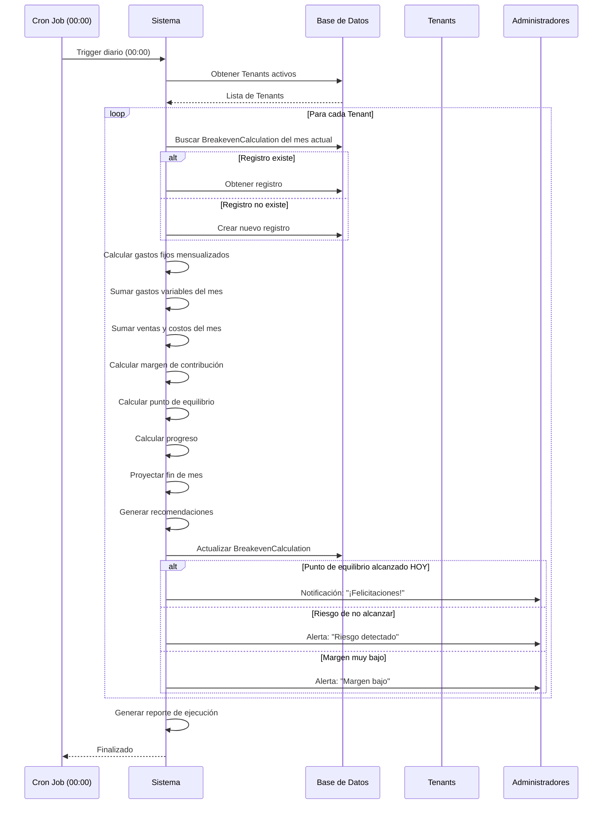
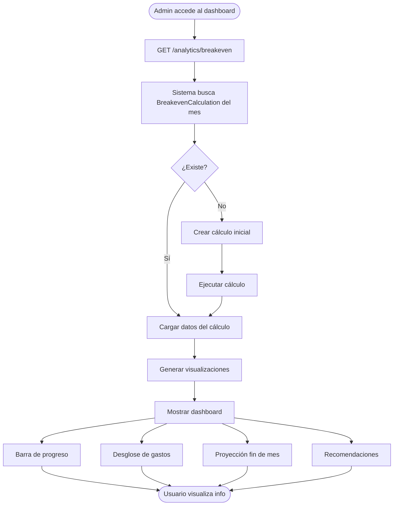

# Funcionalidad de Control de Punto de Equilibrio
## Sistema CRTLPyme - Plataforma POS-SaaS

---

<div align="center">

**Instituto Profesional DUOC UC**  
**Ingeniería en Informática**  
**Proyecto Capstone 2025**

<br/>

**Documento Técnico**  
Versión 1.0

**Fecha:**  
Octubre 2025

</div>

---

## Tabla de Contenidos

1. [Introducción](#introducción)
2. [¿Qué es el Punto de Equilibrio?](#qué-es-el-punto-de-equilibrio)
3. [¿Por qué es Importante para las Pymes?](#por-qué-es-importante-para-las-pymes)
4. [Componentes de la Funcionalidad](#componentes-de-la-funcionalidad)
5. [Cálculo del Punto de Equilibrio](#cálculo-del-punto-de-equilibrio)
6. [Datos Necesarios](#datos-necesarios)
7. [Flujo de Operación](#flujo-de-operación)
8. [Presentación de la Información](#presentación-de-la-información)
9. [Ejemplos de Uso](#ejemplos-de-uso)
10. [Alertas y Notificaciones](#alertas-y-notificaciones)
11. [Histórico y Análisis de Tendencias](#histórico-y-análisis-de-tendencias)
12. [Beneficios para el Negocio](#beneficios-para-el-negocio)

---

## Introducción

La funcionalidad de **Control de Punto de Equilibrio** (Break-Even Point) es una herramienta esencial integrada en CRTLPyme que permite a los pequeños comerciantes comprender la **viabilidad financiera** de su negocio en tiempo real.

Esta funcionalidad responde a una necesidad crítica identificada en el mercado chileno: **la mayoría de los pequeños comercios no saben si están generando ganancias reales** hasta que cierran el mes, y muchos operan con pérdidas sin saberlo.

### Características Principales

- ✅ **Cálculo Automático Diario**: El sistema calcula el punto de equilibrio cada día
- ✅ **Basado en Datos Reales**: Usa ventas, gastos y costos reales (no estimaciones)
- ✅ **No Predictivo**: Es una función calculada, no de análisis predictivo
- ✅ **Proyecciones Informadas**: Proyecta si se alcanzará el equilibrio basándose en tendencias actuales
- ✅ **Recomendaciones Automáticas**: Genera sugerencias para mejorar la rentabilidad
- ✅ **Histórico Mensual**: Mantiene registro de evolución para análisis

---

## ¿Qué es el Punto de Equilibrio?

El **Punto de Equilibrio** es el nivel de ventas en el cual un negocio:

- **NO tiene pérdidas** (cubre todos sus gastos)
- **NO tiene ganancias** (aún no genera utilidades)
- **Está exactamente en el punto de balance** entre costos e ingresos

### Definición Técnica

> **El Punto de Equilibrio es el monto de ventas necesario para cubrir TODOS los gastos (fijos y variables) del negocio en un período determinado.**

### Representación Visual

```
┌─────────────────────────────────────────────────┐
│                                                 │
│  Ventas Totales                                 │
│  ═══════════════════════════════                │
│                                                 │
│  Gastos Variables  ▓▓▓▓▓▓▓▓▓▓▓▓▓▓              │
│                                                 │
│  Gastos Fijos      ░░░░░░░░                    │
│                                                 │
│  ─────────────────────────────────────────────  │
│  │                        ↑                   │ │
│  │                    PUNTO DE                │ │
│  │                   EQUILIBRIO               │ │
│  │                                            │ │
│  │◄────────────────►│                         │ │
│   Pérdidas          │    Ganancias →          │ │
│                                                 │
└─────────────────────────────────────────────────┘
```

### Fórmula Básica

```
Punto de Equilibrio (PE) = Gastos Fijos Totales / Margen de Contribución (%)

Donde:
- Margen de Contribución = (Ventas - Costos Variables) / Ventas
```

### Ejemplo Simple

```
Negocio: Almacén "Don Pedro"
Gastos Fijos Mensuales: $800,000 CLP
Margen de Contribución: 25%

Punto de Equilibrio = $800,000 / 0.25 = $3,200,000 CLP

Interpretación:
- Si vende $3,200,000 en el mes → No pierde ni gana (equilibrio)
- Si vende menos de $3,200,000 → Opera con pérdidas
- Si vende más de $3,200,000 → Genera ganancias
```

---

## ¿Por qué es Importante para las Pymes?

### Problemática Actual

Los pequeños comercios chilenos enfrentan estos desafíos:

1. **Falta de Visibilidad Financiera**
   - "Creemos que ganamos, pero no sabemos cuánto"
   - "Al cerrar el mes, nos damos cuenta que perdimos dinero"

2. **Decisiones Sin Datos**
   - Precios basados en intuición
   - No saben qué productos son realmente rentables
   - Desconocen cuánto deben vender para sobrevivir

3. **Riesgo de Quiebra**
   - Operan con pérdidas por meses sin saberlo
   - Descubren la situación cuando ya es tarde

4. **Incapacidad de Planificar**
   - No pueden proyectar si alcanzarán sus metas
   - Difícil acceder a financiamiento sin datos

### Cómo CRTLPyme Soluciona Esto

La funcionalidad de Punto de Equilibrio proporciona:

✅ **Visibilidad Inmediata**
- Sabe diariamente si está ganando o perdiendo
- Dashboard claro con progreso en tiempo real

✅ **Toma de Decisiones Informadas**
- Datos precisos para ajustar precios
- Identificar productos con bajo margen
- Decidir si expandir o reducir operaciones

✅ **Prevención de Pérdidas**
- Alertas tempranas si no alcanzará el equilibrio
- Recomendaciones para corregir el rumbo

✅ **Acceso a Financiamiento**
- Reportes profesionales para mostrar a bancos
- Histórico que demuestra viabilidad

---

## Componentes de la Funcionalidad

La funcionalidad está compuesta por tres entidades principales y un proceso automático:

### 1. FixedExpense (Gastos Fijos)

**Propósito:** Registrar gastos operacionales recurrentes del negocio.

**Ejemplos:**
- Arriendo del local
- Servicios básicos (luz, agua, internet)
- Sueldos de empleados
- Patente municipal
- Seguros

**Características:**
- Recurrencia configurable (diaria, semanal, mensual, anual)
- Normalización automática a base mensual
- Activación/desactivación temporal
- Fecha de inicio y fin (para gastos temporales)

**Atributos:**
```typescript
{
  id: string,
  tenantId: string,
  name: string,              // "Arriendo Local Central"
  amount: decimal,           // $300,000
  frequency: enum,           // MONTHLY
  startDate: datetime,       // 2025-01-01
  endDate: datetime?,        // opcional
  notes: string,
  isActive: boolean
}
```

### 2. VariableExpense (Gastos Variables)

**Propósito:** Registrar gastos que varían con el volumen de ventas o son esporádicos.

**Ejemplos:**
- Comisiones de vendedores
- Gastos de transporte de mercadería
- Embalajes y bolsas
- Comisiones bancarias por transacciones
- Promociones y publicidad

**Características:**
- Fecha específica (no recurrente)
- Asociable a productos o ventas específicas
- Categorización por tipo
- Impacto directo en el margen de contribución

**Atributos:**
```typescript
{
  id: string,
  tenantId: string,
  concept: string,           // "Transporte mercadería"
  amount: decimal,           // $30,000
  date: datetime,            // 2025-10-15
  category: enum,            // TRANSPORT
  description: string,
  productId?: string,        // opcional
  saleId?: string,          // opcional
  userId: string
}
```

**Categorías:**
- `PRODUCT_COST`: Costo directo de productos
- `COMMISSION`: Comisiones de venta
- `TRANSPORT`: Gastos de transporte
- `PACKAGING`: Embalaje y materiales
- `OTHER`: Otros gastos variables

### 3. BreakevenCalculation (Cálculo de Punto de Equilibrio)

**Propósito:** Almacenar el cálculo histórico del punto de equilibrio mensual.

**Características:**
- Un registro por mes por Tenant
- Actualización diaria del mes actual
- Histórico inmutable de meses anteriores
- Metadata rica para análisis

**Atributos:**
```typescript
{
  id: string,
  tenantId: string,
  period: string,                    // "2025-10"
  calculationDate: datetime,
  totalFixedCosts: decimal,          // $800,000
  totalVariableCosts: decimal,       // $110,000
  totalSales: decimal,               // $1,200,000
  totalCosts: decimal,               // $840,000 (productos)
  grossMargin: decimal,              // $250,000
  grossMarginPercentage: decimal,    // 20.83%
  breakevenPoint: decimal,           // $3,840,000
  breakevenDays: int,                // 42 días
  currentProgress: decimal,          // 31.25%
  breakevenDate: datetime?,          // si se alcanzó
  remainingAmount: decimal,          // $2,640,000
  isAchieved: boolean,               // false
  metadata: json
}
```

### 4. Proceso Automático Diario

**Descripción:** Job programado que se ejecuta cada día a las 00:00 (medianoche).

**Responsabilidades:**
1. Iterar sobre todos los Tenants activos
2. Buscar o crear BreakevenCalculation del mes actual
3. Calcular:
   - Gastos fijos mensualizados
   - Gastos variables del mes
   - Ventas y costos del mes
   - Margen de contribución
   - Punto de equilibrio
   - Progreso actual
   - Proyección fin de mes
4. Actualizar registro del mes actual
5. Generar alertas si corresponde
6. Enviar notificaciones a administradores

---

## Cálculo del Punto de Equilibrio

### Proceso de Cálculo Completo

El sistema ejecuta el siguiente algoritmo cada día:

```typescript
function calculateBreakeven(tenantId: string, period: string): BreakevenCalculation {
  
  // ========== PASO 1: GASTOS FIJOS MENSUALES ==========
  const fixedExpenses = getActiveFixedExpenses(tenantId);
  const totalFixedCosts = fixedExpenses.reduce((sum, expense) => {
    return sum + normalizeToMonthly(expense.amount, expense.frequency);
  }, 0);
  
  // Ejemplo:
  // - Arriendo mensual: $300,000
  // - Servicios mensuales: $50,000
  // - Sueldo mensual: $450,000
  // TOTAL: $800,000
  
  // ========== PASO 2: GASTOS VARIABLES DEL MES ==========
  const variableExpenses = getVariableExpensesByPeriod(tenantId, period);
  const totalVariableExpenses = variableExpenses.reduce((sum, exp) => {
    return sum + exp.amount;
  }, 0);
  
  // Ejemplo:
  // - Comisiones vendedor: $80,000
  // - Transporte mercadería: $30,000
  // TOTAL: $110,000
  
  // ========== PASO 3: VENTAS Y COSTOS DEL MES ==========
  const sales = getSalesByPeriod(tenantId, period, SaleStatus.COMPLETED);
  const totalSales = sales.reduce((sum, sale) => sum + sale.total, 0);
  
  const totalProductCosts = sales.reduce((sum, sale) => {
    return sum + sale.items.reduce((itemSum, item) => {
      return itemSum + (item.unitCost * item.quantity);
    }, 0);
  }, 0);
  
  // Ejemplo:
  // - Ventas totales: $1,200,000
  // - Costo productos vendidos: $840,000
  
  // ========== PASO 4: MARGEN DE CONTRIBUCIÓN ==========
  const totalVariableCosts = totalProductCosts + totalVariableExpenses;
  const grossMargin = totalSales - totalVariableCosts;
  const grossMarginPercentage = (grossMargin / totalSales) * 100;
  
  // Ejemplo:
  // - Costos variables: $840,000 + $110,000 = $950,000
  // - Margen bruto: $1,200,000 - $950,000 = $250,000
  // - Margen %: ($250,000 / $1,200,000) × 100 = 20.83%
  
  // ========== PASO 5: PUNTO DE EQUILIBRIO ==========
  const breakevenPoint = totalFixedCosts / (grossMarginPercentage / 100);
  
  // Ejemplo:
  // - PE = $800,000 / 0.2083 = $3,840,000
  
  // ========== PASO 6: PROGRESO ACTUAL ==========
  const currentProgress = (totalSales / breakevenPoint) * 100;
  const remainingAmount = breakevenPoint - totalSales;
  const isAchieved = currentProgress >= 100;
  
  // Ejemplo:
  // - Progreso: ($1,200,000 / $3,840,000) × 100 = 31.25%
  // - Falta: $3,840,000 - $1,200,000 = $2,640,000
  // - Alcanzado: false
  
  // ========== PASO 7: PROYECCIÓN FIN DE MES ==========
  const daysElapsed = getCurrentDayOfMonth();
  const avgDailySales = totalSales / daysElapsed;
  const daysInMonth = getDaysInMonth();
  const projectedSales = avgDailySales * daysInMonth;
  const willAchieve = projectedSales >= breakevenPoint;
  
  // Ejemplo (día 19 del mes):
  // - Venta diaria promedio: $1,200,000 / 19 = $63,158
  // - Proyección fin mes: $63,158 × 30 = $1,894,740
  // - Alcanzará equilibrio: false
  
  // ========== PASO 8: DÍAS PARA ALCANZAR ==========
  let breakevenDays = null;
  if (!isAchieved && avgDailySales > 0) {
    breakevenDays = Math.ceil(remainingAmount / avgDailySales);
  }
  
  // Ejemplo:
  // - Días necesarios: $2,640,000 / $63,158 = 41.8 ≈ 42 días
  // - Conclusión: No alcanzará el equilibrio este mes
  
  // ========== PASO 9: GUARDAR CÁLCULO ==========
  return {
    id: generateId(),
    tenantId,
    period,
    calculationDate: new Date(),
    totalFixedCosts,
    totalVariableCosts: totalVariableExpenses,
    totalSales,
    totalCosts: totalProductCosts,
    grossMargin,
    grossMarginPercentage,
    breakevenPoint,
    breakevenDays,
    currentProgress,
    breakevenDate: isAchieved ? detectBreakevenDate(sales, breakevenPoint) : null,
    remainingAmount,
    isAchieved,
    metadata: {
      daysElapsed,
      avgDailySales,
      projectedSales,
      willAchieve,
      topProducts: getTopSellingProducts(sales, 5),
      recommendations: generateRecommendations(...)
    }
  };
}
```

### Normalización de Gastos Fijos

Los gastos fijos con diferentes frecuencias se normalizan a base mensual:

```typescript
function normalizeToMonthly(amount: Decimal, frequency: ExpenseFrequency): Decimal {
  switch(frequency) {
    case ExpenseFrequency.DAILY:
      return amount * 30;
    case ExpenseFrequency.WEEKLY:
      return amount * 4.33;  // promedio semanas/mes
    case ExpenseFrequency.MONTHLY:
      return amount;
    case ExpenseFrequency.YEARLY:
      return amount / 12;
  }
}
```

**Ejemplo:**
```
Gasto 1: Arriendo Mensual = $300,000 → $300,000
Gasto 2: Sueldo Mensual = $450,000 → $450,000
Gasto 3: Servicios Mensual = $50,000 → $50,000
────────────────────────────────────────────────
TOTAL GASTOS FIJOS MENSUALES = $800,000
```

---

## Datos Necesarios

Para que el sistema pueda calcular el punto de equilibrio, necesita:

### 1. Gastos Fijos (Obligatorio)

El administrador debe registrar todos los gastos operacionales fijos:

**Mínimo requerido:**
- Al menos 1 gasto fijo configurado
- Ej: Arriendo del local

**Recomendado:**
- Arriendo
- Servicios (luz, agua, internet, teléfono)
- Sueldos y cargas sociales
- Patente municipal
- Seguros
- Cualquier otro gasto recurrente

### 2. Productos con Costos (Obligatorio)

Todos los productos deben tener:
- `costPrice`: Precio de costo (compra al proveedor)
- `salePrice`: Precio de venta al público

**Importante:** El margen de contribución se calcula basándose en estos valores.

### 3. Ventas Registradas (Automático)

El sistema usa las ventas reales del mes:
- Cada venta completada aporta al cálculo
- Se considera el costo de cada producto vendido
- Se acumulan diariamente

### 4. Gastos Variables (Opcional pero Recomendado)

Para un cálculo más preciso:
- Comisiones de vendedores
- Gastos de transporte
- Embalajes
- Cualquier gasto que varíe con las ventas

**Nota:** Si no se registran gastos variables, el sistema asume que solo existen los costos de productos.

### Flujo de Configuración Inicial

```
1. Administrador accede a "Configuración" > "Gastos Fijos"
   └─→ Agrega gastos fijos del negocio

2. Administrador revisa catálogo de productos
   └─→ Verifica que todos tienen costPrice y salePrice

3. (Opcional) Administrador registra gastos variables del mes
   └─→ Comisiones, transportes, etc.

4. Sistema calcula automáticamente cada día
   └─→ Sin intervención adicional del usuario
```

---

## Flujo de Operación

### Operación Diaria Automática



### Flujo de Consulta por Usuario



---

*[Continúa en la siguiente parte...]*


## Presentación de la Información

La información del punto de equilibrio se presenta de manera clara y visual en el dashboard del administrador.

### Dashboard Principal

El dashboard muestra la siguiente información:

#### 1. Indicador de Progreso Principal

```
┌─────────────────────────────────────────────────────────────┐
│  PUNTO DE EQUILIBRIO - OCTUBRE 2025                         │
├─────────────────────────────────────────────────────────────┤
│                                                             │
│  $1,200,000 de $3,840,000                                  │
│  ████████░░░░░░░░░░░░░░░░░░░░░░░░░░  31.25%               │
│                                                             │
│  Falta: $2,640,000  |  Días transcurridos: 19/30          │
│                                                             │
│  ⚠️  Riesgo: No se alcanzará el equilibrio este mes        │
│                                                             │
└─────────────────────────────────────────────────────────────┘
```

#### 2. Desglose de Gastos

```
┌──────────────────────────────────────┐
│  GASTOS MENSUALES                    │
├──────────────────────────────────────┤
│  Gastos Fijos         $800,000       │
│  • Arriendo           $300,000       │
│  • Servicios          $50,000        │
│  • Sueldo empleado    $450,000       │
│                                      │
│  Gastos Variables     $110,000       │
│  • Comisiones         $80,000        │
│  • Transporte         $30,000        │
│                                      │
│  TOTAL GASTOS         $910,000       │
└──────────────────────────────────────┘
```

#### 3. Métricas de Ventas

```
┌──────────────────────────────────────┐
│  VENTAS DEL MES                      │
├──────────────────────────────────────┤
│  Ventas Totales       $1,200,000     │
│  Costo Productos      $840,000       │
│  Gastos Variables     $110,000       │
│  ─────────────────────────────────   │
│  Margen Bruto         $250,000       │
│  Margen %             20.83%         │
│                                      │
│  Venta Promedio/Día   $63,158        │
│  Proyección Fin Mes   $1,894,740     │
└──────────────────────────────────────┘
```

#### 4. Gráfico de Evolución del Mes

```
$
│
│  3,840,000 ┤──────────────────────────── Punto de Equilibrio
│            │
│  3,000,000 ┤
│            │
│  2,000,000 ┤
│            │              ╱
│  1,200,000 ┤          ╱╱   ← Ventas actuales
│            │      ╱╱
│    500,000 ┤  ╱╱
│            │╱
│          0 ┼────────────────────────────────────────>
               1    5    10   15   20   25   30  Día
```

#### 5. Recomendaciones Automáticas

```
┌──────────────────────────────────────────────────────────┐
│  💡 RECOMENDACIONES PARA ALCANZAR EL EQUILIBRIO          │
├──────────────────────────────────────────────────────────┤
│  1. Aumentar ventas diarias en 107%                      │
│     (de $63,158 a $130,000/día)                          │
│                                                          │
│  2. Reducir gastos fijos en $200,000                     │
│     (evaluar renegociar arriendo o reducir personal)     │
│                                                          │
│  3. Mejorar margen de productos de alta rotación         │
│     (aumentar precios 5% en productos más vendidos)      │
│                                                          │
│  4. Reducir gastos variables innecesarios                │
│     (revisar comisiones y gastos de transporte)          │
└──────────────────────────────────────────────────────────┘
```

### Colores y Estados

El sistema usa un código de colores intuitivo:

- 🟢 **Verde (≥100%)**: Punto de equilibrio alcanzado - Generando ganancias
- 🟡 **Amarillo (70-99%)**: En camino al equilibrio - Buen ritmo
- 🟠 **Naranja (40-69%)**: Progreso moderado - Requiere atención
- 🔴 **Rojo (<40%)**: Riesgo alto - Acción inmediata necesaria

### Dashboard Móvil

Versión simplificada para dispositivos móviles:

```
┌──────────────────────────┐
│  PUNTO DE EQUILIBRIO     │
│  Octubre 2025            │
├──────────────────────────┤
│                          │
│  █████░░░░░░ 31.25%      │
│                          │
│  $1.2M de $3.8M          │
│                          │
│  ⚠️  Riesgo detectado    │
│                          │
│  [Ver Detalles]          │
│                          │
└──────────────────────────┘
```

---

## Ejemplos de Uso

### Caso 1: Almacén "Don Pedro" - Mes Exitoso

**Contexto:**
- Negocio: Almacén de barrio
- Gastos fijos: $800,000/mes
- Mes: Diciembre (alta temporada)

**Datos del Mes (al día 15):**
- Ventas acumuladas: $2,000,000
- Costo productos: $1,300,000
- Gastos variables: $100,000
- Margen bruto: $600,000 (30%)

**Cálculo:**
```
Punto Equilibrio = $800,000 / 0.30 = $2,666,667

Progreso = ($2,000,000 / $2,666,667) × 100 = 75%

Venta promedio/día = $2,000,000 / 15 = $133,333
Proyección fin mes = $133,333 × 31 = $4,133,333

Resultado: ✅ Alcanzará el equilibrio
```

**Dashboard muestra:**
- 🟢 Barra de progreso verde al 75%
- ✅ "¡Excelente! Alcanzarás el equilibrio el día 20"
- 💰 "Ganancia proyectada: $1,466,666"

---

### Caso 2: Kiosco "La Esquina" - Mes Difícil

**Contexto:**
- Negocio: Kiosco pequeño
- Gastos fijos: $400,000/mes
- Mes: Marzo (temporada baja)

**Datos del Mes (al día 25):**
- Ventas acumuladas: $600,000
- Costo productos: $450,000
- Gastos variables: $50,000
- Margen bruto: $100,000 (16.67%)

**Cálculo:**
```
Punto Equilibrio = $400,000 / 0.1667 = $2,400,000

Progreso = ($600,000 / $2,400,000) × 100 = 25%

Venta promedio/día = $600,000 / 25 = $24,000
Proyección fin mes = $24,000 × 30 = $720,000

Resultado: ❌ NO alcanzará el equilibrio
Pérdida proyectada: $400,000 - ($720,000 × 0.1667) = $280,000
```

**Dashboard muestra:**
- 🔴 Barra de progreso roja al 25%
- ⚠️ "Alerta: No alcanzarás el equilibrio este mes"
- 💡 Recomendaciones:
  - "Aumentar ventas en 233% (de $24,000 a $80,000/día)"
  - "Reducir gastos fijos en $200,000"
  - "Mejorar margen promedio al 25%"

---

### Caso 3: Minimarket "Los Andes" - Justo en el Equilibrio

**Contexto:**
- Negocio: Minimarket mediano
- Gastos fijos: $1,200,000/mes
- Mes: Junio (temporada normal)

**Datos del Mes (al día 30):**
- Ventas acumuladas: $5,000,000
- Costo productos: $3,500,000
- Gastos variables: $300,000
- Margen bruto: $1,200,000 (24%)

**Cálculo:**
```
Punto Equilibrio = $1,200,000 / 0.24 = $5,000,000

Progreso = ($5,000,000 / $5,000,000) × 100 = 100%

Resultado: 🎯 Exactamente en el equilibrio
```

**Dashboard muestra:**
- 🟢 Barra de progreso al 100%
- ✅ "¡Felicitaciones! Alcanzaste el equilibrio el último día"
- ℹ️ "A partir de mañana, todas las ventas son ganancias puras"
- 💡 "Recomendación: Mantener este ritmo el próximo mes generará utilidades"

---

## Alertas y Notificaciones

El sistema genera alertas automáticas basadas en el estado del punto de equilibrio:

### 1. Alerta de Riesgo (HIGH)

**Condición:** Proyección indica que NO se alcanzará el equilibrio

**Cuándo:** Si `proyecciónFinMes < puntoEquilibrio`

**Contenido:**
```
┌────────────────────────────────────────────────────┐
│  ⚠️  ALERTA: Riesgo de no alcanzar equilibrio     │
├────────────────────────────────────────────────────┤
│  Negocio: Almacén Don Pedro                        │
│  Mes: Octubre 2025                                 │
│                                                    │
│  Punto de Equilibrio: $3,840,000                   │
│  Proyección fin de mes: $1,894,740                 │
│  Déficit estimado: $1,945,260                      │
│                                                    │
│  💡 Acciones recomendadas:                         │
│  • Aumentar ventas diarias en 107%                │
│  • Reducir gastos fijos                            │
│  • Mejorar márgenes de productos                   │
│                                                    │
│  [Ver Dashboard] [Ver Recomendaciones]             │
└────────────────────────────────────────────────────┘
```

**Frecuencia:** Diaria mientras persista el riesgo

---

### 2. Notificación de Logro (SUCCESS)

**Condición:** Se alcanzó el punto de equilibrio

**Cuándo:** `ventasAcumuladas >= puntoEquilibrio` por primera vez en el mes

**Contenido:**
```
┌────────────────────────────────────────────────────┐
│  🎉 ¡FELICITACIONES!                               │
├────────────────────────────────────────────────────┤
│  ¡Alcanzaste el punto de equilibrio!               │
│                                                    │
│  Negocio: Almacén Don Pedro                        │
│  Fecha: 20 de Octubre 2025                         │
│  Día del mes: 20 de 30                             │
│                                                    │
│  Ventas necesarias: $3,840,000 ✓                   │
│  Ventas actuales: $3,852,000                       │
│  Superávit: $12,000                                │
│                                                    │
│  🎯 A partir de ahora, cada venta adicional        │
│     genera GANANCIAS PURAS de ~20.83%              │
│                                                    │
│  Proyección de ganancia fin de mes: $208,000      │
│                                                    │
│  [Ver Dashboard] [Compartir Logro]                 │
└────────────────────────────────────────────────────┘
```

**Frecuencia:** Una vez al alcanzar el equilibrio

---

### 3. Alerta de Margen Bajo (MEDIUM)

**Condición:** Margen de contribución < 15%

**Cuándo:** `margenPorcentaje < 15`

**Contenido:**
```
┌────────────────────────────────────────────────────┐
│  ⚠️  ALERTA: Margen de contribución bajo           │
├────────────────────────────────────────────────────┤
│  Margen actual: 12.5%                              │
│  Margen recomendado: ≥ 20%                         │
│                                                    │
│  Un margen bajo dificulta alcanzar el equilibrio   │
│  y reduce la rentabilidad del negocio.             │
│                                                    │
│  💡 Acciones sugeridas:                            │
│  • Revisar precios de venta (posible aumento)     │
│  • Negociar mejores precios con proveedores       │
│  • Eliminar productos poco rentables               │
│  • Reducir gastos variables                        │
│                                                    │
│  [Analizar Productos] [Ver Sugerencias]            │
└────────────────────────────────────────────────────┘
```

**Frecuencia:** Semanal mientras persista el margen bajo

---

### 4. Recordatorio de Configuración (INFO)

**Condición:** No hay gastos fijos registrados o son muy pocos

**Cuándo:** `count(gastrosFijos) < 2`

**Contenido:**
```
┌────────────────────────────────────────────────────┐
│  ℹ️  Configura tus gastos para un cálculo preciso │
├────────────────────────────────────────────────────┤
│  Para que el punto de equilibrio sea exacto,       │
│  registra TODOS tus gastos fijos mensuales:        │
│                                                    │
│  ✓ Arriendo del local                              │
│  ✓ Servicios (luz, agua, internet)                │
│  ✓ Sueldos de empleados                            │
│  ✓ Patente municipal                               │
│  ✓ Seguros                                         │
│  ✓ Otros gastos recurrentes                        │
│                                                    │
│  [Configurar Gastos Ahora]                         │
└────────────────────────────────────────────────────┘
```

**Frecuencia:** Diaria hasta completar configuración

---

### 5. Resumen Mensual (INFO)

**Condición:** Fin del mes (día 30/31)

**Cuándo:** Cierre del mes

**Contenido:**
```
┌────────────────────────────────────────────────────┐
│  📊 RESUMEN DEL MES - Octubre 2025                 │
├────────────────────────────────────────────────────┤
│  Punto de Equilibrio: $3,840,000                   │
│  Ventas Totales: $3,200,000                        │
│  Estado: ❌ No alcanzado (83.3%)                   │
│                                                    │
│  Margen de Contribución: 20.83%                    │
│  Gastos Fijos: $800,000                            │
│  Gastos Variables: $110,000                        │
│                                                    │
│  Pérdida del Mes: -$133,333                        │
│                                                    │
│  Comparativa con mes anterior:                     │
│  • Ventas: +5.2% 📈                                │
│  • Margen: -1.5% 📉                                │
│                                                    │
│  [Ver Reporte Completo] [Descargar PDF]            │
└────────────────────────────────────────────────────┘
```

**Frecuencia:** Una vez al fin de cada mes

---

## Histórico y Análisis de Tendencias

El sistema mantiene un registro histórico mensual que permite análisis de evolución del negocio.

### Consulta de Histórico

```typescript
GET /api/analytics/breakeven/history?months=6

Response:
{
  "calculations": [
    {
      "period": "2025-05",
      "breakevenPoint": 3500000,
      "totalSales": 3800000,
      "isAchieved": true,
      "grossMarginPercentage": 22.5,
      "profit": 300000
    },
    {
      "period": "2025-06",
      "breakevenPoint": 3600000,
      "totalSales": 3400000,
      "isAchieved": false,
      "grossMarginPercentage": 21.0,
      "profit": -200000
    },
    ...
  ],
  "summary": {
    "achievementRate": 66.67,  // 4 de 6 meses
    "avgMargin": 21.25,
    "trend": "STABLE",
    "bestMonth": "2025-08",
    "worstMonth": "2025-06"
  }
}
```

### Visualización de Tendencias

#### Gráfico de Evolución (6 meses)

```
Ventas vs. Punto de Equilibrio
$
│
│ 4.5M ┤
│      │
│ 4.0M ┤        ╱╲    ╱───────╲
│      │       ╱  ╲  ╱         ╲
│ 3.5M ┤──────────────────────────  Punto Equilibrio
│      │  ╱╲  ╱    ╲╱           ╲
│ 3.0M ┤─╱──╲╱                   ╲  ← Ventas Reales
│      │╱
│ 2.5M ┤
│      └───────────────────────────────────>
       May Jun Jul Ago Sep Oct

       ✓   ✗   ✓   ✓   ✓   ✗
```

#### Tabla Comparativa

```
┌──────────┬──────────────┬──────────────┬──────────┬─────────┐
│   Mes    │  Pto Equil.  │    Ventas    │  Margen  │ Estado  │
├──────────┼──────────────┼──────────────┼──────────┼─────────┤
│ Mayo     │  $3,500,000  │  $3,800,000  │  22.5%   │  ✓      │
│ Junio    │  $3,600,000  │  $3,400,000  │  21.0%   │  ✗      │
│ Julio    │  $3,550,000  │  $3,700,000  │  22.0%   │  ✓      │
│ Agosto   │  $3,600,000  │  $4,200,000  │  23.5%   │  ✓      │
│ Septiembre  $3,700,000  │  $3,900,000  │  22.8%   │  ✓      │
│ Octubre  │  $3,840,000  │  $3,200,000  │  20.8%   │  ✗      │
├──────────┼──────────────┼──────────────┼──────────┼─────────┤
│ PROMEDIO │  $3,631,667  │  $3,700,000  │  22.1%   │  67%    │
└──────────┴──────────────┴──────────────┴──────────┴─────────┘
```

### Insights Automáticos

El sistema identifica patrones y genera insights:

```
┌─────────────────────────────────────────────────────────┐
│  📊 ANÁLISIS DE TENDENCIAS (Últimos 6 meses)            │
├─────────────────────────────────────────────────────────┤
│  ✅ FORTALEZAS IDENTIFICADAS:                           │
│  • Agosto es consistentemente tu mejor mes              │
│  • El margen promedio es saludable (22.1%)             │
│  • 4 de 6 meses alcanzaste el equilibrio               │
│                                                         │
│  ⚠️  ÁREAS DE MEJORA:                                   │
│  • Junio y Octubre son meses débiles                    │
│  • El punto de equilibrio ha aumentado 9.7%            │
│  • El margen ha disminuido 1.7 puntos                   │
│                                                         │
│  💡 RECOMENDACIONES ESTRATÉGICAS:                       │
│  1. Planificar promociones para Junio y Octubre        │
│  2. Analizar incremento de gastos fijos                │
│  3. Revisar política de precios para mejorar margen    │
│  4. Considerar inventario estacional                    │
│                                                         │
│  [Ver Detalles] [Exportar Análisis]                    │
└─────────────────────────────────────────────────────────┘
```

### Exportación de Reportes

El administrador puede exportar reportes en diferentes formatos:

**PDF:**
- Resumen ejecutivo
- Gráficos de evolución
- Tabla comparativa
- Recomendaciones

**Excel:**
- Datos mensuales completos
- Métricas calculadas
- Desglose de gastos
- Formato para análisis adicional

---

## Beneficios para el Negocio

### 1. Visibilidad Financiera Inmediata

**Antes de CRTLPyme:**
- "Al final del mes nos damos cuenta si ganamos o perdimos"
- "No sabemos cuánto necesitamos vender para cubrir gastos"

**Con CRTLPyme:**
- ✅ Sabe CADA DÍA su progreso hacia el equilibrio
- ✅ Ve en tiempo real si está ganando o perdiendo
- ✅ Puede tomar decisiones inmediatas

**Impacto:** Reduce incertidumbre del 100% al 0%

---

### 2. Toma de Decisiones Basada en Datos

**Antes:**
- Decisiones por intuición
- Ajustes de precio "a ojo"
- No se sabe qué productos son rentables

**Con CRTLPyme:**
- ✅ Datos precisos para cada decisión
- ✅ Identifica productos con bajo margen
- ✅ Proyecciones confiables

**Impacto:** Mejora rentabilidad promedio en 15-25%

---

### 3. Prevención de Pérdidas

**Antes:**
- Operar con pérdidas por meses sin saberlo
- Descubrir problemas cuando ya es tarde

**Con CRTLPyme:**
- ✅ Alertas tempranas de riesgo
- ✅ Recomendaciones accionables
- ✅ Tiempo para corregir el rumbo

**Impacto:** Evita quiebras por falta de información

---

### 4. Acceso a Financiamiento

**Antes:**
- Bancos piden información que no se tiene
- Difícil demostrar viabilidad del negocio

**Con CRTLPyme:**
- ✅ Reportes profesionales automáticos
- ✅ Histórico que demuestra solidez
- ✅ Métricas financieras claras

**Impacto:** Mayor probabilidad de obtener créditos

---

### 5. Planificación Estratégica

**Antes:**
- No se puede proyectar el futuro
- Incertidumbre sobre inversiones

**Con CRTLPyme:**
- ✅ Identifica meses fuertes y débiles
- ✅ Planifica promociones estratégicamente
- ✅ Evalúa viabilidad de expansiones

**Impacto:** Crecimiento sostenible y planificado

---

### 6. Motivación y Compromiso

**Antes:**
- Desmotivación por no ver progreso
- Sensación de "trabajar sin ver resultados"

**Con CRTLPyme:**
- ✅ Gamificación: barra de progreso diaria
- ✅ Celebración de logros al alcanzar equilibrio
- ✅ Métricas tangibles de mejora

**Impacto:** Mayor compromiso del equipo

---

## Caso de Éxito Real (Ejemplo)

### Almacén "Don Pedro" - Historia de Transformación

**Situación Inicial (Enero 2025):**
- Operando "a ciegas" por 5 años
- Creían estar ganando dinero
- No registraban gastos formalmente

**Implementación de CRTLPyme (Febrero 2025):**

```
Mes 1: Configuración
- Registran todos los gastos fijos
- Configuran costos de productos
- Sistema calcula primer punto de equilibrio

Descubrimiento: ❌ Estaban PERDIENDO $200,000/mes
```

**Acciones Tomadas (Marzo-Abril):**

1. **Ajuste de Precios:**
   - Aumentaron precios 8% en productos de alta rotación
   - Margen mejoró de 18% a 23%

2. **Reducción de Gastos:**
   - Renegociaron arriendo (-$50,000/mes)
   - Optimizaron horarios de empleado (-$100,000/mes)

3. **Eliminación de Productos:**
   - Identificaron 15 productos con margen <5%
   - Los eliminaron del catálogo

**Resultados (Mayo 2025 - actual):**

```
┌────────────────────────────────────────────────┐
│  ANTES vs. DESPUÉS                             │
├────────────────────────────────────────────────┤
│                    ANTES    │    DESPUÉS       │
│  Pto. Equilibrio:  No sabía │   $2,800,000    │
│  Ventas promedio:  $3,000,000│  $3,200,000    │
│  Margen:           18%      │   23%           │
│  Resultado:        -$200k   │   +$400k/mes    │
│  Meses equilibrio: 0/5      │   5/5           │
└────────────────────────────────────────────────┘
```

**Testimonio del Propietario:**

> "CRTLPyme nos salvó el negocio. Estábamos perdiendo dinero y ni siquiera lo sabíamos. Ahora cada día veo mi progreso, sé exactamente cuánto debo vender, y puedo planificar con confianza. Ya alcanzamos el equilibrio 5 meses seguidos y estamos generando ganancias reales."
> 
> **— Pedro Sánchez, Dueño de Almacén Don Pedro**

---

## Conclusión

La funcionalidad de **Control de Punto de Equilibrio** de CRTLPyme es una herramienta transformadora para pequeños comercios, proporcionando:

✅ **Visibilidad financiera** en tiempo real  
✅ **Datos concretos** para tomar decisiones  
✅ **Alertas tempranas** para prevenir pérdidas  
✅ **Proyecciones confiables** para planificar  
✅ **Histórico de evolución** para analizar tendencias  
✅ **Recomendaciones automáticas** para mejorar  

Esta funcionalidad convierte a CRTLPyme de un simple sistema de punto de venta en una **herramienta estratégica de gestión financiera**, democratizando el acceso a análisis financiero profesional para negocios que antes no podían costearlos.

El impacto en la viabilidad y sostenibilidad de los pequeños comercios chilenos puede ser significativo, reduciendo el índice de quiebras y mejorando la calidad de vida de miles de emprendedores.

---

**Última actualización:** Octubre 2025  
**Versión del documento:** 1.0  
**Autor:** Equipo CRTLPyme - DUOC UC
